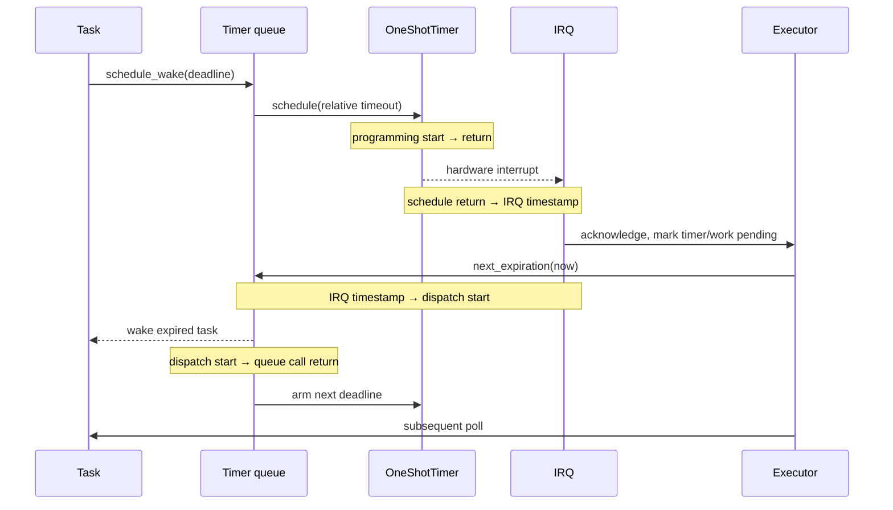

# Shared timer observations

The `timer-observation` feature exposes `timer_observation::Window::begin()`.
It returns an exclusive local guard, or `None` if the timer is uninitialized or
another window is active. `finish()` returns aggregate observations; dropping
the guard disables recording, including cancellation. Neither operation changes
alarms, queued wakers, IRQ binding or executor scheduling. The guard is neither
Send nor Sync. The recorder belongs to the unique platform timer owner.

A window includes all users of the shared timer. It does not identify the PHY
future or promise that an interrupt corresponds to one particular requested
settling interval. The HIL station pause opens a window around the complete
pause request, including control handoff, and closes it before publishing
results. These boundaries differ from the physical radio-exclusive interval.

`registrations` counts every `schedule_wake` call within the window, including
calls that do not change the queue's next deadline. `due_at_registration`
counts deadlines at or before the timestamp sampled under the timer lock,
before queue insertion. `due_at_program_start` and `due_at_program_return`
classify actual alarm programs at the existing `schedule()` boundaries.
Their difference counts deadlines reached during programming. Registrations
and alarm programs are different populations: dispatch can program an older
queued deadline without a new registration. These counters do not identify
which task owns a deadline.

`irq_ack` measures IRQ entry through mutex acquisition, interrupt clear and
alarm-state reset, ending before recorder accounting. It is a subset of the
IRQ handling path, not the complete ISR duration. `irq_to_dispatch` still
includes observer accounting and executor delay; subtracting aggregate ack
cost is not a per-event scheduler latency measurement when IRQs coalesce.

`programming` measures the existing `schedule()` call, including retries after
InvalidTimeout. `alarm_to_irq` ends at the software IRQ-entry timestamp, not at
the hardware's internal alarm edge. `deadline_lateness` is the positive
IRQ timestamp minus requested absolute deadline; early IRQs are counted
separately because the driver may use a shorter intermediate alarm.
`irq_to_dispatch` ends immediately before dequeuing expired timers and includes
interrupt acknowledgment, observation work, completion of the executor's
current poll and lock acquisition. `dispatch` measures IRQ-driven queue processing and
waker calls; immediate expiry during registration is outside this timing. It excludes programming the next alarm. None of these intervals
measures wake-to-PHY-poll latency specifically.

Replacing or stopping an observed alarm retires it explicitly. IRQs from an
alarm predating the window are unmatched; coalesced IRQs retain the earliest
pending timestamp. Alarms and IRQs still pending at window end are reported,
not counted as completed or treated as hardware errors. Counts permit
reconciliation of programs, retirements, interrupts and dispatches. Inputs
come from the same monotonic platform clock. Reversal within a measured
interval, arithmetic overflow or a finish without an active window invalidates
a report. This observer does not independently qualify the platform clock. An IRQ timestamp is sampled whenever this feature is compiled, even
outside a recording window. Other observation clocks run only while enabled.

Instrumentation has overhead and changes placement. It is intended for
diagnostics; the ordinary runtime has neither the recorder nor these clock
reads when the feature is disabled. Timing categories overlap and must not be
summed as CPU utilization or subtracted from unrelated PHY intervals. Compare
hardware behavior using identical instrumentation before claiming a speedup.

The time driver retires already-due registrations through the same Embassy
queue before reconciling the hardware alarm. It wakes all due entries and
retains the earliest future deadline; it does not add a one-microsecond alarm
just to wake a task whose deadline has already passed. Waking a task pends its
executor, not a recursive poll. Future deadlines still use the hardware timer.
The registration timestamp precedes insertion; a deadline can also become due
before the post-insertion expiry check.
