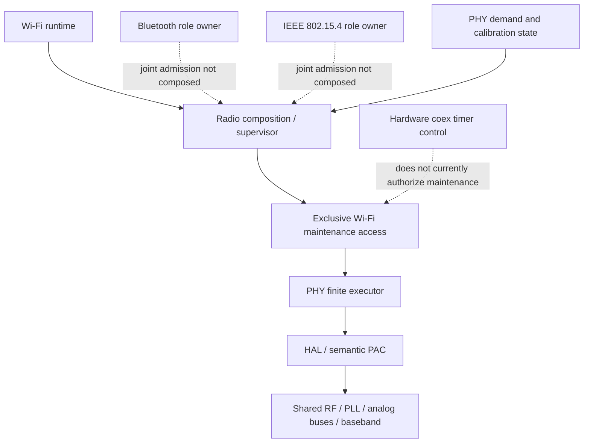
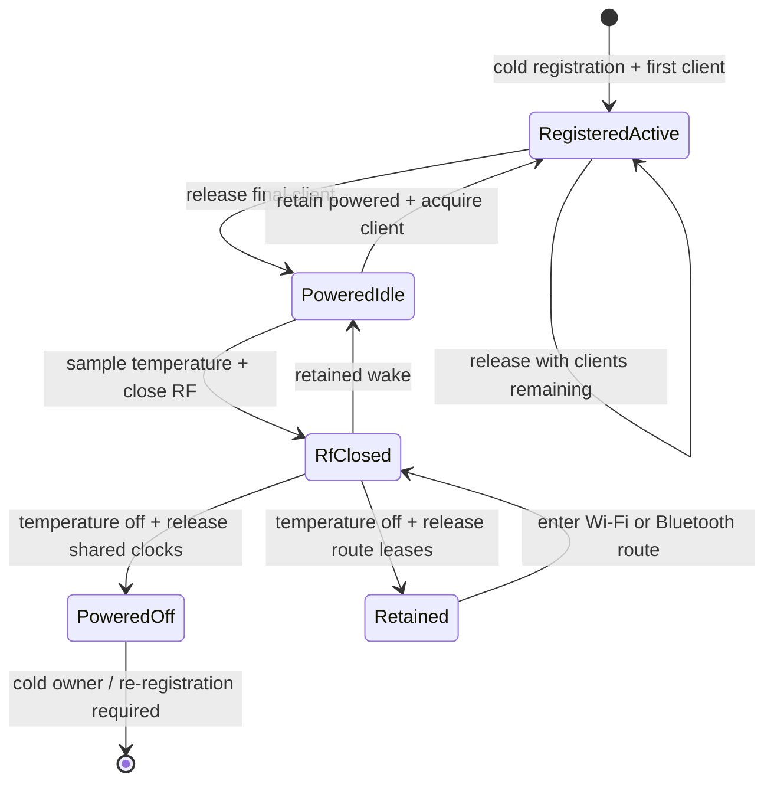
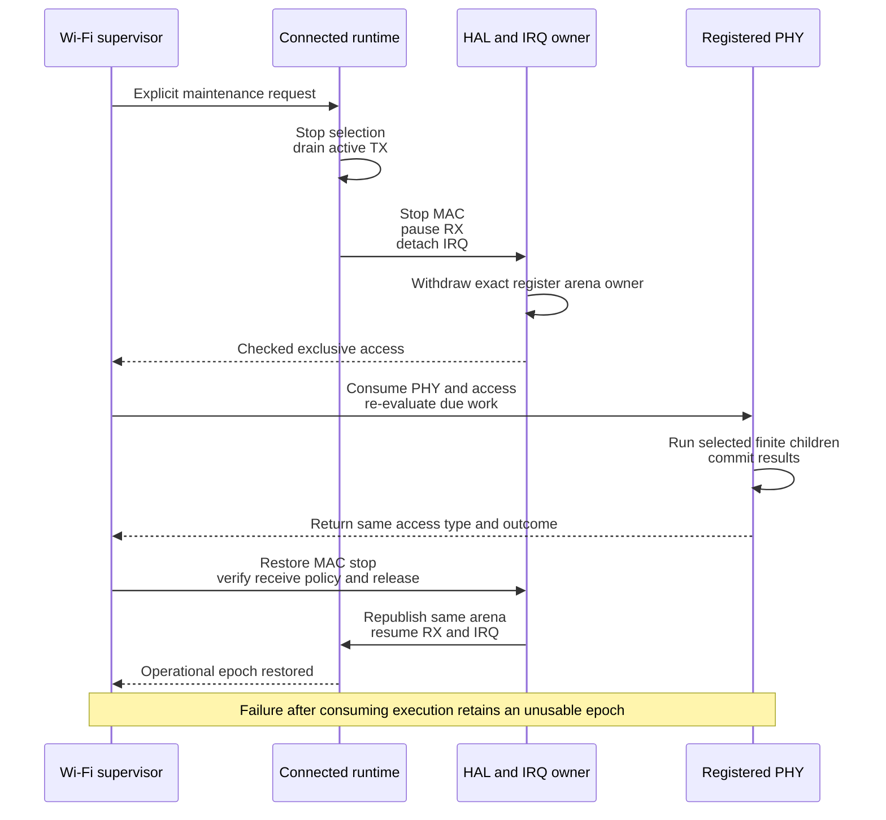

# ESP32-S31 PHY architecture

This crate owns S31 RF algorithms, calibration state and finite hardware
transitions. It consumes typed HAL operations; it does not link the vendor PHY
library. Protocol runtimes own their MAC, descriptors, interrupt routes and
connection state. The radio composition decides when those resources can be
withheld from normal traffic to admit a PHY operation.

The [capability matrix](FEATURES.md) distinguishes implemented primitives from
composed services. The [tracking contract](src/tracking/README.md) is the
canonical reference for demand, admission, cancellation and restoration.

The opt-in `lifecycle-fault-injection` feature exposes destructive one-shot
checkpoints in real maintenance. It owns no timer, reset mechanism or transport;
the caller must provide independent termination. Default builds omit its code.
See the [HIL checkpoint contract](../../../../hil/targets/esp32s31/README.md)
for the exact injected boundaries and evidence limits.

## Terminology and phases

| Term | Meaning in this module |
| --- | --- |
| Initial calibration | Measurements and hardware setup performed during cold registration, before a protocol receives its operational radio owner. |
| Calibration results | Retained measurements and derived configuration. Having these values does not prove that hardware currently contains them. |
| Restore / replay | Re-establishing hardware from retained results after an invalidating power/reset transition. It is distinct from measuring new results. |
| Runtime tracking | The service of observing operating conditions, deciding which RF parameters need attention and executing admitted updates. It is an umbrella term, not a PLL-only operation. |
| Compensation | Computing and publishing an adjustment from an existing calibration model, such as temperature-dependent power/gain or analog-I2C band selection. It can still change hardware used by active traffic. |
| Recalibration | Repeating selected measurements or searches, such as common DCODE/RX gain or class TXDC/PWDET calibration. It does not necessarily repeat the full cold graph. |
| Maintenance | The execution interval and ownership transaction around tracking or another disruptive PHY operation. Demand for maintenance is not permission to execute it. |
| Packet reception adaptation | Per-frame AGC, carrier/frequency correction and channel estimation in the receive path. These are not the runtime temperature-tracking scheduler. |

RFPLL capacitor correction is named by its actual operation; it must not be
confused with complete frequency initialization or a proof of PLL lock.
Likewise, restoring MAC baseband enable is not restoring a protocol's DMA,
interrupt or connection epoch.

```mermaid
flowchart TD
    Power[Unique powered radio] --> Init[Cold registration and initial calibration]
    Init --> Registered[Registered PHY state and physical owner]
    Registered --> Role[Protocol operation]
    Role --> Demand[Read-only tracking demand]
    Demand --> Admission[Composition admits maintenance]
    Admission --> Track[Selected compensation or recalibration]
    Track --> Restore[Restore protocol hardware and checked release]
    Restore --> Role
    Init --> Cache[Optional calibration snapshot]
    Cache --> Validate[Validate schema, identity and complete products]
    Validate --> Init
    Track --> Fault[Failed epoch retained; reset required]
    Restore --> Fault
```

[Registration](src/calibration/registration.rs) admits a cache only when its
schema, physical identity, completion guards and RX table shape match. A valid
snapshot restores semantic calibration products and selects partial cold
calibration. The ordinary RF/baseband graph regenerates frequency memory and
republishes RX and TX gain state that cannot be assumed to survive a cold
epoch. An invalid or incomplete snapshot selects `FullAfterRejectedCache`.
Persistence belongs to the caller. Runtime tracking is not a substitute for
reset or retained-sleep wakeup replay.

## Owners and dependencies

| Owner | Responsibility | Boundary |
| --- | --- | --- |
| [Calibration](src/calibration/registration.rs), [analog](src/analog.rs), [RX](src/rx.rs), [TX](src/tx.rs) | Finite measurements, searches, ordered hardware actions and their results | No network sockets or protocol scheduling policy |
| [PHY state](src/state.rs) | Configuration, calibration results, temperature references and cache values | Values do not grant register access |
| [Client state](src/state/client.rs) and [tracking schedule](src/tracking/schedule.rs) | Active clients, source intervals and read-only demand | Wi-Fi and BT/154 are scheduling classes; BT and 154 remain distinct clients |
| [Registered domain and routes](src/registered_route.rs) | One `PhyDomain` per registration: calibration state and the shared client set. Each protocol route (Wi-Fi, Bluetooth) couples the domain to its physical owner and acquires or releases only its own client through one shared lifecycle | A domain cannot be cloned, rebuilt or paired with another epoch; detached owners check the registration epoch before hardware access |
| [Registered radio](src/registered_radio.rs) | Wi-Fi route owners that keep the powered radio beside its domain; the private [Wi-Fi handoff](src/registered_radio/wifi_integration.rs) holds only protocol-specific typed transfer and receive-enable methods | Cannot split proof from its hardware epoch |
| [Tracking graphs](src/tracking.rs) and [executor](src/executor.rs) | Execute selected children and validate their completions | No independent RF arbitration |
| [Target port](src/target_port.rs) and [HAL PHY](../hal/src/phy.rs) | Typed MMIO, analog buses, hardware completion and bounded waits | Hardware access is borrowed from the admitted owner |
| [Wi-Fi supervisor](../../../composition/esp32s31/embassy/ieee80211/src/supervisor/mod.rs) | Role lifecycle and the connected maintenance transaction | Must collect the runtime's actual resources, not merely request a scheduler pause |
| [Wi-Fi runtime](../../../runtime/esp32s31/ieee80211/src/datapath/maintenance.rs) | Stop selecting new work, drain active TX and retain packet/descriptor resources | A network credit or empty software queue does not prove hardware idle |
| [HAL maintenance access](../hal/src/owner/maintenance.rs) | Retain register/IRQ authority and check hardware admission/release | A CPU mutex does not stop MAC or DMA |
| [Hardware coex control](../driver/coex/README.md) | Recovered timer requests, PTI, clock conversion and withdrawal accounting | Programmed timer identity is not an RF grant |

The supervisor coordinates a lifecycle; PHY supplies the algorithms and demand;
coex supplies a hardware arbitration mechanism only to the extent actually
implemented. These are separate responsibilities. The current exclusive Wi-Fi
route relies on the consuming physical owner and stopped runtime. A future
composition with simultaneously active protocols cannot turn a coex timer
reply, client bit or PTI into this exclusive capability.

The Wi-Fi airtime scheduler selects packet service within a MAC epoch. It does
not own the shared RF resource and cannot independently admit PHY maintenance.

## Power lifecycle boundary

Client bookkeeping and physical RF power are separate state transitions.
Releasing a non-final client returns the ordinary registered radio. Releasing
the final client returns `RegisteredPhyPoweredIdle`: the tracking model is
disarmed and the client set is empty, while RF, analog state and shared clocks
remain physically powered. An always-powered policy can explicitly retain that
owner. Sleep or shutdown must consume it through a hardware transaction.

`RegisteredPhyRfClosed` is minted only after the current-vendor pre-close
temperature observation and the complete finite `phy_close_rf` graph. The
transaction disables hardware frequency control, forces TX/RX off, disables
AGC, closes the RF and frontend/baseband domains and publishes both retained
analog close images. Preparation failure returns the unchanged powered-idle
owner; failure after close begins returns only a reset-required owner.

`RegisteredPhyRfClosed::release_to_cold` then powers down the temperature
sensor, releases retained route clocks and returns a cold `Radio<P, Owned>`
inside `RegisteredPhyColdReleased`. Its previous registration state is retired
and cannot authorize the next hardware epoch. Consuming the cold-release owner
with the platform-derived physical identity returns both the radio and a cache
captured from the final state after runtime tracking and recalibration. The
caller can power the same radio back up and run cold registration with that
cache; validation and hardware replay still run normally. Cold-owner reunion
restores the captured Wi-Fi reset, calibration-clock, I2C-source, modem-source
and register-bus fields before returning ownership. Shared modem ICG maps remain
installed because they are monotonic platform initialization rather than a
route-owned power lease.

The Wi-Fi driver composes this boundary through `restart_esp32s31_radio`: the
cold-release owner is consumed with the identity selected for the next
registration, and the resulting final-state cache is passed directly to the
ordinary validated cold-start graph. Early power or client-acquisition failure
retains that cache with its exact failure frontier. An ambiguous initial
tracking failure keeps the older snapshot opaque because it may no longer
describe the hardware state.

The production Wi-Fi supervisor exposes this as `WifiIdle::restart_radio`.
It first stops MAC, RX DMA and IRQ ownership at the same physical boundary used
for maintenance, checks the stopped hardware state again before final-client
release, and acknowledges restart only after cold registration returns a new
stopped owner. A role-local `Stop` remains a separate operation and does not
power-cycle PHY.

`RegisteredPhyRfClosed::wake_rf` implements the shorter retained path without
retiring the registration epoch. It executes the complete current-vendor wake
parent in recovered order: frontend/baseband and analog-I2C power, retained
frequency publication, channel and TX-cap state, PBUS boundaries, PHY and AGC
register updates, CKGEN reset, then restoration of hardware frequency control,
BBPLL, force-TX/RX and baseband mode. Only terminal success returns
`RegisteredPhyPoweredIdle`; every started failure remains reset-required.
Protocol composition and HIL recovery across this path remain separate gates.

### Protocol switch without re-registration

`RetainedPhy` carries a registered, RF-closed domain between protocol routes,
matching the vendor `esp_phy_disable`/`esp_phy_enable` pair used when one
protocol stops and another starts. `RegisteredPhyRfClosed::release_retained`
checks, before any MMIO, that no calibration restore obligation remains and
that the route established common PHY power; it then powers down the
temperature sensor and hands the HAL's `RetainedRadioHardware` to the new
owner. Wi-Fi releases its coexistence lease; the PHY-I2C lease, the cold-power
baseline and the registration epoch stay in effect. A rejected release returns
the unchanged closed owner.

`RetainedPhy::into_wifi` re-enters the Wi-Fi route as a `RegisteredPhyRfClosed`
without repeating `Radio::power_up`. Routes that lend their shared-PHY
registers (currently Bluetooth) share one domain-level lifecycle:
`PhyClientRelease::close_rf` closes RF after the last client with any lent
borrow and returns `PhyRfClosed`, whose `wake_rf` runs the same wake graph and
returns the route's registered owner. Both reject, before MMIO, a borrow this
registration no longer describes. `RetainedPhy::into_rf_closed` hands the root
and a closed domain to such a route, and `RetainedPhy::from_rf_closed` pairs a
closed domain with the root its route released; a root of another registration
is returned with the domain. The client set is empty throughout, and every
wake failure after the first edge is reset-required.
Both routes' HIL recovery across a switch remains a separate gate.

The Wi-Fi driver composes the handoff as `WifiStopped::release_retained` and
`resume_esp32s31_radio`, which runs the ordinary client, tracking, channel and
MAC initialization tail after the retained wake; its report records
`WifiPhyEntry::RetainedWake` instead of a registration. The Bluetooth engine
provides `BluetoothStopped::from_retained` and the retained release after PHY
close; no LE Controller currently composes the Bluetooth side of the handoff.

### Concurrent clients

For concurrently running protocols the registered domain lives beside the
shared registers in the HAL radio arbiter, as `SharedRadio<ConcurrentPhy>`.
Every operation takes the arbiter's lease, so the domain and the shared PHY are
serialized by one mechanism:

- `register_concurrent_phy` registers the domain once through the lease's
  shared-PHY borrow. As ESP-IDF's calibrating first `esp_phy_enable`, it
  enables the `PHY` and `PHY_CALIBRATION` modem clock modules through the
  arbiter and releases `PHY_CALIBRATION` after calibration;
- `close_concurrent_rf` runs `phy_close_rf` after the last client left and
  releases `PHY`, as the last `esp_phy_disable` does. `wake_concurrent_rf`
  takes `PHY` and `PHY_CALIBRATION` again, restores the retained
  registration by `phy_wakeup_init` without calibration and releases
  `PHY_CALIBRATION`. A closed domain admits no client;
- `acquire_client` and `release_client` enter and leave Wi-Fi, Bluetooth and
  IEEE 802.15.4 as clients of the one client set;
- `evaluate_periodic_tracking` and an acquisition that needs initial tracking
  leave the domain pending, and no client operation proceeds until it settles;
- `admit_maintenance` checks, without register access, that every active client
  presents a `ClientQuiescence` proof whose window is open;
  `maintain_concurrent_phy` then runs the tracking transaction inside the
  earliest `release_by` window. A started failure poisons the domain.

IEEE 802.15.4 composes these steps in [its client module](src/ieee802154_client.rs).
`join_ieee802154` runs on the HAL `Ieee802154Clocked` owner: it checks that the
settled registration still describes the lease, acquires the client, takes the
shared BTBB reference with the gain byte projected from that registration and
applies the transmit-on delay, issuing an affine `Ieee802154PhyMembership`.
`RegisteredIeee802154Operational` keeps the membership beside the operational
MAC owners; they return through a foundation readback, not a policy readback,
because the operational MAC rewrote the PIB. `leave_ieee802154` releases the
client and the BTBB reference, neither with register access.

Protocol runtimes must first return their real TX, RX DMA, IRQ, MAC/LL and
per-protocol receive-enable owners to the composition. Consequently neither
`PhyClientState::release`, a zero client mask nor a coex request can call the
physical close transaction on its own. Failure after close begins cannot
return `RegisteredPhyPoweredIdle`; it must retain a reset-required epoch.

## Conditions and cadence

[Registered-policy inspection](src/tracking/inspection/README.md) reports
scheduling demand separately from the current RFPLL, power, analog-I2C and
common/class calibration conditions. It makes no MMIO calls. Runtime sensor acquisitions have monotonic
start/end provenance; undated replacements invalidate that provenance. A due evaluation is not an instruction
to perform all heavy calibration. No hourly/daily calibration schedule or
qualified maximum thermal deferral is implemented.

## Runtime sequence and timing

A completed common RX calibration carries
[`PhyRxGainDcQuality`](src/rx/gain_calibration/quality.rs) alongside its
coefficients. It identifies convergence for every shared/Wi-Fi baseband gain
and the five `phy_rxdc_fine_cal` radio searches after Wi-Fi gain zero.
Exhausting a baseband search retains its initial pair; fine searches retain
their last correction. These vendor-compatible outcomes complete the transaction,
but do not mean every search converged. Completion flags describe lifecycle;
quality remains a separate result. A skipped DC branch has no new quality.

The source-derived tracking graph contains optional RFPLL work, BT/154 power
and class calibration, Wi-Fi analog-I2C/power and class calibration, followed
by temperature sampling. Decisions in this graph use retained temperature;
the final sample must not be interpreted as the input to every preceding
decision. Temperature sampling can itself adjust the sensor's analog range.

Read-only demand neither advances timestamps nor refreshes calibration results.
`Schedule::At` supports an absolute timer; `Schedule::Inactive` requires none.
Deferral retains the outstanding due instant. The execution path re-observes
the active clients, and only matching child completion commits branch results.
The source interval is not a measured maximum thermally safe deferral.

The [connected pause](../../../composition/esp32s31/embassy/ieee80211/src/supervisor/station/pause.rs)
is an explicit diagnostic route. The connected role also exposes an [observation-driven service](src/tracking/service/README.md),
which production configures at a one-second cadence and which uses the same physical pause/restoration boundary. A separate stopped-role path services
due work at role boundaries. Joint Wi-Fi/Bluetooth/154 maintenance and
active-traffic publication of individual compensation classes are not
qualified execution modes.

`WifiPhyMaintenanceRequest::Calibrate` changes the threshold for one due pass;
it does not change stored policy, fabricate a temperature or advance the due
time. Its outcome distinguishes actual committed common and class calibration
from a call that selected no work.

The production RX-gain and TXDC/PWDET paths execute as direct blocking
transactions under the already-acquired exclusive PHY owner. Required 1–20 us
hardware settles use the ESP32-S31 ROM `ets_delay_us` primitive used by the
recovered vendor graph; bounded PBus, I2C, DC/IQ and SAR readiness reads poll
directly. Interrupts remain enabled and the physical owner remains held until
terminal restoration. The complete common/Wi-Fi runtime calibration graph
runs in one caller poll without a timer suspension. Longer registration,
tracking and lifecycle operations may still express waits through
`PhyAsyncDelay` and `executor::wait::Kind`.

RX gain PBus completion matches the rev0 ROM command loop while retaining
bounded attempts and typed timeout failure. Its I2C commands use direct status
reads with the same edge budget, and DC/IQ readiness samples directly on first
and subsequent attempts. The finite observation bounds are correctness limits,
not elapsed-time guarantees.

The execution limits have different scopes:

| Mechanism | Established bound | Limitation |
| --- | --- | --- |
| [Direct bus polling](src/executor/wait/poll.rs) and [target executor](src/target_executor.rs) | Finite observations per PBus/I2C operation; typed failure on exhaustion | Requires each MMIO access to return; nested operations have separate observation budgets |
| [DC/IQ estimator](src/calibration/estimator.rs) | Finite readiness samples, then measurement/start cleanup on missing-ready | Cleanup and settle calls must themselves return |
| [Calibration executor](src/target_port/calibration.rs) | Root operation accounting and finite gain-state loops | Operation counts do not bound IRQ interference or a stalled bus access |
| [RFPLL search](src/tracking/rfpll/search.rs) | Both search directions terminate after finite samples, including unrecognized status values | Its finite state graph still invokes synchronous bus and settle operations |
| [Transaction deadline](src/tracking/deadline.rs) | Rejects expired entry and a result returned at or after the absolute deadline | The executor cannot interrupt a child that never returns from `poll` |

The BLE and Wi-Fi compositions arm the independent SoC deadline service around
physical lifecycle transactions and retain its lease until checked restoration.
The board/application supplies explicit engineering budgets; PHY owns no timer
or reset peripheral. Hardware reset does not by itself establish a qualified
RF-cessation bound. A pending-future timeout, observed calibration maximum and
finite loop count cannot establish that stronger guarantee either. Failed or
expired work cannot manufacture runnable ownership.

Timing qualification must cover the complete action-to-hardware path, including
executor-added waits, readiness retries, failure cleanup and the selected
runtime adapter. Every wait of at most 100 us requires hot-path classification,
with waits of at most 20 us reviewed first. Record the required minimum,
first-read placement, retry predicate and bound, implementation mechanism, and
measured elapsed time separately. Include variable-duration waits whose range
can enter this interval. A compiled semantic comparison alone does not qualify
these timing properties. Vendor references must include the linked firmware
and its ROM callees: ESP-IDF can override archive leaves, including the I2C
critical-section hooks. Code-placement comparisons require an aligned wait
baseline first.

CPU waiting time, RF exclusion and unavailable packet service are different
quantities. Async hardware waits can release the CPU while the radio remains
unavailable. The current executor uses bounded hardware observations where
there is no owned completion interrupt. Moving those observations to a timer
does not make a long calibration harmless to traffic.

The event-driven RX-gain transitions remain executable semantic models for host
tests and vendor comparison. Production calls the same source-owned arithmetic
and finite hardware primitives directly, without creating an async boundary or
moving a large action enum at each hot edge. Every nested DC/IQ estimator
consumes the same root operation budget, while the fixed outer calibration
graph has its own finite structural bounds. Budget exhaustion cannot produce a
complete coefficient set, and failure retains the recovered cleanup and
outer-control restoration sequence.

The fixed bank encodings are generated at compile time and shared as read-only
data. Measured DC coefficients remain in the individual transition, and entry
encoding borrows them. Terminal products are inspected separately from hardware
admission. Compile-time budgets cover both retained transitions and the compact
external bindings that cross executor call boundaries.

RX diagnostics record only the root interval, its single-poll execution, three
disjoint direct phases and clock-free path counts. They do not install callbacks
inside the minimum-search loop. Search traces and elapsed HIL timing remain
separate measurement scopes.

## Restoration and failure

The physical operation owns register access across all nested waits. The
protocol retains packet storage, DMA leases and its paused runtime. MAC or
baseband writes inside calibration cannot manufacture a resumable protocol
epoch. Release checks and the exact RX/IRQ handoff establish that boundary.

A pending demand wait is cancellable without starting hardware work. An
abandoned or failed consuming execution is not automatically rolled back;
it exposes no ready owner. Restoration failure also requires reset. Holding
a CPU critical section across async waits is not the exclusion model.

Calibration completion, restoration completion and measured RF quality are
distinct outcomes. The existing branch flags establish the first, while
protocol restoration establishes the second. Neither proves EVM, calibrated
radiated power, sensitivity or sustained thermal stability.

## Vendor reference scope

The runtime parent order and combined RX/TX transaction follow the pinned
esp-phy-lib `libphy.a` of `verification/vendor/projects/esp32s31/artifacts.toml`.
RX has its own temperature reference; TX uses one shared reference and retains
separate Wi-Fi and BT/154 calibration results. Authenticated parent-boundary
execution checks call order and arguments with explicit child models. Compiled
comparisons additionally execute actual archive/ROM children for combined
calibration and the whole parent, including an RFPLL-enabled validation profile.
They compare semantic state and ordered effects under modeled peripheral inputs
and documented transport/wait projections; they do not establish RF quality,
hardware timing or live radio admission. See the
[tracking contract](src/tracking/README.md).

ESP-IDF's [open orchestration](https://github.com/espressif/esp-idf/blob/c712a0dde385d659a1470a136251980d31a70bc1/components/esp_phy/src/phy_common.c)
calls a binary parameter-tracking function from a periodic task timer and on
eligible PHY enable. Its result flags describe selected branches, not a
hardware quiet-window contract. The library's grant-hook names alone are not
evidence that the final firmware acquired exclusive RF access.

RX gain diagnostics retain coarse DC, table-publication and control/restoration
regions without per-edge timing. Minimum-search intervals are nested in the DC
region, including accepted estimator steps and waits. The three region totals
are disjoint; minimum and fine-step totals must not be added to them. Observer
clock reads occur at region boundaries, so these remain instrumented durations,
not pure CPU costs. Early executor errors close active intervals as failed;
cancellation leaves incomplete evidence and does not release hardware ownership.

Coarse RX diagnostics additionally sample one in sixteen minimum invocations and
non-minimum DC executor steps, starting with the first. These sampled intervals
separate prepare/advance from MMIO, minimum settle and readiness execution.
Readiness time includes its timer and suspension, not just a register read.
Sampling is deterministic and may correlate with the search sequence; counts and
scoped maxima accompany totals, which are not whole-calibration costs.

The DC/IQ executor probes readiness immediately after measurement enable, as in
rev0 ROM phy_iq_est_enable. The required 1-us start/stop settles are unchanged.
Only a previously unready result incurs the existing 1-us asynchronous completion
backoff. The observation limit and timeout disable tail remain unchanged.
