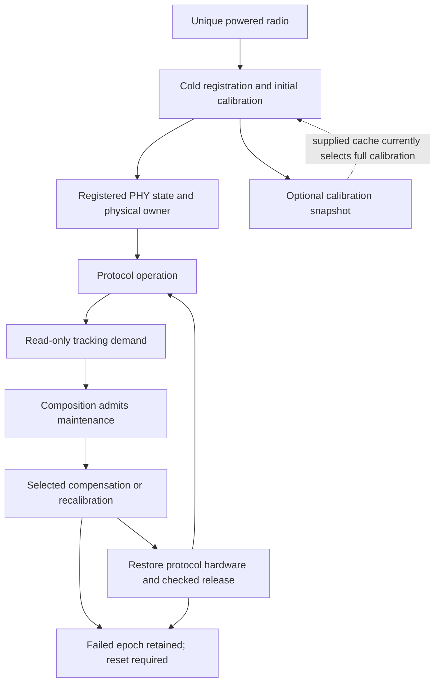
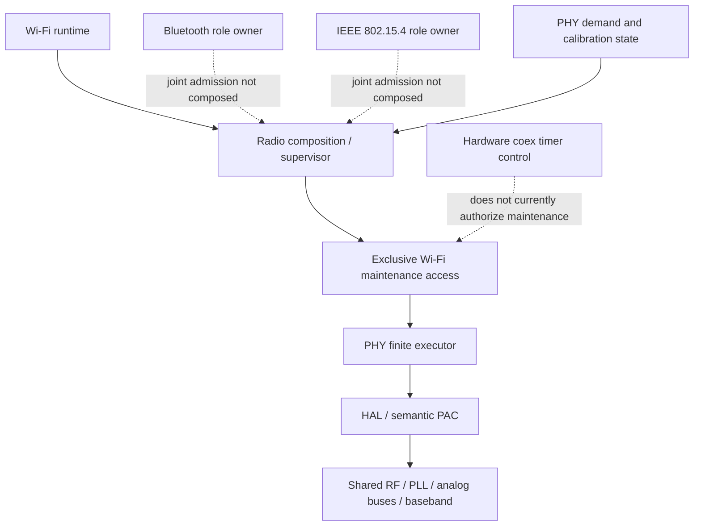

# ESP32-S31 PHY architecture

This crate owns S31 RF algorithms, calibration state and finite hardware
transitions. It consumes typed HAL operations; it does not link the vendor PHY
library. Protocol runtimes own their MAC, descriptors, interrupt routes and
connection state. The radio composition decides when those resources can be
withheld from normal traffic to admit a PHY operation.

The [capability matrix](FEATURES.md) distinguishes implemented primitives from
composed services. The [tracking contract](src/tracking/README.md) is the
canonical reference for demand, admission, cancellation and restoration.

## Terminology and phases

| Term | Meaning in this module |
| --- | --- |
| Initial calibration | Measurements and hardware setup performed during cold registration, before a protocol receives its operational radio owner. |
| Calibration results | Retained measurements and derived configuration. Having these values does not prove that hardware currently contains them. |
| Restore / replay | Re-establishing hardware from retained results after an invalidating power/reset transition. It is distinct from measuring new results. |
| Runtime tracking | The service of observing operating conditions, deciding which RF parameters need attention and executing admitted updates. It is an umbrella term, not a PLL-only operation. |
| Compensation | Computing and publishing an adjustment from an existing calibration model, such as temperature-dependent power/gain or analog-I2C band selection. It can still change hardware used by active traffic. |
| Recalibration | Repeating selected measurements or searches, such as common DCODE/RX gain or class TXDC/PWDET calibration. It does not necessarily repeat the full cold graph. |
| Maintenance | The execution interval and ownership transaction around tracking or another disruptive PHY operation. Demand for maintenance is not permission to execute it. |
| Packet reception adaptation | Per-frame AGC, carrier/frequency correction and channel estimation in the receive path. These are not the runtime temperature-tracking scheduler. |

RFPLL capacitor correction is named by its actual operation; it must not be
confused with complete frequency initialization or a proof of PLL lock.
Likewise, restoring MAC baseband enable is not restoring a protocol's DMA,
interrupt or connection epoch.



All admitted [registration paths](src/calibration/registration.rs) currently
perform full calibration. The cache has a typed representation and identity
checks, but complete cold hardware replay is not implemented. Passing a cache
therefore selects `FullAfterRejectedCache`; a software-valid snapshot cannot
skip physical initialization. Persistence belongs to the caller. Runtime
tracking is not a substitute for reset or wakeup replay.

## Owners and dependencies

| Owner | Responsibility | Boundary |
| --- | --- | --- |
| [Calibration](src/calibration/registration.rs), [analog](src/analog.rs), [RX](src/rx.rs), [TX](src/tx.rs) | Finite measurements, searches, ordered hardware actions and their results | No network sockets or protocol scheduling policy |
| [PHY state](src/state.rs) | Configuration, calibration results, temperature references and cache values | Values do not grant register access |
| [Client state](src/state/client.rs) and [tracking schedule](src/tracking/schedule.rs) | Active clients, source intervals and read-only demand | Wi-Fi and BT/154 are scheduling classes; BT and 154 remain distinct clients |
| [Registered radio](src/registered_radio.rs) | Keep physical radio, registration proof and client lifetime associated | Cannot split proof from its hardware epoch |
| [Tracking graphs](src/tracking.rs) and [executor](src/executor.rs) | Execute selected children and validate their completions | No independent RF arbitration |
| [Target port](src/target_port.rs) and [HAL PHY](../hal/src/phy.rs) | Typed MMIO, analog buses, hardware completion and bounded waits | Hardware access is borrowed from the admitted owner |
| [Wi-Fi supervisor](../../../composition/esp32s31/embassy/ieee80211/src/supervisor/mod.rs) | Role lifecycle and the connected maintenance transaction | Must collect the runtime's actual resources, not merely request a scheduler pause |
| [Wi-Fi runtime](../../../runtime/embassy/esp32s31/ieee80211/src/datapath/maintenance.rs) | Stop selecting new work, drain active TX and retain packet/descriptor resources | A network credit or empty software queue does not prove hardware idle |
| [HAL maintenance access](../hal/src/owner/maintenance.rs) | Retain register/IRQ authority and check hardware admission/release | A CPU mutex does not stop MAC or DMA |
| [Hardware coex control](../driver/coex/README.md) | Recovered timer requests, PTI, clock conversion and withdrawal accounting | Programmed timer identity is not an RF grant |



The supervisor coordinates a lifecycle; PHY supplies the algorithms and demand;
coex supplies a hardware arbitration mechanism only to the extent actually
implemented. These are separate responsibilities. The current exclusive Wi-Fi
route relies on the consuming physical owner and stopped runtime. A future
composition with simultaneously active protocols cannot turn a coex timer
reply, client bit or PTI into this exclusive capability.

The Wi-Fi airtime scheduler selects packet service within a MAC epoch. It does
not own the shared RF resource and cannot independently admit PHY maintenance.

## Conditions and cadence

[Registered-policy inspection](src/tracking/inspection/README.md) reports
scheduling demand separately from the current RFPLL, power, analog-I2C and
common/class calibration conditions. It makes no MMIO calls. Runtime sensor acquisitions have monotonic
start/end provenance; undated replacements invalidate that provenance. A due evaluation is not an instruction
to perform all heavy calibration. No hourly/daily calibration schedule or
qualified maximum thermal deferral is implemented.

## Runtime sequence and timing

The source-derived tracking graph contains optional RFPLL work, BT/154 power
and class calibration, Wi-Fi analog-I2C/power and class calibration, followed
by temperature sampling. Decisions in this graph use retained temperature;
the final sample must not be interpreted as the input to every preceding
decision. Temperature sampling can itself adjust the sensor's analog range.

Read-only demand neither advances timestamps nor refreshes calibration results.
`Schedule::At` supports an absolute timer; `Schedule::Inactive` requires none.
Deferral retains the outstanding due instant. The execution path re-observes
the active clients, and only matching child completion commits branch results.
The source interval is not a measured maximum thermally safe deferral.

```mermaid
sequenceDiagram
    participant S as Wi-Fi supervisor
    participant W as Connected runtime
    participant A as HAL and IRQ owner
    participant P as Registered PHY
    S->>W: Explicit maintenance request
    W->>W: Stop selection; drain active TX
    W->>A: Stop MAC; pause RX; detach IRQ
    A->>A: Withdraw exact register arena owner
    A-->>S: Checked exclusive access
    S->>P: Consume PHY and access; re-evaluate due work
    P->>P: Run selected finite children; commit results
    P-->>S: Return same access type and outcome
    S->>A: Restore MAC stop; verify receive policy and release
    A->>W: Republish same arena; resume RX and IRQ
    W-->>S: Operational epoch restored
    Note over S,P: Failure after consuming execution retains an unusable epoch
```

The [connected pause](../../../composition/esp32s31/embassy/ieee80211/src/supervisor/station/pause.rs)
is an explicit diagnostic route. The connected role also exposes an opt-in [observation-driven service](src/tracking/service/README.md),
which starts disabled and uses the same physical pause/restoration boundary. A separate stopped-role path services
due work at role boundaries. Joint Wi-Fi/Bluetooth/154 maintenance and
active-traffic publication of individual compensation classes are not
qualified execution modes.

`WifiPhyMaintenanceRequest::Calibrate` changes the threshold for one due pass;
it does not change stored policy, fabricate a temperature or advance the due
time. Its outcome distinguishes actual committed common and class calibration
from a call that selected no work.

CPU waiting time, RF exclusion and unavailable packet service are different
quantities. Async hardware waits can release the CPU while the radio remains
unavailable. The current executor uses bounded hardware observations where
there is no owned completion interrupt. Moving those observations to a timer
does not make a long calibration harmless to traffic.

## Restoration and failure

The physical operation owns register access across all nested waits. The
protocol retains packet storage, DMA leases and its paused runtime. MAC or
baseband writes inside calibration cannot manufacture a resumable protocol
epoch. Release checks and the exact RX/IRQ handoff establish that boundary.

A pending demand wait is cancellable without starting hardware work. An
abandoned or failed consuming execution is not automatically rolled back;
it exposes no ready owner. Restoration failure also requires reset. Holding
a CPU critical section across async waits is not the exclusion model.

Calibration completion, restoration completion and measured RF quality are
distinct outcomes. The existing branch flags establish the first, while
protocol restoration establishes the second. Neither proves EVM, calibrated
radiated power, sensitivity or sustained thermal stability.

## Vendor reference scope

The runtime parent order and combined RX/TX transaction follow esp-phy-lib
`b88e4b76e090ae59c51cb00b916d38def895b396`, SHA-256
`d4218e359b9716c616cbf116172f44d9195d4f2e020fad73279067e92d08e580`.
RX has its own temperature reference; TX uses one shared reference and retains
separate Wi-Fi and BT/154 calibration results. Authenticated parent-boundary
execution checks call order and arguments with explicit child models. Compiled
comparisons additionally execute actual archive/ROM children for combined
calibration and the whole parent, including an RFPLL-enabled validation profile.
They compare semantic state and ordered effects under modeled peripheral inputs
and documented transport/wait projections; they do not establish RF quality,
hardware timing or live radio admission. See the
[tracking contract](src/tracking/README.md).

ESP-IDF's [open orchestration](https://github.com/espressif/esp-idf/blob/c712a0dde385d659a1470a136251980d31a70bc1/components/esp_phy/src/phy_common.c)
calls a binary parameter-tracking function from a periodic task timer and on
eligible PHY enable. Its result flags describe selected branches, not a
hardware quiet-window contract. The library's grant-hook names alone are not
evidence that the final firmware acquired exclusive RF access.
