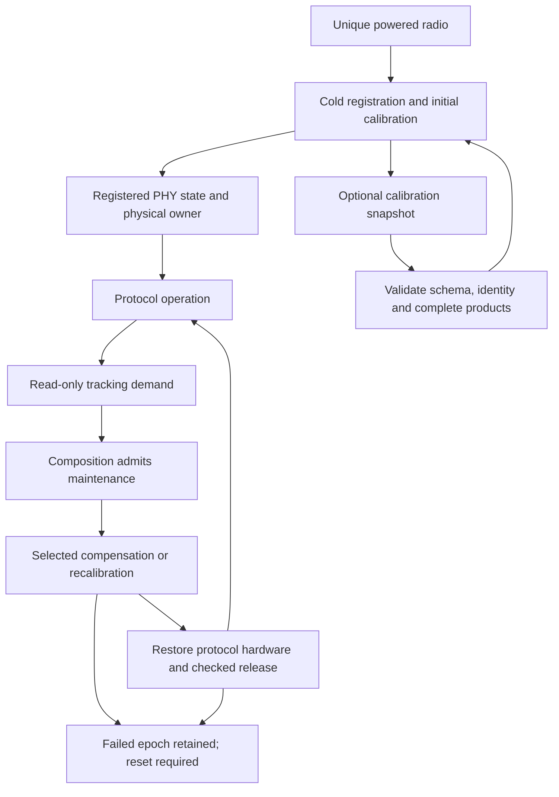
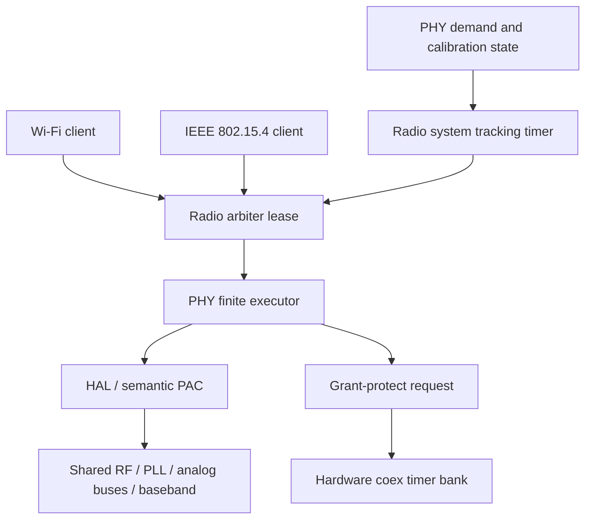
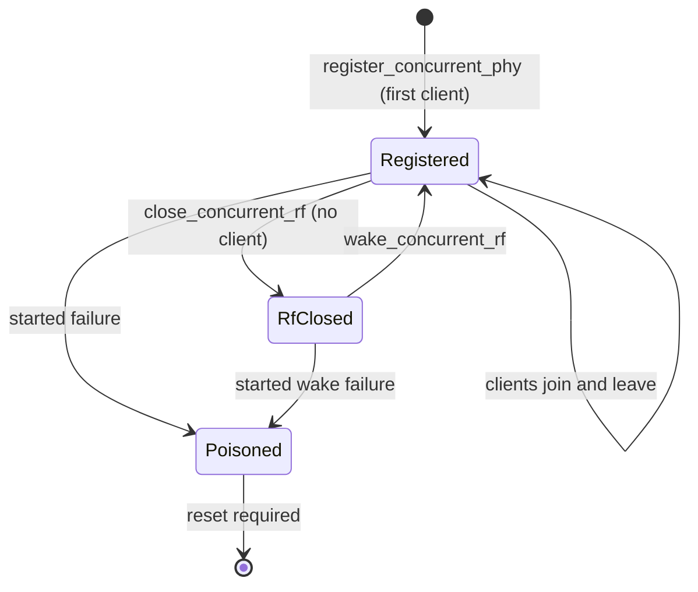

# ESP32-S31 PHY architecture

This crate owns S31 RF algorithms, calibration state and finite hardware
transitions. It consumes typed HAL operations; it does not link the vendor PHY
library. Protocol runtimes own their MAC, descriptors, interrupt routes and
connection state. The radio composition decides when those resources can be
withheld from normal traffic to admit a PHY operation.

The [capability matrix](FEATURES.md) distinguishes implemented primitives from
composed services. The [tracking contract](src/tracking/README.md) is the
canonical reference for demand, admission, cancellation and restoration.

The opt-in `lifecycle-fault-injection` feature exposes destructive one-shot
checkpoints in real maintenance. It owns no timer, reset mechanism or transport;
the caller must provide independent termination. Default builds omit its code.
See the [HIL checkpoint contract](../../../../hil/targets/esp32s31/README.md)
for the exact injected boundaries and evidence limits.

## Terminology and phases

| Term | Meaning in this module |
| --- | --- |
| Initial calibration | Measurements and hardware setup performed during cold registration, before a protocol receives its operational radio owner. |
| Calibration results | Retained measurements and derived configuration. Having these values does not prove that hardware currently contains them. |
| Restore / replay | Re-establishing hardware from retained results after an invalidating power/reset transition. It is distinct from measuring new results. |
| Runtime tracking | The service of observing operating conditions, deciding which RF parameters need attention and executing admitted updates. It is an umbrella term, not a PLL-only operation. |
| Compensation | Computing and publishing an adjustment from an existing calibration model, such as temperature-dependent power/gain or analog-I2C band selection. It can still change hardware used by active traffic. |
| Recalibration | Repeating selected measurements or searches, such as common DCODE/RX gain or class TXDC/PWDET calibration. It does not necessarily repeat the full cold graph. |
| Maintenance | The execution interval and ownership transaction around tracking or another disruptive PHY operation. Demand for maintenance is not permission to execute it. |
| Packet reception adaptation | Per-frame AGC, carrier/frequency correction and channel estimation in the receive path. These are not the runtime temperature-tracking scheduler. |

RFPLL capacitor correction is named by its actual operation; it must not be
confused with complete frequency initialization or a proof of PLL lock.
Likewise, restoring MAC baseband enable is not restoring a protocol's DMA,
interrupt or connection epoch.

```mermaid
flowchart TD
    Power[Unique powered radio] --> Init[Cold registration and initial calibration]
    Init --> Registered[Registered PHY state and physical owner]
    Registered --> Role[Protocol operation]
    Role --> Demand[Read-only tracking demand]
    Demand --> Admission[Composition admits maintenance]
    Admission --> Track[Selected compensation or recalibration]
    Track --> Restore[Restore protocol hardware and checked release]
    Restore --> Role
    Init --> Cache[Optional calibration snapshot]
    Cache --> Validate[Validate schema, identity and complete products]
    Validate --> Init
    Track --> Fault[Failed epoch retained; reset required]
    Restore --> Fault
```

[Registration](src/calibration/registration.rs) admits a cache only when its
schema, physical identity, completion guards and RX table shape match. A valid
snapshot restores semantic calibration products and selects partial cold
calibration. The ordinary RF/baseband graph regenerates frequency memory and
republishes RX and TX gain state that cannot be assumed to survive a cold
epoch. An invalid or incomplete snapshot selects `FullAfterRejectedCache`.
Persistence belongs to the caller. Runtime tracking is not a substitute for
reset or retained-sleep wakeup replay.

## Owners and dependencies

| Owner | Responsibility | Boundary |
| --- | --- | --- |
| [Calibration](src/calibration/registration.rs), [analog](src/analog.rs), [RX](src/rx.rs), [TX](src/tx.rs) | Finite measurements, searches, ordered hardware actions and their results | No network sockets or protocol scheduling policy |
| [PHY state](src/state.rs) | Configuration, calibration results, temperature references and cache values | Values do not grant register access |
| [Client state](src/state/client.rs) and [tracking schedule](src/tracking/schedule.rs) | Active clients, source intervals and read-only demand | Wi-Fi and BT/154 are scheduling classes; BT and 154 remain distinct clients |
| [Registered domain](src/domain.rs) | One `PhyDomain` per registration: calibration state and the shared client set | A domain cannot be cloned, rebuilt or paired with another epoch; operations check the registration epoch before hardware access |
| [Concurrent domain](src/concurrent.rs) and its [target port](src/target_port/concurrent.rs) | The shared domain beside the HAL radio arbiter; Wi-Fi, Bluetooth and IEEE 802.15.4 join it as clients | Every operation holds the arbiter lease |
| [Tracking graphs](src/tracking.rs) and [executor](src/executor.rs) | Execute selected children and validate their completions | No independent RF arbitration |
| [Target port](src/target_port.rs) and [HAL PHY](../hal/src/phy.rs) | Typed MMIO, analog buses, hardware completion and bounded waits | Hardware access is borrowed from the admitted owner |
| [Radio system](../../../runtime/esp32s31/radio/README.md) | The arbiter, the platform resources and the vendor periodic tracking timer | Tracking runs under the lease and the grant-protect brackets; it pauses no protocol |
| [HAL stopped-MAC check](../hal/src/owner/maintenance.rs) | The stopped Wi-Fi MAC check at the final-client boundary | A CPU mutex does not stop MAC or DMA |
| [Hardware coex control](../driver/coex/README.md) | Recovered timer requests, PTI, clock conversion and withdrawal accounting | Programmed timer identity is not an RF grant |

```mermaid
flowchart TD
    W[Wi-Fi client] --> L[Radio arbiter lease]
    Z[IEEE 802.15.4 client] --> L
    T[Radio system tracking timer] --> L
    P[PHY demand and calibration state] --> T
    L --> E[PHY finite executor]
    E --> H[HAL / semantic PAC]
    H --> RF[Shared RF / PLL / analog buses / baseband]
    E --> G[Grant-protect request]
    G --> C[Hardware coex timer bank]
```

PHY supplies the algorithms, demand and the concurrent domain; the radio
system composition owns the arbiter and runs the vendor periodic tracking;
coex supplies the hardware arbitration mechanism. Tracking follows the vendor
admission: the arbiter lease is the PHY lock, and the tracking graph brackets
its RF-sensitive regions with the grant-protect request instead of pausing
the protocols. A coex timer reply, client bit or PTI is never an ownership
proof for the shared PHY.

The Wi-Fi airtime scheduler selects packet service within a MAC epoch. It does
not own the shared RF resource and cannot independently admit PHY maintenance.

## Power lifecycle boundary

Client bookkeeping and physical RF power are separate state transitions. The
last client leaving keeps RF, analog state and shared clocks physically
powered until the composition closes RF; a closed domain admits no client
until it is woken.

```mermaid
stateDiagram-v2
    [*] --> Registered: register_concurrent_phy (first client)
    Registered --> Registered: clients join and leave
    Registered --> RfClosed: close_concurrent_rf (no client)
    RfClosed --> Registered: wake_concurrent_rf
    Registered --> Poisoned: started failure
    RfClosed --> Poisoned: started wake failure
    Poisoned --> [*]: reset required
```

RF close runs the current-vendor pre-close temperature observation and the
complete finite `phy_close_rf` graph: it disables hardware frequency control
and AGC, closes the RF and frontend/baseband domains
and publishes both retained analog close images. A preparation failure keeps
RF open; failure after close begins poisons the domain.

Retained wake executes the complete current-vendor wake parent in recovered
order without retiring the registration epoch: frontend/baseband and
analog-I2C power, retained frequency publication, channel and TX-cap state,
PBUS boundaries, PHY and AGC register updates, CKGEN reset, then restoration
of hardware frequency control, BBPLL, force-TX/RX and baseband mode. Every
started failure poisons the domain.

### Concurrent clients

For concurrently running protocols the registered domain lives beside the
shared registers in the HAL radio arbiter, as `SharedRadio<ConcurrentPhy>`.
Every operation takes the arbiter's lease, so the domain and the shared PHY are
serialized by one mechanism:

- `register_concurrent_phy` registers the domain once through the lease's
  shared-PHY borrow. As ESP-IDF's calibrating first `esp_phy_enable`, it
  enables the `PHY` and `PHY_CALIBRATION` modem clock modules through the
  arbiter and releases `PHY_CALIBRATION` after calibration;
- `close_concurrent_rf` runs `phy_close_rf` after the last client left and
  releases `PHY`, as the last `esp_phy_disable` does. `wake_concurrent_rf`
  takes `PHY` and `PHY_CALIBRATION` again, restores the retained
  registration by `phy_wakeup_init` without calibration and releases
  `PHY_CALIBRATION`. A closed domain admits no client;
- `acquire_client` and `release_client` enter and leave Wi-Fi, Bluetooth and
  IEEE 802.15.4 as clients of the one client set;
  `wifi_client::join_wifi` and `leave_wifi` do this for Wi-Fi on the HAL's
  clocked Wi-Fi owner (`esp_phy_enable`/`esp_phy_disable(PHY_MODEM_WIFI)`),
  as `ieee802154_client` does for IEEE 802.15.4 and `bluetooth_client` for the
  Bluetooth Controller's task owner, each with its BTBB reference;
- `select_concurrent_wifi_channel` and `switch_concurrent_wifi_channel` tune
  the shared domain for Wi-Fi through the HAL Wi-Fi client's channel HAL,
  which it lends together with the arbiter attachment; the switch stops and
  restarts the Wi-Fi MAC around the retune;
- `evaluate_periodic_tracking` and an acquisition that needs initial tracking
  leave the domain pending, and no client operation proceeds until it settles;
- `admit_maintenance` checks, without register access, whether pending
  tracking may start under the domain's `MaintenancePolicy`, and
  `maintain_concurrent_phy` then runs the tracking transaction. A started
  failure poisons the domain.
  - `Vendor` (the default) follows ESP-IDF's `phy_common.c`: the periodic
    timer runs `phy_param_track_tot` under the PHY lock alone, without
    pausing any protocol. The arbiter lease is that lock, and the tracking
    graph brackets its RF-sensitive regions with the grant-protect request.
  - `Quiesced` is a stricter local policy: every active client presents a
    `ClientQuiescence` proof whose window is open, and tracking runs inside
    the earliest `release_by` window.
- `track_concurrent_phy` is one tick of the vendor `phy_track_pll`: it
  evaluates the clients' tracking period and runs due tracking under the
  vendor policy, or reports that the quiesced policy awaits proofs. The
  vendor periodic timer that calls it belongs to the composition that owns
  the arbiter, as it belongs to ESP-IDF's `esp_phy` component:
  [`oer-esp32s31-radio-runtime`](../../../runtime/esp32s31/radio/README.md)
  runs it for the shared radio.

IEEE 802.15.4 composes these steps in [its client module](src/ieee802154_client.rs).
`join_ieee802154` runs on the HAL `Ieee802154Clocked` owner: it checks that the
settled registration still describes the lease, acquires the client, takes the
shared BTBB reference with the gain byte projected from that registration and
applies the transmit-on delay, issuing an affine `Ieee802154PhyMembership`.
`RegisteredIeee802154Operational` keeps the membership beside the operational
MAC owners; they return through a foundation readback, not a policy readback,
because the operational MAC rewrote the PIB. `leave_ieee802154` releases the
client and the BTBB reference, neither with register access.

IEEE 802.15.4 stays a PHY client while it sleeps. On the ESP32-S31 the
vendor `ieee802154_rf_disable` closes RF only together with the REGDMA PHY
retention (`esp_hw_support/lowpower/port/esp32s31/sleep_phy.c`), whose I2C
burst the pinned `libphy.a` does not provide
(`phy_ana_i2c_master_burst_rf_onoff`); without it the vendor keeps RF open
for the client's lifetime. RF closes only when the last client leaves.

Protocol runtimes must first return their real TX, RX DMA, IRQ, MAC/LL and
per-protocol receive-enable owners to the composition. Consequently neither
`PhyClientState::release`, a zero client mask nor a coex request can call the
physical close transaction on its own. Failure after close begins poisons
the domain; the radio then requires reset.

## Conditions and cadence

[Registered-policy inspection](src/tracking/inspection/README.md) reports
scheduling demand separately from the current RFPLL, power, analog-I2C and
common/class calibration conditions. It makes no MMIO calls. Runtime sensor acquisitions have monotonic
start/end provenance; undated replacements invalidate that provenance. A due evaluation is not an instruction
to perform all heavy calibration. No hourly/daily calibration schedule or
qualified maximum thermal deferral is implemented.

## Runtime sequence and timing

A completed common RX calibration carries
[`PhyRxGainDcQuality`](src/rx/gain_calibration/quality.rs) alongside its
coefficients. It identifies convergence for every shared/Wi-Fi baseband gain
and the five `phy_rxdc_fine_cal` radio searches after Wi-Fi gain zero.
Exhausting a baseband search retains its initial pair; fine searches retain
their last correction. These vendor-compatible outcomes complete the transaction,
but do not mean every search converged. Completion flags describe lifecycle;
quality remains a separate result. A skipped DC branch has no new quality.

The source-derived tracking graph contains optional RFPLL work, BT/154 power
and class calibration, Wi-Fi analog-I2C/power and class calibration, followed
by temperature sampling. Decisions in this graph use retained temperature;
the final sample must not be interpreted as the input to every preceding
decision. Temperature sampling can itself adjust the sensor's analog range.

Read-only demand neither advances timestamps nor refreshes calibration results.
`Schedule::At` supports an absolute timer; `Schedule::Inactive` requires none.
Deferral retains the outstanding due instant. The execution path re-observes
the active clients, and only matching child completion commits branch results.
The source interval is not a measured maximum thermally safe deferral.

The vendor periodic tracking is the only runtime maintenance path: the radio
system runs one `track_concurrent_phy` tick every tracking period under the
arbiter lease, and the domain's admission policy decides whether due work
starts. There is no protocol-selected maintenance of individual operations.
Joint Wi-Fi/Bluetooth/154 maintenance and active-traffic publication of
individual compensation classes are not qualified execution modes.

The production RX-gain and TXDC/PWDET paths execute as direct blocking
transactions under the already-acquired arbiter lease. Required 1–20 us
hardware settles use the ESP32-S31 ROM `ets_delay_us` primitive used by the
recovered vendor graph; bounded PBus, I2C, DC/IQ and SAR readiness reads poll
directly. Interrupts remain enabled and the physical owner remains held until
terminal restoration. The complete common/Wi-Fi runtime calibration graph
runs in one caller poll without a timer suspension. Longer registration,
tracking and lifecycle operations may still express waits through
`PhyAsyncDelay` and `executor::wait::Kind`.

RX gain PBus completion matches the rev0 ROM command loop while retaining
bounded attempts and typed timeout failure. Its I2C commands use direct status
reads with the same edge budget, and DC/IQ readiness samples directly on first
and subsequent attempts. The finite observation bounds are correctness limits,
not elapsed-time guarantees.

The execution limits have different scopes:

| Mechanism | Established bound | Limitation |
| --- | --- | --- |
| [Direct bus polling](src/executor/wait/poll.rs) and [target executor](src/target_executor.rs) | Finite observations per PBus/I2C operation; typed failure on exhaustion | Requires each MMIO access to return; nested operations have separate observation budgets |
| [DC/IQ estimator](src/calibration/estimator.rs) | Finite readiness samples, then measurement/start cleanup on missing-ready | Cleanup and settle calls must themselves return |
| [Calibration executor](src/target_port/calibration.rs) | Root operation accounting and finite gain-state loops | Operation counts do not bound IRQ interference or a stalled bus access |
| [RFPLL search](src/tracking/rfpll/search.rs) | Both search directions terminate after finite samples, including unrecognized status values | Its finite state graph still invokes synchronous bus and settle operations |
| [Transaction deadline](src/tracking/deadline.rs) | Rejects expired entry and a result returned at or after the absolute deadline | The executor cannot interrupt a child that never returns from `poll` |

The BLE and Wi-Fi compositions arm the independent SoC deadline service around
physical lifecycle transactions and retain its lease until checked restoration.
The board/application supplies explicit engineering budgets; PHY owns no timer
or reset peripheral. Hardware reset does not by itself establish a qualified
RF-cessation bound. A pending-future timeout, observed calibration maximum and
finite loop count cannot establish that stronger guarantee either. Failed or
expired work cannot manufacture runnable ownership.

Timing qualification must cover the complete action-to-hardware path, including
executor-added waits, readiness retries, failure cleanup and the selected
runtime adapter. Every wait of at most 100 us requires hot-path classification,
with waits of at most 20 us reviewed first. Record the required minimum,
first-read placement, retry predicate and bound, implementation mechanism, and
measured elapsed time separately. Include variable-duration waits whose range
can enter this interval. A compiled semantic comparison alone does not qualify
these timing properties. Vendor references must include the linked firmware
and its ROM callees: ESP-IDF can override archive leaves, including the I2C
critical-section hooks. Code-placement comparisons require an aligned wait
baseline first.

CPU waiting time, RF exclusion and unavailable packet service are different
quantities. Async hardware waits can release the CPU while the radio remains
unavailable. The current executor uses bounded hardware observations where
there is no owned completion interrupt. Moving those observations to a timer
does not make a long calibration harmless to traffic.

The event-driven RX-gain transitions remain executable semantic models for host
tests and vendor comparison. Production calls the same source-owned arithmetic
and finite hardware primitives directly, without creating an async boundary or
moving a large action enum at each hot edge. Every nested DC/IQ estimator
consumes the same root operation budget, while the fixed outer calibration
graph has its own finite structural bounds. Budget exhaustion cannot produce a
complete coefficient set, and failure retains the recovered cleanup and
outer-control restoration sequence.

The fixed bank encodings are generated at compile time and shared as read-only
data. Measured DC coefficients remain in the individual transition, and entry
encoding borrows them. Terminal products are inspected separately from hardware
admission. Compile-time budgets cover both retained transitions and the compact
external bindings that cross executor call boundaries.

RX diagnostics record only the root interval, its single-poll execution, three
disjoint direct phases and clock-free path counts. They do not install callbacks
inside the minimum-search loop. Search traces and elapsed HIL timing remain
separate measurement scopes.

## Restoration and failure

The physical operation owns register access across all nested waits. The
protocol retains packet storage, DMA leases and its paused runtime. MAC or
baseband writes inside calibration cannot manufacture a resumable protocol
epoch. Release checks and the exact RX/IRQ handoff establish that boundary.

A pending demand wait is cancellable without starting hardware work. An
abandoned or failed consuming execution is not automatically rolled back;
it exposes no ready owner. Restoration failure also requires reset. Holding
a CPU critical section across async waits is not the exclusion model.

Calibration completion, restoration completion and measured RF quality are
distinct outcomes. The existing branch flags establish the first, while
protocol restoration establishes the second. Neither proves EVM, calibrated
radiated power, sensitivity or sustained thermal stability.

## Vendor reference scope

The runtime parent order and combined RX/TX transaction follow the pinned
esp-phy-lib `libphy.a` of `verification/esp32s31/artifacts.toml`.
RX has its own temperature reference; TX uses one shared reference and retains
separate Wi-Fi and BT/154 calibration results. Authenticated parent-boundary
execution checks call order and arguments with explicit child models. Compiled
comparisons additionally execute actual archive/ROM children for combined
calibration and the whole parent, including an RFPLL-enabled validation profile.
They compare semantic state and ordered effects under modeled peripheral inputs
and documented transport/wait projections; they do not establish RF quality,
hardware timing or live radio admission. See the
[tracking contract](src/tracking/README.md).

ESP-IDF's [open orchestration](https://github.com/espressif/esp-idf/blob/4d59230ddff16327812782151ef0afef202dc6d7/components/esp_phy/src/phy_common.c)
calls a binary parameter-tracking function from a periodic task timer and on
eligible PHY enable. Its result flags describe selected branches, not a
hardware quiet-window contract. The library's grant-hook names alone are not
evidence that the final firmware acquired exclusive RF access.

RX gain diagnostics retain coarse DC, table-publication and control/restoration
regions without per-edge timing. Minimum-search intervals are nested in the DC
region, including accepted estimator steps and waits. The three region totals
are disjoint; minimum and fine-step totals must not be added to them. Observer
clock reads occur at region boundaries, so these remain instrumented durations,
not pure CPU costs. Early executor errors close active intervals as failed;
cancellation leaves incomplete evidence and does not release hardware ownership.

Coarse RX diagnostics additionally sample one in sixteen minimum invocations and
non-minimum DC executor steps, starting with the first. These sampled intervals
separate prepare/advance from MMIO, minimum settle and readiness execution.
Readiness time includes its timer and suspension, not just a register read.
Sampling is deterministic and may correlate with the search sequence; counts and
scoped maxima accompany totals, which are not whole-calibration costs.

The DC/IQ executor probes readiness immediately after measurement enable, as
rev0 ROM `phy_iq_est_enable` does, around the required 1-us start and stop
settles. Only a result that was not ready incurs the 1-us asynchronous
completion backoff; the observation limit and the timeout disable tail bound
the wait.
