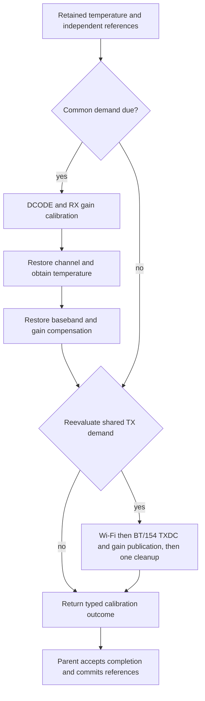

# PHY tracking contracts

See the [PHY architecture](../../README.md) for initialization, runtime
terminology and the ownership relationship with protocol runtimes and coex.

This module owns the source-derived tracking algorithms and read-only demand.
It does not grant RF access, stop protocol runtimes, or implement coexistence.
The registered PHY and physical-radio owner must remain coupled throughout
execution. A network queue credit, scheduler pause or CPU mutex alone is not
permission to mutate the shared PHY.

## Inspecting conditions

The registered radio and Wi-Fi owners expose `inspect_tracking(now_micros)`.
The [inspection contract](inspection/README.md) separates evaluation deadlines,
retained thermal conditions and physical admission. It reuses the executor's
predicates and does not replace its ordered, consuming decision process.

## Demand and execution

`PhyClientSnapshot::tracking_schedule_at(now_micros)` returns
`schedule::Schedule`:

- `Inactive`: no client requires a timer.
- `At(t)`: arm an absolute timer for the first due microsecond.
- `Due(demand)`: work is outstanding; hardware admission is still required.

Observation does not update source timestamps, temperature references or
calibration validity. Repeated observations after deferral retain the same
`due_since_micros`; they do not create additional execution obligations. This
instant reflects the source interval, not a measured maximum safe deferral.
BT and IEEE 802.15.4 share one tracking class but remain distinct clients.

Demand is copyable observation, not an ownership token. Re-observe the current
client set after waiting for admission: a client may have stopped while the
request was deferred. Do not execute an old copied demand as an RF grant.
The consuming `evaluate_immediate_tracking` transition retains its original
sample order and timestamp updates. It runs only when the caller commits to
execution; it must not be used merely to ask whether work is due. Its pending
owner remains pending until the selected target children complete.

`RegisteredPhyRadio::wait_for_tracking_demand` borrows the registered owner
while an absolute timer is pending. It returns demand without creating a
pending hardware transaction. Cancelling this wait or observing a clock error
leaves the physical owner intact; a later client release remains possible.
Cancellation after starting the consuming target operation is a different
boundary and still requires the documented failure/reset handling.

The Wi-Fi supervisor uses this read-only observation at completed role
boundaries. Its existing `WifiStopped::maintain_phy` path requires stopped DMA
and an inactive IRQ owner. A standalone connected station supports a MAC/RX/IRQ pause round trip,
including an explicit HIL request. This round trip withdraws the runtime
register owner from its arena, admits and releases PHY access, then republishes
the owner into the same arena before RX/IRQ resume. An explicit tracking request
consumes the registered PHY/platform owner while this access is held, reobserves
due work and restores MAC stop before release.
The station receive-policy snapshot must remain unchanged; RX resume separately
checks its saved descriptor cursor. The [observation-driven service](service/README.md)
is opt-in and defaults to disabled for each connected epoch.
Joint Wi-Fi/BLE/IEEE 802.15.4 grants are not implemented.

## Exclusive Wi-Fi access

HAL `owner::maintenance::WifiAccess` retains the existing
`RadioRuntimeOwner` and a closed interrupt-authority type: `MacInterruptSetup`
for a terminated epoch or `MacInterruptCheckpoint` for a paused one. It does
not create another PHY owner. `try_into_phy_maintenance` consumes those resources and checks inactive
MAC and disabled RX walker before exposing PHY operations. A failed admission
returns the original resources with an explicit reason and makes no writes.
The Wi-Fi composition treats a failed stopped precondition as a fault.

The checkpoint holds both returned MAC and WDEVPWR capabilities without
peripheral writes. The ESP-HAL route owns CPU detachment and same-core resume;
HAL owns the checkpoint representation. Checkpoint completion preserves the
interrupt-owner type: checked maintenance release cannot turn a paused route
into a cold setup. A timer request cannot implement the sealed
`InterruptAuthority` contract.

`RegisteredWifiPhy::maintain` consumes this access together with the registered
PHY across all awaits. An error retains both in an opaque failure; cancellation
does not return either owner. Success returns access for restoration, then
`try_release` rechecks MAC and RX walker before releasing register and IRQ
resources. Restoration failure retains the physical access and requires reset.
The driver distinguishes admission, PHY execution and restoration failures.

`WifiRoleOwner::maintain_phy` consumes the active role's logical PHY/platform
owner with already admitted physical access. It retains channel and startup
context and returns the same interrupt-authority type. It leaves restoration
to the paused role: the terminal `WifiStopped` path's disabling of both RX
policies is not appropriate for preserving an active station. The IRQ runtime's
`PausedInterruptEpoch::try_with_authority` retains the detached route and its
pending work while an owned operation holds the checkpoint. Failure and
cancellation expose no resumable epoch.

MAC restoration belongs to the Wi-Fi execution boundary. The terminal stopped
path disables both role receive policies and requests MAC stop after tracking.
The paused connected path preserves those policies and waits for MAC stop before
checking release. HAL checks the resulting hardware state; it does not silently
stop a live descriptor epoch to make admission succeed. The outer composition
must retain idle TX resources and either stopped RX ownership or the paused RX
owner with all outstanding leases preserved. Readback is not a substitute for
those ownership transitions.

The access contract is specific to the exclusive Wi-Fi route. The consuming
radio root makes other protocol owners unavailable; an application must not
infer this authority merely from a Wi-Fi client count or PTI value. This
exclusive route needs no invented coex acknowledgement. A future joint-radio
composition needs its own qualified admission contract, and cannot reuse this
permission while other physical clients remain active.
Coexistence timer programming does not certify a grant, and no equivalent
BLE/IEEE 802.15.4 maintenance admission is exposed. Low-level `SharedPhyHal`
continues to be a narrow register borrow, not an independently valid runtime
maintenance permission.

## Operations and hardware effects

The following effects are implemented source operations. They are not a list
of operations qualified for concurrent radio use. Child operations are
ordered inside the outer transition; completing one child does not release
the outer owner's exclusive access.

| Operation | Selection and effects | Commit / restoration boundary |
| --- | --- | --- |
| [Outer parameter tracking](parameters.rs) | Registered policy selects RFPLL, BT/154 power and calibration, Wi-Fi I2C/power/calibration, and temperature children. Inhibited policy skips hardware children. | Critical-section actions bracket the graph. The current target port acknowledges them logically; the caller supplies actual exclusion. Inhibited completion does not mean calibration data was refreshed. |
| [Power compensation](power.rs) | Computes a temperature decision; changed enabled gain publishes the selected class's gain through BBPLL calibration enable/disable edges. | Gain/temperature outcome follows the child and BBPLL tail. An unchanged decision does not publish gain. Live gain publication atomicity is not qualified. |
| [Wi-Fi I2C tracking](i2c.rs) | A temperature-band change executes two bounded masked analog-I2C writes. | The new band is committed only after both writes. No band change means no writes. The analog bus must have one transaction owner. Safe overlap with active TX/RX is not established. |
| [Temperature sampling](../analog/temperature.rs) | Reads PHY-I2C range and sensor code; may also write a new range. This is not an unconditional read-only operation. | The sensor transition carries matching completions. Concurrent sensor/range access is not qualified. |
| [RFPLL capacitor tracking](../analog/rfpll.rs) | ROM reference `RfpllCapTrackingTransition`: disables hardware frequency control, applies selected capacitor correction through analog I2C/memory, then enables hardware frequency control. This primitive is distinct from full `RfpllFrequencyTransition` and is not selected by the outer tracking action. | The capacitor child and control tail precede completion. This does not certify RF lock, uninterrupted reception or a bounded exclusive radio interval. Continuous-radio execution is not qualified. |
| [Current measured RFPLL correction](rfpll/README.md) | Bounded capacitor search, signed correction of the installed frequency-memory table, and current baseband-mode entry/restoration through `target_port::rfpll::maintain`. | Compiled comparisons cover command/memory effects and vendor-policy boundaries. The registered parent still keeps RFPLL disabled; whole-parent software comparisons include this branch, while timing and physical range limits remain unqualified. |
| [Common calibration](calibration.rs) | A temperature threshold selects DCODE, RX-gain calibration and channel restoration. | The branch restores MAC baseband and TX gain compensation before committing the common reference or entering class calibration. |
| [Shared TX calibration](calibration.rs) | A shared TX threshold selects software frequency control, forced gain/TX-RX state, TXDC/PWDET and class gain publication. | The graph restores its baseband/control and gain-compensation state. This is not proof that every protocol's MAC, key, TSF or DMA context is unchanged. No selected branch means no hardware actions in this child. |

Full cold registration and cache replay belong to
[calibration/registration](../calibration/registration.rs), not the periodic
scheduler. A serializable calibration snapshot does not certify hardware
restoration.

`PhyCalibrationTrackingParameters::decision()` is the single read-only
thermal decision used by the calibration transition. It exposes independent
RX and shared TX demand, their reference samples, absolute deltas
and thresholds in sensor units. Equality is due; a zero diagnostic threshold
forces both branches. It does not commit references, certify sample freshness
or provide RF authority. The common branch can obtain a new temperature during
channel restoration. TX demand is evaluated again after that restoration and
gain cleanup, so it can become due or cease to be due. An initial decision is
not an immutable list of jobs for an entire maintenance pass.

## Current parent and grant boundaries

The outer graph follows `phy_param_track_tot` in esp-phy-lib `b88e4b76`:

The combined calibration call keeps one RX reference and one shared TX
reference. When RX channel restoration replaces the sample, TX demand is
reevaluated against that sample. Selected Wi-Fi and BT/154 TX results remain
distinct; both complete inside one frequency/forced-gain envelope. Failure of
any requested child prevents terminal publication of the combined outcome.
Even a direct call with neither class selected can run the due TX envelope;
the normal scheduler admits work only for active clients. Each measurement
branch explicitly disables Wi-Fi baseband: after DCODE and before RX gain
calibration, or after TX PBus clearing and before calibration bandwidth setup.
This register operation is not a substitute for physical maintenance admission.

The vendor RX branch and shared TX branch each acquire and release grant
protection separately, as does RFPLL. Current `libcoexist.a` (`02c57071`)
provides strong hooks that request/release an event through the coex timer
engine. Those hooks do not themselves wait for a grant acknowledgement or
prove MAC/DMA quiescence. OER retains its wider physical maintenance admission
through the complete call; no new live-radio access is inferred from the hooks.

The vendor composition combines archive request/event mapping with ROM release
and timer operations. Its initializer installs the new mapper in the callback
table used by ROM release. The PHY request selects event 48, timer 5 and request
kind 2 (hardware selector 0), with zero timing arguments. Neither zero timing
arguments nor a successful return establish an indefinite or exclusive grant.
`coex_status_get` delegates to a software-state accessor; it is not a hardware
grant acknowledgement. A physical protection proof needs independent hardware
observations of active exchanges and release.

Beacon suppression or delayed transmission alone is insufficient: maintenance
admission must also establish what happens to an already active MPDU, immediate
ACK/BlockAck, RX and DMA. A request interval and the actual RF exclusion interval
are separate observations. A vendor beacon TX callback is a local terminal
notification, not acknowledgement from a receiver; even a success status must
be correlated with independent reception. A missing frame in one monitor
capture is not proof of omitted transmission: compare frame identities at an
independent receiver and retain each observer's FCS and capture limitations.
A correlated unicast ACK establishes completion of that exchange; it does not
establish RF exclusion throughout an overlapping protection request.
Suppressed promiscuous RX callbacks likewise do not certify DMA quiescence or
normal associated RX/ACK behavior. Retain the receive mode, incoming frame
identities and hardware timestamps when evaluating a narrower admission rule.
Observation windows must include the
last submitted frame's terminal event, or explicitly classify it as incomplete.
The vendor event path has no nested-acquisition count; independently pairing
requests for the same timer could let one caller's
release withdraw another caller's protection. Shared ownership must serialize
that physical request rather than manufacture independent grant leases.

The outer graph has call-order and grant-bracketing tests with explicitly
modeled children, plus a compiled comparison with actual children. The combined-calibration
comparison executes actual `phy_cal_param_track`, callback installation and all
of its archive/ROM measurement and restoration children against the compiled
production executor. It covers Wi-Fi, BT/154, both clients and an empty direct
request on channel 13/HT40, including thermal gates and reference reevaluation
after RX channel restoration. Ordered effects and the committed temperature,
RX and TX coefficient banks are compared. A failed TX conversion after RX
restoration must retain all pre-transaction semantic references and banks.

The combined comparison uses a valid installed sensor range, synthetic I2C,
RX-estimator and SAR measurements, and the archive's default weak grant hooks.
Its effect projection excludes only established I2C transport polling/setup,
PBus and estimator readiness-wait cadence, and the three unused SAR result
reads described below. It does not qualify external COEX overrides, RF
accuracy, physical exclusion or elapsed timing.

The complete `phy_param_track_tot` comparison uses the same peripherals and
projection, executing BT power, Wi-Fi I2C/power, combined RXCAL/TXCAL and final
temperature acquisition. It uses registered production policy: RFPLL is disabled,
calibration enabled and diagnostics disabled. Both power thresholds, signed
temperature range boundaries and nonzero retained Wi-Fi adjustments are covered.
Final shared power-cache values, per-class gain bases, I2C band, calibration
references and banks must match. BT runs before Wi-Fi and both share the power
cache; Wi-Fi can reuse the gain computed by BT. The independent additive
Wi-Fi adjustment is preserved through this runtime graph. The optional RF-test
power-selection producer is described below; it is not a calibration child.

A failed TXCAL cannot recover the normal client owner or publish partial
calibration state. Earlier completed power children remain committed; the outer
transaction does not claim a rollback of already executed hardware operations.
The validation-only RFPLL-enabled profile executes the same parent and actual
children with zero, positive and negative capacitor corrections, thermal
thresholds, all client selections and combined calibration. It compares the
RFPLL reference commit and frequency-memory effects alongside the remaining
parent state. As in the isolated memory profile, its projection removes one
vendor installed-layout query: production owns that layout explicitly. No
frequency-memory transaction or control write is removed. RFPLL completion
remains committed if a later TXCAL fails; normal-owner recovery is still denied.
This profile does not enable RFPLL in registered production policy. External
grant overrides, physical RFPLL qualification and hardware performance remain
separate gates.

The separate private-input
`coex_grant` test executes a linked vendor adapter registration, callback-table
installation, request and ROM release with modeled allocation/logging and bus
storage. It characterizes the linked software path, not physical arbitration
or timer progression. Hardware qualification remains separate.

## Timing observations

[Observation](observation.rs) names outer tracking calls and expensive
calibration steps. The executor emits `Started` before awaiting the port and
`Completed` only after accepting its completion. Port errors or rejected
completions emit `Failed`. Cancellation emits no fabricated terminal event.
Default observers require no clock or storage.

The allocation-free recorder accepts caller-provided monotonic timestamps.
It retains attempt/completion/failure counts, total terminal duration and
maximum duration per operation. Nested durations are inclusive: parent and
child totals must not be summed as exclusive CPU or RF time. Clock reversal,
overflow or malformed event pairing marks timing invalid. A selected call can
complete without performing calibration; committed branch flags retain that
separate meaning.

DCODE, RX gain and TX DC/PWDET also expose poll count, total time inside polls,
maximum poll duration, the number of Pending returns, and total/maximum gaps
from a Pending return to the following poll entry. Each completed child has
one final Ready poll; cancelled children cannot manufacture that completion.
Gaps are measured within each invocation, never between successive invocations.
The target wraps the actual child future without
adding wakes, polls or timers. These intervals include interrupts and observer
overhead, so they are not CPU cycle measurements. Operation time minus poll
time includes suspension, executor scheduling and outer transition overhead.
The measured Pending-to-poll gaps exclude the initial poll-entry delay and
outer transition overhead, but do not reveal when the awaited hardware or
timer actually became ready. Neither these gaps nor the remaining time may be
labelled requested hardware delay or CPU idle time. The recorder
and HIL validator reject malformed intervals instead of accepting them as a
successful measurement. Other operations have no poll breakdown.

The Wi-Fi Embassy adapter interprets `PhyAsyncDelay` as a minimum elapsed
duration. It captures an absolute deadline when creating the delay and checks
it before polling the Embassy timer. An already elapsed deadline completes
without registering an extra wake; a future deadline uses ordinary timer wake
registration. There is no busy wait, and the target's hardware edge limits and
settling durations remain unchanged. This is not a cooperative execution budget:
several completed waits may permit more hardware steps in one poll. The maximum
poll observation must therefore be considered independently of total pause time.
Bluetooth owns its separate time binding.

Diagnostic connected Wi-Fi keeps the recorder beside the parked runtime,
outside nested PHY futures. Callbacks borrow it briefly, with no borrow across
a wait and no formatted output. Successful pause reports include a snapshot.
Physical failures return their existing failure stage without a timing
snapshot. Diagnostics-off images have no timing observer.

## Physical ownership and errors

The existing stopped Wi-Fi path is a conservative admission contract for that
composition. It does not establish that all tracking operations physically
require disabling MAC, DMA and IRQ, nor that a smaller exclusion scope is
safe. No active-radio operation is admitted based only on its name or on a
similar driver for another chip.

A CPU critical section does not stop DMA. The async target executor must not
hold a CPU critical section across timer waits. The outer owner instead
retains the required hardware exclusion until terminal completion or failure.
A failed or abandoned tracking epoch cannot yield a ready owner without the
required reset/recovery.

A PHY operation may restore baseband enable bits. The caller must establish
its required postcondition after execution before publishing descriptor or
interrupt ownership. Existing `RxRingHalted` teardown rebuilds a new descriptor
epoch; it is not a transparent pause for outstanding upper-layer RX leases.

Source timestamps record the scheduler's execution request. They are not
independent evidence of RF quality, completed calibration branches or an
externally granted radio interval. Temperature-reference commits and typed
child outcomes remain the algorithm's completion authority.

`PhyParamTrackingOutcome::calibration` reports only committed common and
RX and requested TX calibration branches. Invoking a calibration child below its thermal
threshold leaves the corresponding flag false. Wrong-class or incomplete child
completions cannot publish this progress. These flags do not measure RF quality.

`WifiPhyMaintenanceRequest::Calibrate` selects a zero calibration threshold for
one due maintenance pass. It uses the existing common and Wi-Fi child graph
with real sensor readings; the stored policy and deadline remain unchanged.
It is an explicit diagnostic operation, not automatic periodic recalibration.
An early call still returns no work. Completion flags must confirm both branches
before a caller claims that calibration executed.

During a connected pause the non-runnable datapath remains in permanent cold
storage beside its worker mailbox while PHY futures execute. Only the restored
arena capability permits consuming this parked state. Failure or cancellation
retains it without hardware authority; no `RefCell` borrow spans an await.

Runtime Dcode passes an explicit delay factory through both its direct PHY-I2C
bindings and its nested RFPLL frequency transitions. The report keeps three
nonoverlapping groups: direct I2C, RFPLL I2C and explicit RFPLL settling/lock
delays. Each group retains completed wait counts, requested microseconds,
elapsed microseconds and maximum deadline lateness. I2C groups also count the
subset of waits caused by a busy bus at command start; remaining waits precede
transaction-completion reads. These counts are not hardware-ready timestamps.

The timer adapter supplies the same start/deadline used for its own wait.
Events run after polling the timer; the completion timestamp is sampled before
recorder work. This avoids making a one-microsecond wait expire merely by
recording its start before polling. The observer and its state are local to the
maintenance invocation; no global active-operation identifier or extra wake
source is used. Overflow, unsupported timing or unmatched events invalidate the
report. The diagnostic count bound does not change hardware retry limits.

D-code visits Wi-Fi channels 1, 5, 10 and 14 through the frequency-table
switch path. Each switch waits for channel readiness and updates NRX once
before CKGEN reset and two D-code reads. It does not perform a full capacitor
search. Its RFPLL settle timing therefore describes channel-switch waits;
analog PLL locked/unlocked and RFPLL-I2C counters remain zero on this path.
Channel readiness is not an analog lock measurement. The standalone tracking
RFPLL operation remains distinct from these channel switches.

RX gain recalibration visits 2484 MHz through the initialized frequency table,
using the same table-selection entry as D-code. Direct synthesizer programming
remains a separate entry for cold frequency-table construction. RX gain does
not run a capacitor search merely because its input is expressed in MHz.

The RX-gain root retains newly measured per-gain DC, Wi-Fi base DC and RXBB
fine corrections until both gain banks are published. Wi-Fi entries use those
fresh corrections; the shared Bluetooth/IEEE 802.15.4 bank uses fixed baseband
DC with its own per-gain radio DC. The independent Wi-Fi radio-DC measurement
starts only after the low PBus level has been acknowledged. A timeout cannot
advance it to measurement. Parent semantic state is committed only after the
complete calibration child, including channel and baseband restoration.

The channel and runtime gain regeneration use the current S31 Wi-Fi coefficient
profile from `phy_wifi_get_tx_tab_new`, with provenance beside the source
constants. Wi-Fi adds its independent signed-byte adjustment to the gain base;
Bluetooth/IEEE 802.15.4 retains a separate subtractive attenuation input.
The Wi-Fi adjustment belongs to semantic Wi-Fi state and its calibration
snapshot. Gain calculation, calibrated coefficient selection and gain-memory
publication remain separate boundaries. Matching their effects does not
establish RF power accuracy or qualify the enclosing RXCAL/TXCAL parent.
The current archive initializes its additive adjustment to zero, but calibration
backup/recovery preserves it and init-parameter loading does not clear it.
Zero at startup is therefore not a lifetime invariant. The comparison exercises
restored synthetic values through the actual gain callback.
The production semantic state does not import this vendor calibration image.

A known producer is `librftest.a::set_rate_power_index`, in the optional
`CONFIG_ESP_PHY_ENABLE_CERT_TEST` composition. The authenticated S31 RF-test
archive at `b88e4b76e090ae59c51cb00b916d38def895b396` has SHA-256
`547786cd684eb9cd8902955176e9a9a7f113d8faa3f415e12108ed261f55a11e`.
The function subtracts signed attenuation from the selected target power,
narrows to a signed byte, and selects a MAC power index. Above its code ceiling
of 84 it stores the excess as the additive adjustment and regenerates Wi-Fi gain
before publishing index 21. Otherwise it stores the attenuation's rounding
correction modulo four and publishes the arithmetic-shifted power index without
an immediate gain regeneration. These are vendor numeric codes, not measured RF
power. A private executable characterization runs the actual RF-test body, ROM
target selection and current PHY gain publication, including signed wrap cases.

This establishes a power-selection producer, not an additional thermal
calibration algorithm or the only possible writer. It does not establish an
ordinary-networking call site, physical units for every profile, or permission
to run the test API while radio traffic is active. The runtime tracking executor
preserves this independent configuration; RF-test MAC power policy does not
belong inside RXCAL/TXCAL.

The TX-DC/PWDET child uses the current archive's Wi-Fi and BT/154 forms through
one bounded target executor. Its initial TX-on prefix includes the final
selector-five PBus command before SAR configuration, followed by separate
per-row path and baseband-gain settings. The child restores its retained
power-detector fields before publishing measured DC rows. These measurements
do not update the independent Wi-Fi additive gain adjustment.

Private comparisons execute the actual current root and ROM children against
compiled production, covering calculated rows and ordered control effects.
They exclude only OER's PBus readiness-wait delays and three unused read-only
SAR result words fetched by the ROM's general result reader. Production reads
the one result consumed by the tone-average algorithm. These comparisons do
not establish physical SAR accuracy. The combined comparison above adds the
enclosing RXCAL/TXCAL software graph without extending the hardware claim.

Each tone-SAR conversion bounds unsuccessful readiness observations using
`HARDWARE_EDGE_LIMIT`. Exhaustion is `ReadyObservationLimit`, carrying the
measurement, sample and observation count; it is distinct from an externally
reported elapsed deadline and from the global executor operation limit. A
failed conversion cannot publish a measured sample. The enclosing TX-DC root
propagates this failure through its cleanup without publishing DC coefficients.

Runtime TX DC/PWDET reports five separate timer groups: PBus, search settling,
tone arming, SAR triggering and root setup/cleanup. PBus waits distinguish a
busy command start from waiting before a completion-edge read. SAR ready and
not-ready counters consume existing status completions. Repeated not-ready
samples are synchronous polls in the finite calibration executor, not timer
waits; these counters reveal that work without adding reads or changing retries.

RX gain and cold registration retain unobserved delay factories. Diagnostics-off observers do
not request deadline measurements. Lateness includes delay-future construction,
executor resumption, timer polling and timestamp sampling; it is not a pure
scheduler-latency measurement. Instrumentation still has a cost, especially
for microsecond waits. Wait times lie inside the enclosing operation/poll/gap
intervals and must not be added to those parent totals.
