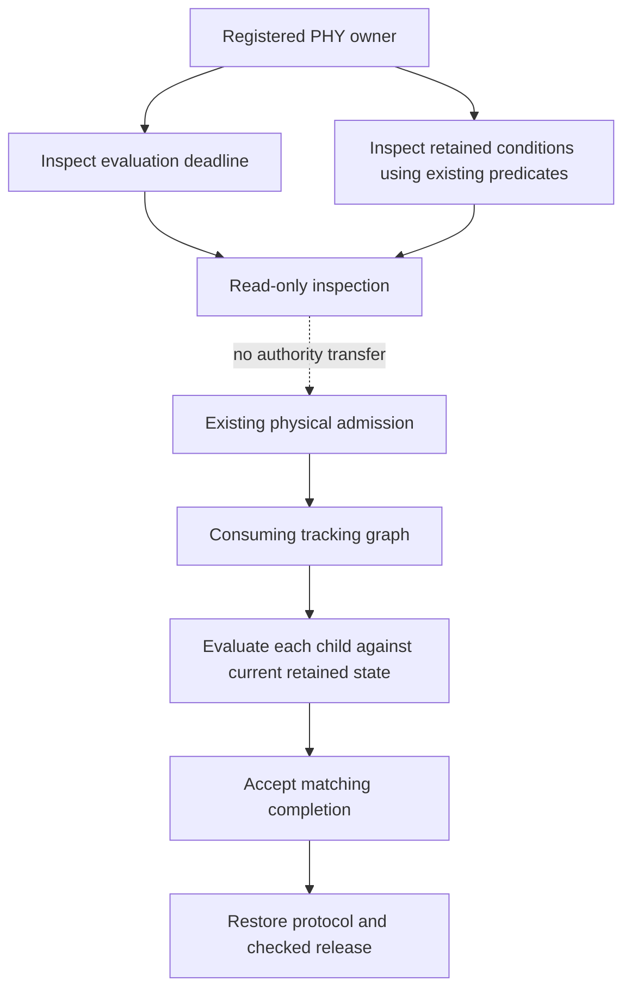

# Tracking inspection and execution boundaries

`RegisteredPhyRadio::inspect_tracking(now_micros)` and
`RegisteredWifiPhy::inspect_tracking(now_micros)` borrow the registered owner
and return `inspection::Inspection`. They do not consume a client, advance a
tracking timestamp, sample temperature, access hardware or admit maintenance.
Clock errors come from the existing client scheduler. No separate scheduler
or copy of calibration reference state is introduced.

## What the snapshot means

| Field | Meaning |
| --- | --- |
| `schedule` | Inactive, the next evaluation deadline, or outstanding evaluation demand. Due does not mean every calibration branch is due. |
| `inhibited` | The registered outer policy suppresses its hardware children. The source schedule is still reported. |
| `rfpll` | Enabled active RFPLL-cap inputs; `is_due()` is the same predicate used by the transition. `None` means disabled, inactive or inhibited. The current registered policy disables this child. |
| `wifi`, `bluetooth_ieee802154` | Conditions for active tracking classes. BT and 154 share one class without merging their protocol owners. |
| `power` | Existing power decision, including the difference between recalculating a candidate gain and needing a hardware publication. |
| `calibration` | Existing common/TX thermal decision; absent if policy disables calibration. Common demand appearing in two active classes is the same shared state, not two queued jobs. |
| `wifi_i2c` | Current retained temperature and band; `update_required()` uses the transition's own band decision. |

`temperature` carries the retained value and acquisition provenance:
`Unobserved`, `Undated`, or a monotonic acquisition window. Reversed clocks
and acquisition intervals exceeding the stored duration are explicit invalid
provenance states. Runtime sensor
completion records the start and end of the complete sensor transition.
`freshness(now, maximum_age)` measures age conservatively from acquisition
start, including sensor waits, and rejects reversed clocks. Other paths that
replace temperature without a clock invalidate the old date. The inspection
call itself never acquires a sample. Values and thresholds use PHY sensor
units, not guaranteed Celsius values.

This snapshot is deliberately not an executable plan. Earlier power children
can change shared tracking references. Common calibration restores the channel
and can change the temperature used by the later TX decision. The executor
therefore evaluates at each real child boundary. A copied inspection cannot
force the later branch, authorize concurrent writes or refresh a result.
The diagnostic zero-threshold request is not applied to normal inspection.

## Cadence, effects and admission

The implementation separates a cadence for evaluating tracking from the
thermal conditions of the hardware operations. It contains no hourly or daily
runtime-calibration schedule and provides no qualified safe deferral period.
Cold initialization and reset/wakeup replay are separate lifecycle operations.

| Kind | Current selection | Current hardware boundary |
| --- | --- | --- |
| Pure inspection / decision | Explicit call; no I/O | Shared immutable registered-state borrow; no RF exclusion |
| Temperature observation | Selected by the outer graph, after other children | Sensor access may change analog range; admitted PHY access remains held |
| Gain compensation | Temperature-dependent candidate and changed enabled gain | BBPLL/gain publication inside admitted access; live-TX atomicity is not qualified |
| Wi-Fi analog-I2C adjustment | Temperature-band change | Two transactions with commit after both; safe overlap with radio traffic is unknown |
| RFPLL-cap correction | Enable policy and its own thermal delta | Frequency-control changes and correction; distinct from full frequency calibration |
| Common recalibration | Common thermal reference delta | DCODE, RX calibration/table publication, channel and gain restoration |
| Class TX recalibration | Selected TX reference delta, reevaluated after common work | Frequency/forced gain/TX-RX changes, measurement and restoration |

Fewer writes or a conditional gain calculation do not constitute a measured
fast RF-safe operation. In the connected Wi-Fi composition, all selected
hardware children retain the same exclusive access. A child completion or an
async Pending return is not a resumable protocol checkpoint. Hardware coex
timer control does not supply a joint-protocol maintenance grant.

The connected Wi-Fi composition exposes an opt-in observation-driven service
and a coalescing external request for a new measurement. These notifications
carry no temperature and no RF authority. The existing `Track` request follows
registered policy; `Calibrate` is a due-only diagnostic override for both heavy
branches. Independent operations preserve the periodic scheduler timestamps.
See the [service contract](../service/README.md). Inspection itself never starts
the service or performs hardware work.

Execution outcomes, observed conditions and protocol restoration remain three
separate facts. Failure after consuming the operation retains an unusable epoch;
inspection does not change that failure contract. See the parent
[tracking contract](../README.md) and [PHY architecture](../../../README.md).
