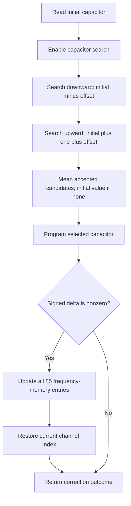

# Runtime RFPLL correction

This component owns the finite measured capacitor search and conditional
frequency-memory update. Its source reference is `phy_rfpll_cap_init_cal_new`
and `phy_rfpll_cap_correct_new` in esp-phy-lib revision
`b88e4b76e090ae59c51cb00b916d38def895b396`, archive SHA-256
`d4218e359b9716c616cbf116172f44d9195d4f2e020fad73279067e92d08e580`.

`search::Search` issues helper operations and accepts their completions. It
keeps requested capacitor values separate from the helper's programmed value:
`phy_write_pll_cap` clamps negative signed inputs, while the search accumulates
the original unsigned candidate. The sum wraps at 16 bits. A status accepting
no candidate restores the initial requested value and returns a zero delta;
this is not proof of RFPLL lock.



Each direction permits at most ten status samples and ends early after two
direction-specific boundary observations. The observations need not be
consecutive. Every candidate write is followed by an explicit five-microsecond
settle before reading status. The final write has no additional search settle.
`Correction` consumes the search outcome and updates the existing frequency
memory with the measured signed delta, which is not restricted to ±2.

The memory child uses the layout installed by OER's cold initialization:
85 entries, base 32, stride 7. Vendor code reads that layout from hardware;
OER retains it as part of its initialization contract. Replacing that layout
requires changing the memory child as well. The adjustment retains the full
signed intermediate before splitting data and write mode for the typed PAC.
In particular, underflow can propagate into the mode byte, as in ROM. Matching
that behavior does not qualify an out-of-range correction on physical RF.

`target_port::rfpll::{search, correct}` uses the existing typed I2C bindings,
bounded I2C completion waits and frequency-memory operations. The caller must
already hold exclusive physical PHY access. This child does not acquire a
coexistence grant, disable hardware frequency updates, change thermal reference
state, or authorize traffic to resume after failure.

`thermal::Transition` owns the temperature gate, measured correction and
current frequency-control envelope. `target_port::rfpll::track` executes it.
`maintain` requests unconditional work through that same transition, using a
zero threshold for diagnostic callers; it does not duplicate the envelope:

```mermaid
sequenceDiagram
    participant Owner as Exclusive physical owner
    participant PHY as RFPLL maintenance
    participant HAL as Typed HAL / PAC
    Owner->>PHY: maintain(current_channel)
    PHY->>HAL: Select software frequency control (baseband mode 2)
    PHY->>PHY: Await 2 microseconds
    PHY->>HAL: Read SDM counter, then I2C-number control
    PHY->>PHY: Search and conditional memory correction
    alt Successful correction
        PHY->>HAL: Restore hardware frequency control (baseband mode 0)
        PHY-->>Owner: Correction outcome
    else Hardware failure
        PHY-->>Owner: Error; no restoration write
        Note over Owner: Retain/quarantine physical owner
    end
```

The current archive uses the low two bits of `FREQUENCY_PARAMETER_1_STATUS`
at `0x20100028`; the ROM helpers instead change the disable bit of
`FREQUENCY_CONTROL` at `0x2010001c`. These operations are not interchangeable.
The existing baseband-mode accessor implements the new register update while
preserving all other bits. Success selects mode zero, as the vendor does;
it does not restore an arbitrary saved mode. Once started, `maintain` must not
be cancelled. On error its caller remains responsible for fault containment.

## Parent boundary and coverage

The current archive initializes the parent's RFPLL-enable byte to one and its
tracking child uses a default delta of 15 sensor units. That initializer is not
a proof that no linked component later changes the policy. The grant acquire
and release symbols in this archive are weak no-op definitions; their final
behavior depends on symbol resolution in the linked vendor composition.

The current vendor child admits work when the absolute difference between
signed current and reference temperatures is **at least** the threshold and
its shared busy flag is clear. Debug bit zero selects the caller's byte-sized
override; a zero override admits even an unchanged temperature. Debug bit one
alone does not replace the RFPLL threshold. The difference is evaluated without
wrapping it back into a signed 16-bit temperature.

After a completed correction, including a zero correction with no accepted
capacitor samples, vendor updates its reference to the current temperature and
sets the RFPLL result flag. This indicates that the procedure ran, not that
lock was achieved. A skipped invocation preserves the reference and result
flags. Vendor publishes the reference and result flag before restoring hardware
frequency control, then clears busy. OER's registered parent must retain its
existing rule that semantic
completion cannot be published before checked physical restoration.

The outer RFPLL action lowers to this current thermal child. Its owner keeps
an exclusive borrow of `PhyState`; it cannot mint the outer completion token
until the child consumes hardware-control restoration. Only consuming this
terminal owner commits the reference temperature. Skip completion preserves
the previous reference. Errors before restoration cannot publish a successful
outer completion. The vendor busy flag is represented by physical admission
and exclusive ownership, not a second mutable lock inside this algorithm.

Registered OER policy keeps the RFPLL branch disabled pending physical
qualification. Compiled comparisons include the RFPLL-enabled parent with
zero, positive and negative corrections.
The ROM status-based correction is a distinct reference primitive with its
own default threshold and fixed ±2 correction; the outer RFPLL action no
longer selects it.

Host tests cover bounded search termination, direction changes, arithmetic
boundaries, completion ordering and channel restoration after memory updates.
The compiled probes `open_phy_rfpll_trace_search` and
`open_phy_rfpll_trace_maintain` invoke production target entries, including I2C
and delay operations. Private-input executable tests compare the search's I2C
commands and requested settling delays, and the frequency-control envelope
against the admitted vendor child with zero and nonzero corrections. Every
memory transaction and the final channel restoration are compared for the
installed layout. `open_phy_rfpll_trace_track` additionally compares threshold,
debug override, skipped/executed outcomes and the resulting reference against
the admitted vendor child. Vendor-only cases retain the busy/result-flag
characterization. Tests also
check that a bounded I2C timeout returns without restoring hardware control.
See the [comparison contract](../../../../../../../verification/vendor/projects/esp32s31/blobray-provider/models/README.md).

The comparison separates the production I2C executor's one-microsecond waits
from the ROM's polling. It does not assert equal execution time or raw polling
traces. Alternative memory layouts, linked coexistence grants and physical RF behavior
require separate evidence. The validation-only full-parent profile is described
in the [tracking contract](../README.md).

`WifiPhyMaintenanceRequest::MeasureRfpll` selects this child alone with a zero
thermal threshold under the existing exclusive Wi-Fi maintenance owner. It
requires an explicit `maximum_age_micros` and rechecks the dated temperature
sample after physical admission; forcing measurement does not bypass freshness.
It preserves registered policy and periodic deadlines. Successful completion exits
the maintenance graph before power/calibration/temperature children; failure
retains the poisoned epoch and physical access. The request does not grant joint
radio access and must not be cancelled after hardware work begins. Conditional
`Operation::Rfpll` retains its normal thermal predicate. The automatic service
currently does not select either RFPLL request.

`ObservedOperation { operation: Operation::Rfpll, maximum_age_micros }` uses the
same child and thermal threshold, but rejects a stale, undated or invalid-clock
sensor observation after physical admission. Acquisition and RFPLL remain
separate operations with checked restoration between them. The sample timestamp
comes from the real completed sensor transaction, never from inspection or a
request deadline. This selected request does not enable periodic RFPLL.

## Terminal observations

The parameter target executor calls `PhyTargetObserver::rfpll_completed` only
after the child reaches its terminal state and commits its reference. The
value-only `Observation` retains the thermal request and exact procedure result;
it grants no access to the hardware. No callback runs on an unfinished or failed
child. The maintenance recorder accepts one such observation while RFPLL timing
is active and flags duplicate or out-of-scope records as invalid.

A missing correction means the thermal predicate skipped hardware work. A
present zero correction may have zero accepted samples; it is not a lock claim.
For a nonzero correction, the result includes the completed memory entry count
and restored frequency index. The selected capacitor is the requested helper
input, not readback of the clamped value. Temperature is the retained sample used
at invocation, not an implicit new sensor reading. These distinctions remain
explicit in HIL's separate, correlated RFPLL detail frame, preserving the bounded
main pause frame. Normal production observers remain no-ops.

Observers opting into `OBSERVE_RFPLL_AGE` also receive the conservative sample
age at RFPLL entry, measured from acquisition start. Missing or invalid timing
is `None`; zero is never substituted. With observation disabled, this detail
adds no clock read. Age records provenance and does not authorize RF access.
