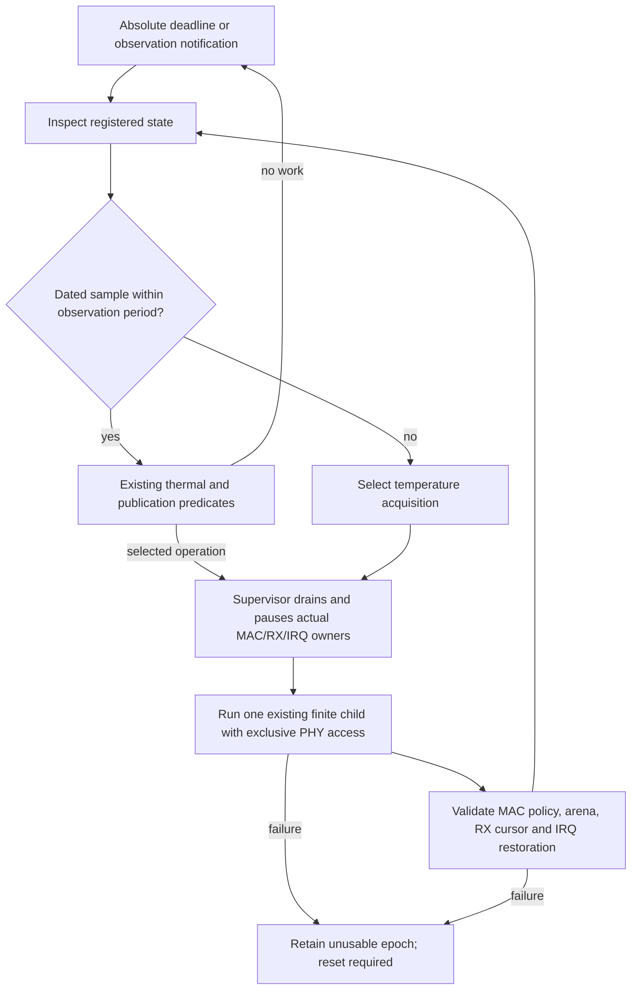

# Observation-driven Wi-Fi maintenance

`tracking::service::Config` selects one hardware operation from a current
`Inspection`. It owns only the requested observation period. The registered
PHY remains the single owner of sensor values, calibration references and
client deadlines. The service does not duplicate those values in a queue.

The connected Wi-Fi composition exposes `configure_station_tracking`,
`request_station_temperature_observation`, `station_tracking_status` and
`station_tracking_report`. Configuration is explicit and ends with the
connected epoch. The default is disabled. This is a standalone Wi-Fi path;
shared Wi-Fi/Bluetooth/IEEE 802.15.4 access remains unsupported.

## Observation and selection

A missing or stale sensor date selects temperature acquisition before using
thermal predicates. Runtime acquisition records its start and completion in
the same monotonic microsecond clock as the scheduler. Age includes acquisition
waits. Channel restoration and other undated replacements invalidate the old
sample date. An inspection timestamp never substitutes for a sensor sample.

Given a fresh sample, selection checks analog-I2C publication, Wi-Fi gain
publication, common calibration and TX calibration in that order. After each
operation the composition restores the protocol and inspects the actual state
again. Common channel restoration can replace temperature, requiring a new
dated observation before the subsequent TX decision. A selected operation
retains its existing thermal predicate; selection is not forced calibration.
Automatic requests recheck sample age after physical admission. If waiting made
the sample stale, no child executes, no calibration reference or periodic
clock advances, and the restored service selects a new observation. Deferred
attempts remain distinct from completed operations in the report.

The RFPLL-cap child remains disabled by registered policy. The service suspends
if enabled RFPLL demand appears: it cannot silently acknowledge an unsupported
operation. Reversed clocks, shared clients and an observation whose own duration
exceeds the configured period also suspend service. This prevents an impossible
sampling cadence from generating an endless immediate pause loop.

## Scheduling and ownership

The service waits on an Embassy deadline or a signal. External notifications
coalesce and request a measurement; they cannot supply a temperature or grant
RF access. A notification arriving during an operation survives its completion.
An explicit diagnostic request and automatic work have separate completion
routing, so automatic completion cannot satisfy an unrelated HIL request.

All hardware children use the existing consuming maintenance transaction.
Neither a child `Pending` return nor a software queue becoming empty releases
RF. The protocol can run between separately restored operations. RX/DCODE and
TXDC/PWDET remain complete measurement branches; their internal waits are not
preemption points. Selected operations do not advance the periodic wrapper's
evaluation timestamps or acknowledge unrelated branches.

Disabling configuration prevents further automatic selection. It does not
cancel an already admitted hardware operation. Callers needing a restoration
barrier can follow disable with an explicit access round trip. Reconfiguration
while an automatic operation is pending is rejected as busy. Selection checks
that configuration is still current after inspection. Ending the connected
epoch clears a cancelled selection; a failed operation disables automatic
retry and retains its reported cause until explicit reconfiguration.

## Diagnostics and limits

`TrackingReport` counts completed operations, committed calibration branches,
physical pause total/maximum, faults and suspension. Overflow invalidates the
report. It measures physical service interruption, not pure CPU residence or
measured RF airtime. Timer observation and the network counters remain separate.

Run the focused set through `cargo hil run-all --tag phy-maintenance --network patched-xarxa`.
Each scenario applies and verifies its own fixture; hardware evidence stays in
the runner's ignored output.

HIL provides `diagnostic-station-phy-temperature`, `-wifi-power`, `-wifi-i2c`,
`-common-calibration`, `-tx-calibration` and `-tracking-service`. Common/TX
scenarios force only their requested measurement branch for diagnosis. The
service scenario measures a four-second automatic window with a one-second
observation period inside the twelve-second UDP workload. Its correlated
service detail precedes completion; host timeout includes the specified window.
The window timer is measurement duration, not a guessed readiness delay.
`diagnostic-station-phy-service-task-poll` and `-control-task-poll` compare
service and access-only control with identical task-residence instrumentation,
one twelve-second run and 130 Mbit/s offered TX. Residence describes time inside
instrumented task polls on each core, not complete core utilization including
all IRQs and uninstrumented work.

The observation period is not a thermally safe maximum deferral time. There
is no hourly/daily calibration policy, thermal-stability qualification, or
claim that compensation can overlap active TX. The current conservative
boundary pauses Wi-Fi even for short sensor and compensation operations.

## Vendor correspondence

The reviewed current archive (`b88e4b76e090ae59c51cb00b916d38def895b396`,
SHA-256 `d4218e359b9716c616cbf116172f44d9195d4f2e020fad73279067e92d08e580`)
invokes power/I2C children before its combined calibration parent and samples
temperature at the end. Its calibration parent brackets common and TX work
with separate grant hooks. The service deliberately observes before deciding
and restores the complete Wi-Fi protocol between independent operations.
It does not claim instruction-order equivalence to that vendor parent.

The runtime calibration transition uses the current vendor's shared TX
reference, with Wi-Fi then BT/154 inside one TX envelope. This does not admit
joint execution: the observation service still rejects shared-radio use.
Current RFPLL tracking uses a threshold of 15 sensor units and physical
admission. Automatic RFPLL enable remains unavailable pending hardware
qualification and complete child-effect comparison. Individual source-verified
leaves do not qualify the whole runtime service.
