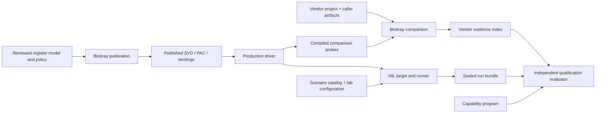

# Архитектура инструментов, проверки и HIL

Дата: 2026-09-05. Реализация согласованной миграции завершена. Последующим
исправлением устранены оба найденных сбоя диагностических HIL профилей. Исходный аудит и принятый план сохранены как
[исторический документ](tooling-audit/initial-audit.md), инвентарь базы
`994aa093` — в [tooling-audit](tooling-audit/README.md).

## Карта владельцев

| Область | Назначение |
| --- | --- |
| [tools/blobray](../tools/blobray/README.md) | Самостоятельный generic binary analyzer, comparison engine и publisher; существующие crates/addons/data catalogs |
| [tools/memory-report](../tools/memory-report/README.md) | Универсальная ELF memory/stack library + CLI; policy принадлежит потребителю |
| [tools/repo](../tools/repo/README.md) | Rust `cargo xtask`: repository gates, Cargo graph checks, builds и tests |
| [verification/vendor/projects](../verification/README.md) | Конкретные vendor investigations: manifests, reviewed project overlays, compiled providers, probes и host composition |
| [verification/vendor/chips](../verification/vendor/chips/esp32s31/chip.toml) | Повторно используемые chip identities/providers, отдельно от artifact-specific investigation |
| [registers/esp32s31](../registers/esp32s31/README.md) | Model, ownership/API policy, provenance, reviewed upstream input и publication composition |
| [qualification/evaluator](../qualification/evaluator/README.md) | Независимый readiness evaluator; прежние package identity и CLI |
| [qualification/targets](../qualification/README.md) | Три capability programs и датированная история; sealed evidence здесь не подменяется Markdown |
| [hil](../hil/README.md) | Wire protocol, лаборатория, workloads, embedded test compositions и evidence producer |
| [examples](../examples/esp32s31-station/README.md) | Обычные application compositions, без зависимости на HIL harness |

Новые Cargo packages не создавались. Доменные каталоги и Cargo workspaces
имеют разные обязанности: workspace управляет совместной сборкой и lockfile,
каталог обозначает владельца. Публичные package, CLI, provider/project IDs и
существующие wire/schema identities были сохранены миграцией. Последующее
исправление RX delivery повышает wire protocol до v77; runner и firmware
обновляются вместе. Path-based evidence freshness
может измениться при переносе исходников.

`validation` — операция проверки конкретного входа/инварианта, а не общий
контейнер. Product verification относится к требованиям, product validation —
к пригодности для использования; обе могут использовать тесты и анализ.
См. [NASA](https://www.nasa.gov/reference/5-3-product-verification/).
`hil` обозначает способ выполнения, а qualification — независимое решение
о готовности. Поэтому эти области не объединены в одну папку.

## Направление данных и решений

Blobray отвечает за сравнение, HIL — за фактический аппаратный run, evaluator —
за product readiness. Перенос evaluator рядом с programs не создаёт зависимости
на producer implementation. Его private DTOs остаются независимыми проекциями
serialized documents; общий validator или новая schema crate не добавлены.

Документация [qualification v4](../qualification/README.md) теперь описывает
реальное поведение: implementation/host/async — явные declarations с проверкой
согласованности, vendor/HIL — derived axes по evidence. Валидная неполная
программа не является passing readiness gate. Поиск Rust source spelling
не восстановлен как мнимая замена доказательствам.

## Register publication

`registers/esp32s31/model` содержит device/peripherals, MMIO map и reviewed
assertions; `policy` — API/lints/shared ownership ranges; `evidence` — provenance.
`upstream/platform-radio-deps.svd` является reviewed input. В `published`
находятся generated radio SVD/bindings, а оба generated Rust outputs остаются
в production PAC. Generic generator остаётся в Blobray.

Source-only composition явно выбирает model, API, reviewed assertions,
chip provider, общий lint pack и девять evidence catalogs. Статическая проверка
этих reviewed TOML inputs не требует vendor binaries. Full investigation явно
выбирает дополнительный artifact context.
Новая `[registers].ownership-policy` ссылается на строгий schema-1 pack общего
scope. Одновременный inline `owned-ranges` отвергается: merge/override precedence
нет. Policy участвует в cache invalidation и защите publication inputs от
перезаписи outputs. Остальные selection sets не наследуются автоматически.

Команда `registers generate-pac-api` использует прежний semantic PAC generator
и позволяет проверять его выход без artifact-scoped project publication.
Поддерживаемый source-only workflow описан у [publication owner](../registers/esp32s31/publication/README.md).
Полный `project publish` сохраняет собственные требования к reviewed artifacts.

## HIL owners и каталог

Host runner разделён на `scenario`, `image`, `lab`, `fixture`, `session`,
`workload`, `evidence`, `reporting`. ImageClass/recipes принадлежат image;
fixture guard — лаборатории; UART capture lifetime — session; immutable run
archive/seal — evidence; HTML/history — reporting. Целые execution/session
owners и порядок handoff/drop сохранены: независимое ревью подтвердило
неизменность 17 Drop implementations и полей пяти живых владельцев ресурсов.
65 host файлов распределены по владельцам, 53 тестовых модуля вынесены
в соседние файлы. В embedded runtime выделены
value-only RX statistics, связанные boot/console/stack owners оставлены вместе.

189 scenario TOML разложены по domains и побайтно сохранены. Catalog ID,
repetitions, tags и image selection не изменены. `run-all` сохраняет порядок
`ImageClass::ALL`, внутри каждого класса — прежний порядок IDs.

Оба reader независимо поддерживают рекурсивный каталог, требуют filename = ID,
отклоняют duplicates/unsupported entries и symlinks, включая ancestors входного
пути. README.md — явно разрешённое описание. Общие synthetic fixtures проверяют
совместимость формата, но parsing/validation code между producer и evaluator
не разделяется. Это валидация стабильного source tree, не sandbox против
одновременной подмены файлов другим процессом.

[Обзор firmware support](tooling-audit/FIRMWARE_SUPPORT_REVIEW.md) завершил
условный этап выделения общего boot/linker: текущая HIL stage-two ABI связана
с image packing, PSRAM adoption, relocation и IRQ stacks. У примеров обычный
ESP-HAL entry. Общего безопасного owner с двумя существующими consumers пока
нет; speculative support crate не создана, ограничение examples явно сохранено.

## Blobray и repository checks

`providers` заменил внутренний `harnesses`: это registry/composition, не набор
HIL прошивок. Neutral reviewed memory/pointer descriptors перенесены в
существующий `analysis-model`; pointer recognizer остаётся в RISC-V backend.
Оба declarative knowledge provider больше не тянут backend/execution models.
Прежние public reexports сохранены, у immutable pointer descriptor добавлены
только read-only accessors. Typed boundary проверена по Cargo graph и compiled
semantic tests.

Repository gates и Cargo graph resolution теперь принадлежат Rust package
`oer-xtask` в `tools/repo`. Их Rust tests находятся рядом с модулями и в
`tools/repo/tests`; process limiter и его tests принадлежат Blobray.
Linux/OpenWrt HIL helpers остаются на месте. Текущая command map —
[tools/repo/README.md](../tools/repo/README.md); область переноса —
[план automation](tooling-audit/XTASK_PORTABILITY_PLAN.md).

Обязательная проверка регистров выполняется в source-only publication context:
validate и четыре проверки generated outputs. Full investigation отдельно
проверяется через `project configure --check`; artifact-scoped publication
сохраняет требования к authenticated run bindings. Общие static lint/evidence
packs выбраны явно, поэтому смена контекста не исключает прежние проверки.

## История и воспроизводимость

Private run bindings и build caches из прежнего `verification/vendor/targets`
не перемещались. Старый local subtree явно ignored, поэтому перенос его
source `.gitignore` не делает приватные файлы кандидатами на коммит.
Current projects принимают явный caller-selected run spec.

Исторические revisions/snapshots и qualification records сохраняют исходные
байты и identities. Sealed HIL bundles, vendor reports и их hashes не
переписывались под новые paths. Новые source paths могут сделать старое
evidence непригодным для текущей qualification; это корректная проверка
freshness. Outputs остаются у своих владельцев, общего `artifacts` каталога нет.

## Итоговая проверка структурной миграции

Это результаты до переноса scripts в Rust. Они сохраняют исходные команды
и количества tests; новый xtask gate требует отдельного запуска.

| Проверка | Результат |
| --- | --- |
| `cargo check --workspace --locked --offline` | PASS |
| `cargo test --workspace --locked --offline` | 3957 passed, 23 ignored, 0 failed |
| Сохранность тестов относительно базы | Миграция сохранила прежние тесты и добавила 14 регрессий; исправления добавили ещё 4 в соответствующих workspace |
| `cargo fmt --all -- --check` во всех восьми workspace | PASS |
| Locked/offline metadata всех восьми workspace | PASS |
| Девять отдельных network dependency graphs | PASS |
| Repository Python tests + watchdog tests | 16 + 6 PASS |
| Syntax check и ShellCheck всех 11 shell scripts | PASS |
| Strict rustdoc изменённых host/model packages | PASS |
| Standalone Blobray extraction build | PASS |
| `tools/repo/audit-source-only.sh` после окончательного выбора static policy | PASS |
| HIL image classes после исправления дефектов | **12/12 PASS**, placement/stack/source graph и фактические SHA-256 проверены |

Source-only gate включает Clippy workspace с `-D warnings` и существующим
разделением политики `disallowed-methods`: production driver проверяется
отдельно на embedded target. Он также проверяет примеры, register publication,
performance image и его конечный ELF через ограниченный по ресурсам Blobray.
Финальная register validation проверила lint policy, девять каталогов,
296 источников и 14 evidence ranges. Усиленный существующий host regression
падает при отсутствии этих packs и проходит после их явного подключения.

Оба generated PAC Rust outputs, опубликованные radio SVD/bindings и reviewed
upstream SVD побайтно сохранены. Все восемь lockfiles сохраняют внешние
package/version/source/checksum identities; в root lockfile изменены только
три связи зависимостей при переносе нейтральной модели.

Исходные image failures были воспроизведены на чистой базе `994aa093`:
`diagnostic-rx-delivery` содержит неполный match причин RX drop;
`diagnostic-tx-architecture` не хватает 4672 B до обязательного bootstrap
handoff. Оба профиля теперь собраны: CPU-only scan table выделена из DMA-арены,
RX telemetry сохраняет новые причины отдельными счётчиками. История, точная
раскладка памяти и совместимость — в
[отдельном отчёте](tooling-audit/DIAGNOSTIC_PROFILE_FAILURES.md).
Memory budgets сохранены. Некоторые диагностические
feature profiles сохраняют прежние driver dead-code warnings.

Подробные локальные proof maps и логи: `~/.cache/oer-tooling-migration/`.
Оборудование не прошивалось; source/image проверки не заявляют новую hardware
qualification. Успешная сборка диагностических профилей требует последующей
аппаратной проверки перед утверждениями об их runtime-поведении.
