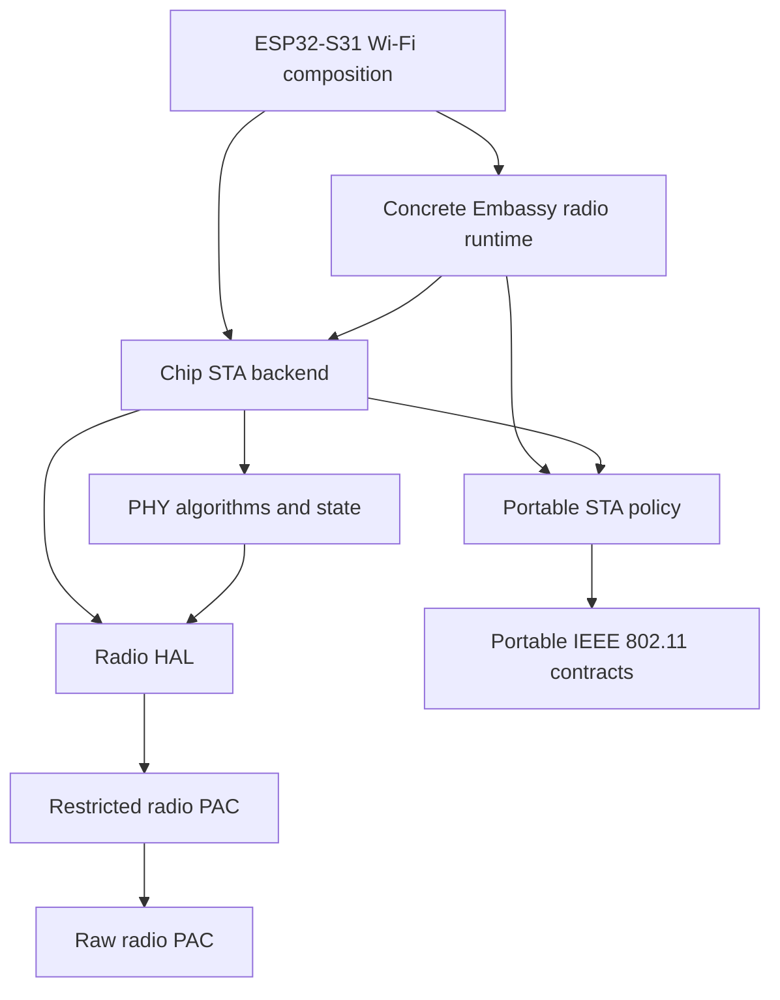
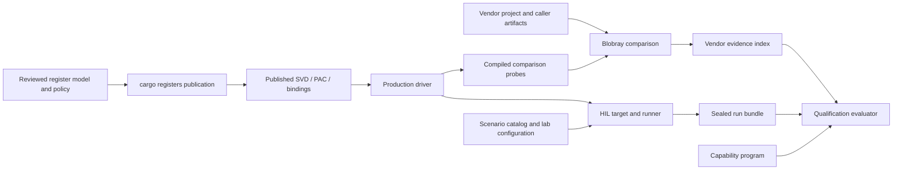

# Repository ownership

This document defines the boundaries between production code, hardware
descriptions, analysis tools, experiments and qualification. Detailed APIs and
commands belong to each component's README and Rust documentation.

Start with [the binary-to-station explanation](binary-to-station.md) for a
reading route through these boundaries.

## Owners

| Owner | Responsibility | Boundary |
| --- | --- | --- |
| [Radio libraries](../crates/README.md) | Portable protocols, typed hardware access, adapters, execution and final composition | Internal libraries depend on specific contracts; only applications depend on the public facade |
| [Network experiments](../experiments/network-engine/README.md) | Experimental synchronous networking and ownership models | Allowed in host test composition; excluded from production dependencies |
| [Registers](../registers/README.md) | Reviewed hardware model, API/ownership policy, provenance and publication inputs | Defines what may enter the production PAC |
| [Blobray](../tools/blobray/README.md) | Binary analysis, reviewed research and bounded comparisons | Generic engine; target facts are selected through providers and projects |
| [Memory tools](../tools/memory-report/README.md) | ELF memory and stack analysis | The consumer chooses the image budget and acceptance policy |
| [Repository tooling](../tools/xtask/README.md) | Cargo graphs, source checks and build orchestration | Calls domain tools; does not duplicate their validators |
| [Verification](../verification/README.md) | Reusable chip knowledge and concrete vendor comparison projects | Private artifacts are caller inputs, never production dependencies |
| [HIL](../hil/README.md) | Typed protocol, lab fixtures, scenarios, target images and sealed observations | Produces hardware evidence; does not decide product readiness |
| [Qualification](../qualification/README.md) | Engineering map, capability declarations and independent assessment of a selected scope | Consumes evidence; does not run the hardware or vendor implementation |
| [Examples](../examples/esp32s31/station/README.md) | Board/application composition and API usage | Own credentials, stack and sockets; do not depend on the HIL harness |

A directory identifies an owner. A Cargo workspace identifies a joint build
and lockfile boundary. They need not coincide, and a logical module does not
require a new crate. `validation` is an operation on a domain's inputs, not a
catch-all owner for unrelated tools.

Every Cargo package declares `package.metadata.open-radio.scope`, `layer`
and `platform`. Scope separates production, experimental and development
packages. Layer describes responsibility; platform is `portable`, `host` or
`chip`. Chip applicability requires a separate `chip` identifier, such as
`esp32s31`; portable and host classifications must not carry one. The identifier
starts with a lowercase ASCII letter and contains lowercase letters, digits or
hyphens. It identifies applicability, not the compiler target or an implemented
backend. These labels do not establish hardware qualification.
`supported-feature-profiles` enumerates alternatives to an all-features union.
Default builds are always checked as well. The facade also requires a minimum
build without default features. Lower compositions with mandatory choices use
their declared profiles; an empty feature set need not form a usable system.

The architecture check discovers source manifests and workspace members before
reading classification. Missing or inconsistent classification is an error.
Production path dependencies, including optional and build dependencies, must
resolve to classified production packages. Test dependencies may compose an
experimental engine with production owners. Protocol/contract packages cannot
depend on hardware, adapters or execution. Internal packages cannot depend on
the public facade. These rules are independent of directory names and chip IDs.

| Source layer | Allowed production dependency layers |
| --- | --- |
| contract, protocol | contract, protocol |
| hardware | contract, protocol, hardware |
| role | contract, protocol, hardware, role |
| service | contract, protocol, service |
| adapter, runtime | contract, protocol, hardware, role, adapter, runtime, service |
| composition, facade | all production layers except facade |

Hardware owns chip resources and the wire codecs its registers carry. A role
composes portable role protocols (station, access point, security) with that
hardware, without an executor. A service declares executor-free ports; an
adapter binds them to an executor, so a service never depends on an adapter.
Only adapters, compositions and the facade may depend on an executor crate
(`embassy-executor`); every lower layer exposes futures that any executor can
poll. Runtimes read and wait on time through the `embassy-time` interface,
whose single driver the final image links.
An adapter can implement a runtime interface, while a runtime can consume
an adapter's executor-neutral contract. Cargo still rejects actual dependency
cycles. Neither layer can depend on the final composition.

## Package names

Every package is named `oer-` followed by lowercase tokens in this order: an
optional chip (`esp32s31`), the domain (`ieee80211`, `bluetooth`, `ieee802154`,
`coex`, `radio`, `memory`, `network`, `hil`, `example`, …), an optional
component (`mac`, `sta`, `rsn`, `runtime`, `system`, …) and, for adapters, the
binding (`embassy`, `esp-hal`, `embassy-net-upstream`, `xarxa-upstream`). The
directory repeats the same tokens under its layer directory; grouping
directories such as `driver/`, `security/`, `le/` or the binding directory of
an adapter add structure without renaming. Wi-Fi is `ieee80211` in package and
directory names alike; the facade module `oer::wifi` and `Wifi*` types keep the
user-facing name. Compositions end in `-system`. The public facade
`open-esp-radio` (library `oer`) is the only branded name. The architecture
check enforces the prefix. The Blobray workspace names its own packages.

## From policy to an application

The production path is deliberately directional:

| Boundary | Decides | Retains |
| --- | --- | --- |
| Portable protocol/service | Valid frames, role transitions, request planning and typed outcomes | Protocol values and affine logical state; never PAC ownership |
| Chip HAL/driver | Semantic register transactions, DMA/IRQ state and physical transition results | PAC capabilities, stable-memory proofs and fail-stop hardware frontiers |
| Chip role | Ordering of one role's association, security and data plane over the chip driver | Executor-free role owners and their returned hardware frontiers |
| Concrete runtime | Which owner-bearing future is polled and how wakes, deadlines and bounded mailboxes progress | Active role/session owners across awaits and client cancellation |
| Composition | One-time storage placement, board/chip roots, final IRQ bindings and application capability split | The sole hardware runner plus static resource claims |
| Application/facade | Credentials, requested role, network/IP policy and sockets | Hardware-free control handles and application packet/socket owners |

The command plane moves requests and value reports between the application and
the sole actor. Submission is not hardware publication, and a response is not
necessarily frame completion. The data plane separately moves bounded packet
leases through adapter queues, stable storage, DMA publication, terminal
completion and return. A protocol policy may request an operation without
owning the PAC; conversely, the concrete actor owns the hardware epoch without
becoming the authority for protocol semantics.

Applications start from the public facade or the final chip composition.
Developers of a lower subsystem start from its defining crate and owner types.
This is why internal crates depend on specific lower contracts and never route
their dependencies back through `oer`.

Here each arrow points from a consumer to a production dependency; the diagram
selects the Wi-Fi station layers and omits other dependencies and feature
profiles. This differs from the knowledge-flow diagrams: Blobray, register
publication and qualification do not enter the production dependency graph.
Calls can pass through a portable port implemented by a higher composition
without introducing a reverse Cargo dependency.

Portable packages cannot depend on chip or host packages; the public facade
is the explicit selection boundary. Chip packages can depend on portable
packages and packages for the same chip. Host packages can depend on portable
or host packages. Cross-chip dependencies are rejected. S31-specific firmware,
diagnostic and register-authority checks remain separate from these general
rules; adding a chip does not make those hardware checks applicable to it.

`open-esp-radio` provides the `oer` library. Its public modules reexport existing
types; `oer-radio` owns the portable radio control lifecycle. The facade may
depend on a selected composition, which depends on `oer-radio`, never on the
facade. PAC access remains an explicit restricted dependency.

`composition/` names the source ownership layer; `oer::systems` is its public
namespace. Facade features select portable protocols, concrete chip backends
and final Embassy compositions independently. Exporting a composition does not
claim hardware qualification; component capability limits still apply.

Internal radio packages use the `oer-` prefix and identify their domain and,
where required, chip: `oer-memory`, `oer-ieee80211-sta`, `oer-esp32s31-hal`.
Rust imports use those dependency names; internal crates do not route imports
through `oer`. Module paths carry context so types can use names such as
`sta::association::{PhyMode, Preference}`. State names retain ownership and
publication distinctions.

A type has one defining owner. For example, association modes are defined in
the lower IEEE 802.11 wire-codec crate and reexported by the station policy
module and facade. The encoder never depends on the station policy or facade.

## Data and decisions

The evaluator reads serialized evidence independently of the producers.
Its engineering map connects knowledge, source owners, checks, observations and
next-work reasons. Static catalog views require no saved runs; program views
retain the evaluator's evidence-applicability decisions. Neither view runs
missing checks or turns the whole project into one readiness gate. Knowledge
and source facts remain useful outside a selected qualification program.
Implementation, host coverage and async states are reviewed declarations;
vendor/HIL states are derived from evidence. A valid incomplete capability
program is not a passing readiness gate. The exact rules are defined in the
[verification and qualification contract](verification-and-qualification.md).

## Hardware descriptions and providers

`registers/<chip>/model` owns devices, peripherals, MMIO maps and reviewed
assertions. `policy` owns API selection, lints and shared register ownership.
`evidence` carries the provenance used by publication. `upstream` is reviewed
input; `published` contains generated SVD/bindings. Generated Rust stays with
the production PAC that consumes it.

Source-only publication selects the model, API, assertions, provider, lint
pack and evidence catalogs explicitly. It does not select private vendor
binaries. Full vendor investigations add their own artifact context. These
compositions have separate validation requirements.

`verification/vendor/projects` holds each chip's typed comparison scenarios,
compiled probes and native evidence index. Generic Blobray crates do not depend
on a chip project; the scenarios depend on Blobray.

## HIL and operating-system boundaries

The host runner separates `scenario`, `image`, `lab`, `fixture`, `session`,
`workload`, `evidence` and `reporting`. Image construction owns build recipes;
the lab owns fixture exclusion; session owns the live UART capture; evidence
owns archive/seal publication; reporting renders observations.

Scenario IDs are stable logical identities within a recursive protocol/role
catalog. Producer and evaluator independently validate the format and reject
ambiguous entries. Firmware and host share a typed wire contract and must be
updated together when that contract changes.

The [ESP32-S31 platform](../platform/esp32s31/README.md) owns the board profile,
Flash bootstrap, stage-two relocation, the staged-boot address map and image
header, linker scripts and per-core SRAM IRQ stacks. HIL and standalone examples use that same boot contract. The host
`oer-esp32s31-firmware` library owns payload packing and structural image audits;
`cargo xtask` builds applications and HIL adds its image classes, observers
and evidence. Neither the platform nor standalone examples depend on HIL.

Linux network helpers and remote OpenWrt operations belong to HIL. Repository
checks do not install fixtures, flash devices or change network state.
Blobray's resource-limited launcher belongs to Blobray so it remains usable
after standalone extraction.

Build products, analysis output and run bundles stay under their owner's
ignored output path. Current source documentation describes their formats and
commands, while [source policy](source-policy.md) defines what may be tracked.
