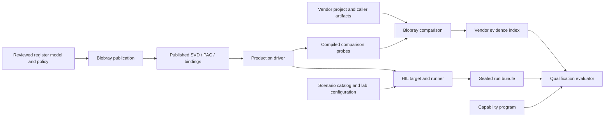

# Repository ownership

This document defines the boundaries between production code, hardware
descriptions, analysis tools, experiments and qualification. Detailed APIs and
commands belong to each component's README and Rust documentation.

## Owners

| Owner | Responsibility | Boundary |
| --- | --- | --- |
| [Driver](../driver/README.md) | Protocol state, typed hardware access, radio execution and application integration | Shipping behavior lives here, not in probes or HIL |
| [Registers](../registers/README.md) | Reviewed hardware model, API/ownership policy, provenance and publication inputs | Defines what may enter the production PAC |
| [Blobray](../tools/blobray/README.md) | Binary analysis, bounded comparisons and register publication | Generic engine; target facts are selected through providers and projects |
| [Memory tools](../tools/memory-report/README.md) | ELF memory and stack analysis | The consumer chooses the image budget and acceptance policy |
| [Repository tooling](../tools/repo/README.md) | Cargo graphs, source checks and build orchestration | Calls domain tools; does not duplicate their validators |
| [Verification](../verification/README.md) | Reusable chip knowledge and concrete vendor comparison projects | Private artifacts are caller inputs, never production dependencies |
| [HIL](../hil/README.md) | Typed protocol, lab fixtures, scenarios, target images and sealed observations | Produces hardware evidence; does not decide product readiness |
| [Qualification](../qualification/README.md) | Capability declarations and an independent readiness evaluator | Consumes evidence; does not run the hardware or vendor implementation |
| [Examples](../examples/esp32s31-station/README.md) | Board/application composition and API usage | Own credentials, stack and sockets; do not depend on the HIL harness |

A directory identifies an owner. A Cargo workspace identifies a joint build
and lockfile boundary. They need not coincide, and a logical module does not
require a new crate. `validation` is an operation on a domain's inputs, not a
catch-all owner for unrelated tools.

## Data and decisions

The evaluator reads serialized evidence independently of the producers.
Implementation, host coverage and async states are reviewed declarations;
vendor/HIL states are derived from evidence. A valid incomplete capability
program is not a passing readiness gate. The exact rules are defined in the
[verification and qualification contract](verification-and-qualification.md).

## Hardware descriptions and providers

`registers/<chip>/model` owns devices, peripherals, MMIO maps and reviewed
assertions. `policy` owns API selection, lints and shared register ownership.
`evidence` carries the provenance used by publication. `upstream` is reviewed
input; `published` contains generated SVD/bindings. Generated Rust stays with
the production PAC that consumes it.

Source-only publication selects the model, API, assertions, provider, lint
pack and evidence catalogs explicitly. It does not select private vendor
binaries. Full vendor investigations add their own artifact context. These
compositions have separate validation requirements.

`verification/vendor/chips` contains reusable chip identity and providers.
`verification/vendor/projects` selects concrete investigation inputs, overlays,
compiled probes and an analysis host. Generic Blobray providers and neutral
analysis types do not depend on that host composition.

## HIL and operating-system boundaries

The host runner separates `scenario`, `image`, `lab`, `fixture`, `session`,
`workload`, `evidence` and `reporting`. Image construction owns build recipes;
the lab owns fixture exclusion; session owns the live UART capture; evidence
owns archive/seal publication; reporting renders observations.

Scenario IDs are stable logical identities within a recursive protocol/role
catalog. Producer and evaluator independently validate the format and reject
ambiguous entries. Firmware and host share a typed wire contract and must be
updated together when that contract changes.

The [ESP32-S31 platform](../platform/esp32s31/README.md) owns the board profile,
Flash bootstrap, stage-two relocation, linker scripts and per-core SRAM IRQ
stacks. HIL and standalone examples use that same boot contract. The host
`oer-firmware` library owns payload packing and structural image audits;
`cargo xtask` builds applications and HIL adds its image classes, observers
and evidence. Neither the platform nor standalone examples depend on HIL.

Linux network helpers and remote OpenWrt operations belong to HIL. Repository
checks do not install fixtures, flash devices or change network state.
Blobray's resource-limited launcher belongs to Blobray so it remains usable
after standalone extraction.

Build products, analysis output and run bundles stay under their owner's
ignored output path. Current source documentation describes their formats and
commands, while [source policy](source-policy.md) defines what may be tracked.
