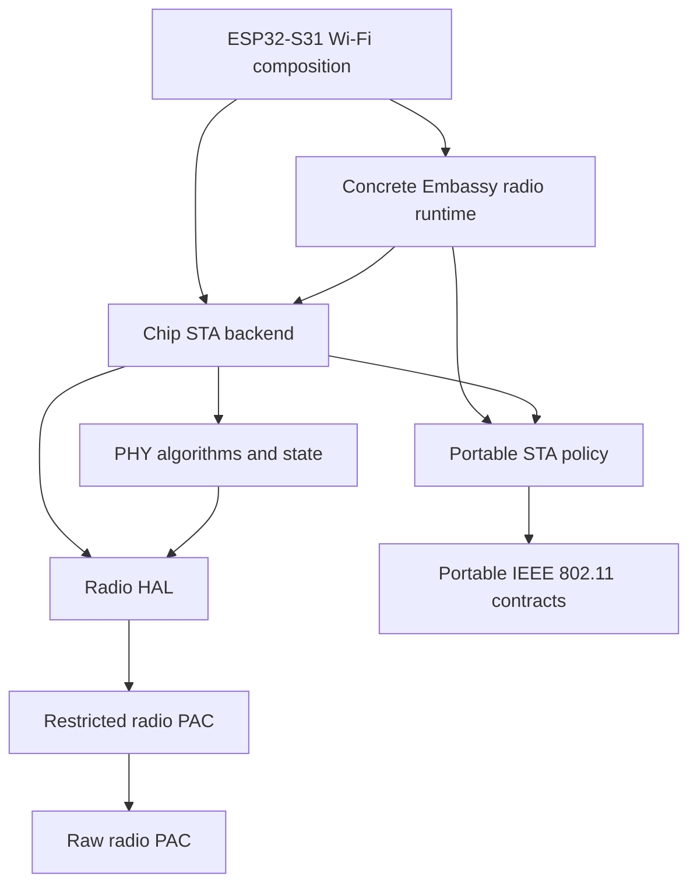
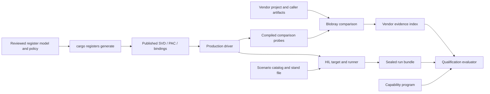

# Repository ownership

This document defines the boundaries between production code, hardware
descriptions, analysis tools, experiments and qualification. Detailed APIs and
commands belong to each component's README and Rust documentation.

Start with [the binary-to-station explanation](binary-to-station.md) for a
reading route through these boundaries.

## Owners

| Owner | Responsibility | Boundary |
| --- | --- | --- |
| [Radio libraries](../crates/README.md) | Portable protocols, typed hardware access, adapters, execution and final composition | Internal libraries depend on specific contracts; only applications depend on the public facade |
| [Registers](../registers/README.md) | Reviewed hardware model, API/ownership policy, provenance and publication inputs | Defines what may enter the production PAC |
| [Blobray](../tools/blobray/README.md) | Binary analysis, reviewed research and bounded comparisons | Generic engine; target facts are selected through providers and projects |
| [ELF view](../tools/elf/README.md) and [vendor provenance](../tools/vendor-provenance/README.md) | The one ELF/archive reader with the RV32 relocation table; the one vendor function fingerprint | Read by every tool; image placement is audited by the image pipeline |
| [Repository tooling](../tools/xtask/README.md) | Cargo graphs, source checks and build orchestration | Calls domain tools; does not duplicate their validators |
| [Verification](../verification/README.md) | Reusable chip knowledge and concrete vendor comparison projects | Private artifacts are caller inputs, never production dependencies |
| [HIL](../hil/README.md) | Typed protocol, lab fixtures, scenarios, target images and sealed observations | Produces hardware evidence; does not decide product readiness |
| [Qualification](../qualification/README.md) | Engineering map, capability declarations and independent assessment of a selected scope | Consumes evidence; does not run the hardware or vendor implementation |
| [Examples](../examples/esp32s31/station/README.md) | Board/application composition and API usage | Own credentials, stack and sockets; do not depend on the HIL harness |

A directory identifies an owner. A Cargo workspace identifies a joint build
and lockfile boundary. They need not coincide, and a logical module does not
require a new crate. `validation` is an operation on a domain's inputs, not a
catch-all owner for unrelated tools.

### Package classification

Every Cargo package declares `package.metadata.open-radio.layer` and
`platform`. Layer describes responsibility and implies the scope: the
`contract`, `protocol`, `hardware`, `role`, `service`, `adapter`, `runtime`,
`composition` and `facade` layers are production, `experiment` is
experimental, and every other layer is development. The repository model
(`oer-repo`) is the one reader of the table: it types every key and rejects
unknown ones, and `oer-tidy` checks every package in seconds; platform is `portable`, `host`,
`chip` or `family`. Chip applicability requires a separate `chip` identifier, such as
`esp32s31`, and family applicability a separate `family` identifier, such as
`espressif`; no other classification carries either.
A `family` package holds code that is vendor-specific but not chip-specific:
a ported vendor driver, recovered coexistence tables, a register protocol
every chip of the vendor shares. `platform/<chip>/chip.toml` names each
chip's `family`. The architecture check builds a family package for the Rust
target of every chip of its family; the chips of that family may depend on
it, and it may depend only on portable packages and packages of its own
family. Portable and host packages never depend on a family
package, and a family package never depends on a chip package, so code shared
by a family cannot select one of its chips.
What chips have — Wi-Fi bands, Bluetooth modes, IEEE 802.15.4, core count —
is the `[properties]` table of `platform/<chip>/chip.toml`, read by host
tools through `oer-chip-profile`. Differences of address or register layout belong in the register model,
not in properties. A build dependency, which runs on the build machine,
must be a host or portable package. The identifier
starts with a lowercase ASCII letter and contains lowercase letters, digits or
hyphens. It identifies applicability, not the compiler target or an implemented
backend. These labels do not establish hardware qualification.
`supported-feature-profiles` enumerates alternatives to an all-features union.
Default builds are always checked as well. The facade also requires a minimum
build without default features. Lower compositions with mandatory choices use
their declared profiles; an empty feature set need not form a usable system.

### Layer dependencies

The repository model discovers every manifest and workspace member before
reading classification, and its dependency policy (`oer_repo::policy`, run
by `cargo tidy check`) is the one statement of these rules. Missing or
inconsistent classification is an error. Production path dependencies,
including optional and build dependencies, must resolve to classified
production packages. Test dependencies may compose an
experimental engine with production owners. Protocol/contract packages cannot
depend on hardware, adapters or execution. Internal packages cannot depend on
the public facade. These rules are independent of directory names and chip IDs.

| Source layer | Allowed production dependency layers |
| --- | --- |
| contract, protocol | contract, protocol |
| hardware | contract, protocol, hardware |
| role | contract, protocol, hardware, role |
| service | contract, protocol, service |
| adapter, runtime | contract, protocol, hardware, role, adapter, runtime, service |
| composition, facade | all production layers except facade |

### Host layers

Every development package that runs on the host (`platform = "host"`)
declares `package.metadata.open-radio.host-layer`; a portable development
package may. A host package depends, through any dependency kind, only on
packages of its own host layer and the layers below it
(`oer_repo::policy::host_edge_allowed`, run by `cargo tidy check`):

| Host layer | Holds | Examples |
| --- | --- | --- |
| `entry` | Command lines: argument parsing and calls | `oer-xtask`, `oer-tidy`, `oer-fw`, `oer-stand`, `oer-hil-cli`, `oer-hil-runner`, `oer-qualification`, `oer-register-tool`, `oer-verification-cli`, `blobray-cli` |
| `orchestration` | Experiments, run analysis, HIL image builds | `oer-hil-experiment`, `oer-hil-analysis`, `oer-hil-image` |
| `execution` | HIL execution: protocol, agent, DUT link, scenarios, workloads, families, run bundles, observer identity, the HIL lab | `oer-hil-link`, `oer-hil-workload`, `oer-hil-family-*`, `oer-hil-run-bundle` |
| `verification` | Vendor evidence and provenance, the register model, vendor scenarios and stands | `oer-vendor-evidence`, `oer-vendor-provenance`, `oer-register-model` |
| `stand` | The stand file, boards, the arbiter, owners, journal, hubs and power, stand hosts | `oer-stand-file`, `oer-stand-board`, `oer-stand-arbiter`, `oer-hil-flash` |
| `build` | Images and binary analysis | `oer-image`, `oer-elf`, `oer-riscv-*`, Blobray's libraries |
| `foundation` | Processes, files, host tools, chip profiles, the repository model, vendor pins, the devices layer and the data formats | `oer-process`, `oer-durable`, `oer-toolchain`, `oer-repo`, `oer-vendor-artifacts`, `oer-device-*`, `oer-devices`, `oer-image-bundle`, `oer-hil-run-bundle-format` |

So the stand and the build layer never reach HIL execution, verification
never reaches HIL execution or orchestration, and the foundation depends
on nothing above it. The shared relation library in
`hil/phy/esp32s31/relation/` belongs to the `verification` host layer, so
verification scenarios and probes may depend on it. Only entry crates
run a repository command line: `cargo tidy check` rejects a
non-entry package whose code spawns `cargo hil` or `cargo xtask`
(`oer_tidy::spawns`); a library calls the owning library instead.

### Host applications

The host side is independent applications. They share only libraries and
data formats, never each other's code; one application uses another by
running it as a process or by reading what it wrote.

| Application | Command | Owns | Uses |
| --- | --- | --- | --- |
| Dev kit | `cargo fw` ([`oer-fw`](../tools/fw/src/main.rs)) | Build an example's image, flash it or any bundle, monitor a board, list boards | Images, devices, chip profiles, foundation; nothing of the stand or HIL |
| Stand | `cargo stand` ([`oer-stand`](../stand/cli/src/main.rs)) | Stand file, boards and hubs, the arbiter's queue and leases, owners (free-form names), journal, host setup, fixture installation | Devices, the stand file format, foundation |
| HIL | `cargo hil` ([`oer-hil-cli`](../hil/host/cli/README.md)) | Runs, plans, run history, A/B experiments, HIL images | Stand libraries, images with HIL policy checks, devices, the run bundle format |
| Vendor verification | `cargo verification` (its own workspace, [verification](../verification/README.md)) | Vendor pins and fetch, provenance, typed scenarios, evidence shards, probes | Blobray's engine, binary analysis, vendor pins, the shard format |
| Blobray | `cargo blobray` (its own workspace, [Blobray](../tools/blobray/README.md)) | Binary analysis | Binary analysis libraries, foundation |
| Registers | `cargo registers` ([register tool](../tools/registers/README.md)) | Register model, review, SVD/PAC/bindings publication | Foundation, chip profiles, the bindings format |
| Qualification | `cargo qualification` ([evaluator](../qualification/README.md)) | Catalogs, programs, assessment | The run bundle, scenario catalog and shard formats, the repository model, foundation; never the runner, lab, HIL images or stand operation |
| Gate | `cargo xtask`, `cargo tidy` ([xtask](../tools/xtask/README.md), [tidy](../tools/tidy/README.md)) | Check registry, push, CI state, worktrees, sweeps, text policy | The repository model and foundation; every other application runs as a process |

Every host-layer package declares `host-app` and `host-boundary` in
`package.metadata.open-radio`. The application values are `gate`, `fw`,
`stand`, `hil`, `verification`, `blobray`, `registers` and `qualification`;
shared owners are `foundation`, `devices`, `images`, `analysis` and `formats`.
`application` marks private code, `library` an exposed library and `format`
a shared data contract. Command lines use `application`.

Normal and build dependencies cannot link another owner's `application`
code. Libraries cross only these boundaries; host layer rules still apply:

| Consumer | Permitted shared owners |
| --- | --- |
| gate | foundation |
| fw | foundation, devices, images, analysis, formats |
| stand | foundation, devices, formats |
| hil | foundation, devices, images, analysis, formats, stand, verification |
| verification | foundation, images, analysis, formats, blobray, registers |
| blobray, analysis | foundation, analysis, formats |
| registers | foundation, analysis, formats, verification |
| qualification, foundation, formats | foundation, formats |
| devices | foundation, formats |
| images | foundation, analysis, formats |

The `formats` owner exposes only `format` packages. Test dependencies may
compose applications for a regression; they still follow host layer rules.
The dependency policy is `oer_repo::policy::application_edge_allowed`.

`cargo tidy check` holds the dependency rules: the [host layers](#host-layers), these application boundaries,
qualification's ban on HIL orchestration and stand operation
(`oer_repo::policy::qualification_edge_allowed`), and one release profile for
every firmware workspace (`oer_tidy::workspaces::release_profiles`).

**Device foundation.** Every application that touches a board goes through
the devices layer ([`tools/device/`](../tools/device/README.md)): `oer-devices`
owns board operations as modules, with flash writes and the held-board facade
behind its `image` feature. Device identity, locking and the reference-peer
grammar retain independent packages with smaller dependency graphs. A board is
its [`DeviceId`](../tools/device/mac/src/lib.rs), the MAC its USB
Serial/JTAG port reports. The [device lock](../tools/device/lock/src/lib.rs)
lets one process own a board at a time for a whole operation (flash with
reopen and start, reset, monitor, a HIL lease with its power cycles); a
refused process names the holder, and the arbiter treats a board locked by
a foreign process as busy. The one flash write,
[`oer_devices::image`](../tools/device/devices/src/image/mod.rs), reads a bundle's
segments once into a verified snapshot, invalidates the board's known image
before writing, writes that snapshot and records a receipt (segment digests
and a write generation); "written" and "started" are distinct states, so an
unchanged image is not reflashed and an interrupted write leaves no stale
claim.

An independent lifetime broker owns the device lock's file description.
`DeviceAccess::operation` admits I/O atomically and returns a guard retaining
exclusion. Owner loss closes admission, then drains admitted operations; the
board becomes available only after their ports and readers close. External
hardware commands retain the same operation through a lifetime connection,
so caller death does not release exclusion before OpenOCD or uhubctl exits.
Delegates receive an admission capability, never the flock descriptor.

**Process context.** The process foundation supplies `Context` and `command`.
Applications select the fields of each intended child's context explicitly;
ordinary commands clear it. A single environment field transports the context
across exec, including an explicitly delegated Cargo or shell wrapper. The
next repository spawn clears it unless its caller attaches another context.
Device capabilities, stand leases and job identities use this path; host and
workload configuration remain ordinary environment settings. Process tests
exercise ordinary children, selected descendants, malformed contexts and owner
loss during real I/O, including an external writer surviving both callers.

**Image compile cache.** Every firmware build of a host, whatever the
checkout, application, chip, image class or example, and the vendor
comparison probes, compiles in one shared Cargo target directory below the
host build root (`oer_toolchain::image::compile_cache`,
`$XDG_CACHE_HOME/open-esp-radio/build/cargo`, overridden by
`OER_BUILD_ROOT`). Compiler flags are identical per chip, so units are
reused across builds; a build holds the cache lock from its Cargo run until
its outputs are copied out, and publishes its bundle by rename only after
full success.

### Sans-IO protocols, executors and time

Protocol logic is sans-IO. A `protocol` package is a set of state machines:
received frames, completed operations and the current time enter as values
(`oer_time::Instant`), and the actions to take and the next deadline leave as
values. It may declare the asynchronous ports its drivers implement, but it
never awaits; the architecture check rejects every `async` body and `.await`
in a protocol package's library sources. The drivers that wait on ports and
timers and feed the state machines are `service` packages, and a runtime or
an adapter polls them. The same state machine therefore runs under any
executor, in a synchronous interrupt context and against a host model with
virtual time.

Hardware owns chip resources and the wire codecs its registers carry. A role
composes portable role protocols (station, access point, security) with that
hardware, without an executor. A service declares executor-free ports; an
adapter binds them to an executor, so a service never depends on an adapter.
Only adapters, compositions and the facade may depend on an executor crate
(`embassy-executor`); every lower layer exposes futures that any executor can
poll. Only adapters, compositions and the facade may depend on the time
driver interface (`embassy-time`), whose single driver the final image links,
or on its `oer-time-embassy` binding; the rule covers dev dependencies too.
Every lower layer, runtimes included, reads and waits on time through the
[`oer-time`](../crates/time/src/lib.rs) `Clock` and `Timer` ports: a runtime
takes its timer from its owner or caller, a composition passes
`oer_time_embassy::EmbassyClock`, and runtime tests use the per-instance
virtual clocks of `oer-time-virtual`. Radio time follows the model below.
An adapter can implement a runtime interface, while a runtime can consume
an adapter's executor-neutral contract. Cargo still rejects actual dependency
cycles. Neither layer can depend on the final composition.

#### Clocks, stamps and alarms

Three kinds of time object exist, each in one domain:

- a **clock** reads "now" in its domain and nothing else: `oer_time::Clock`
  for monotonic time, a port's `now()` for its radio domain;
- a **stamp** is a value the hardware recorded when an event happened; it
  carries its domain and the generation of its clock relation
  (`oer_radio_port::RadioStamp<D>`, `RxMeta::timestamp`);
- an **alarm** wakes something at an instant of its domain. An executor
  **wait** is an alarm of monotonic time (`oer_time::Timer`); a hardware
  timer of a MAC or PHY (the station TBTT, the TSF timers, the BLE modem
  LP timer) is an alarm of its own domain, armed through a port operation,
  never an `oer_time::Timer`.

The domains in the code:

| Domain | Counted by | Type | Relation to monotonic time | New generation |
| --- | --- | --- | --- | --- |
| Monotonic CPU time | the system timer through `oer-time-embassy` | `oer_time::Instant` | itself | — |
| ESP32-S31 Wi-Fi MAC local time | `WIFI_MAC_LOCAL_TIME` (`MacLocalTime`), widened by `MacTimeline`, related by `MacClockStorage`/`MacClockHandle` | `Ieee80211Instant`, `Ieee80211Stamp` | `Affine` (`MAC_CLOCK_INFO`, 1 ppm) | every radio start (`MacClockStorage::start`, never a generation an earlier start used), every RF wake, a counter break |
| IEEE 802.11 lower-MAC host model | the test (`set_now`) | `Ieee80211Instant` | `Monotonic` | — |
| An interface's TSF | the MAC's TSF of that interface | `TsfInstant` of `Ieee80211Tsf`, as `VifTsf` with its interface | `Affine` to the port's radio clock through `TsfSample` (`TSF_DRIFT_PPM`, 200 ppm: the access point's timer and the station's crystal) | a `TsfGeneration`: the epoch each relation's owner takes from the radio start's storage (`MacClockHandle::tsf_epoch`) when created, so owners never share one, and the jumps within it: a channel change, an interface (re)configuration, an access-point TSF restart, a station TSF set beyond the relation's bound, a TSF crossing 2^64 (the TSF is never modular). A sample of another generation does not convert (`TsfProjectionError::StaleSample`) |
| BLE controller | the controller clock, extended from its 32-bit latch | `LeInstant`; inside the driver `SchedulerInstant` | `Unrelated` | — |
| BLE modem LP timer | the modem LP timer | `BluetoothModemLpTimerInstant` (wrapping, no claimed unit) | none | — |
| IEEE 802.15.4 | the runtime's monotonic clock | `Ieee802154Instant` | `Monotonic` | — |
| FTM | the FTM exchange's timestamps | `FtmTimestampPs`, 48-bit picosecond wire values (`oer_ieee80211_mac::ftm`) | none | — |

Rules:

- A sans-IO protocol takes time as values of its own domain. A deadline it
  returns for the executor to wait on is a monotonic `Instant`; an instant
  it returns for a hardware alarm stays in that alarm's domain, and the
  driver arms it.
- Domains do not mix at the type level: a port's instants are
  `RadioInstant<D>` of its own domain `D`. A radio instant is a coordinate
  in its owner's radio epoch, not an image-monotonic or wall-clock instant.
  Its raw microseconds establish no relationship between clocks. The owner
  retains any additional interface, instance and generation validation.
- Radio arithmetic belongs to `oer-time`: `RadioDuration` represents every
  non-negative `u64` microsecond span. Instant ordering and
  `checked_duration_since` require the same domain; equal instants yield a
  zero span and reversed instants fail. Instant `checked_add`/`checked_sub`
  and duration `checked_add`/`checked_sub`/`checked_mul` return `None` for
  results outside the represented range, without wrapping, narrowing or
  clamping. `RadioWindow` is non-empty and half-open, with a representable
  exclusive endpoint; touching windows do not overlap. Scalar extraction
  belongs at named formula or representation boundaries. Monotonic
  duration is not a substitute for radio-domain arithmetic.
- Time crosses between domains only at a boundary, through the port's
  `ClockInfo` and a `ClockSample` with its generation and uncertainty; a
  stamp of another generation is not converted (`EpochError::StaleSample`).
- Time-exact work stays in its domain: the station follows the access
  point's TSF by the MAC local time between a beacon's stamp and now, not
  through monotonic time. A software handoff bound is monotonic: the HE
  Trigger and NDPA response windows count from the frame's executor handoff
  (`RxTimes::handoff`).
- The hot path only records values: a received frame carries
  `RxTimes { handoff, stamp }` with the raw stamp, and no clock is read on
  reception; a consumer that needs the reception time converts the stamp.
- Hardware counters and alarms belong to their driver and reach the layers
  above as read-only capabilities (`MacLocalTime`) or port operations.

## Package names

Every package is named `oer-` followed by lowercase tokens in this order: an
optional chip (`esp32s31`) or family (`espressif`), the domain (`ieee80211`, `bluetooth`, `ieee802154`,
`coex`, `radio`, `memory`, `network`, `hil`, `example`, …), an optional
component (`mac`, `sta`, `rsn`, `runtime`, `system`, …) and, for adapters, the
binding (`embassy`, `esp-hal`, `embassy-net-owned`). The
directory repeats the same tokens under its layer directory; grouping
directories such as `driver/`, `security/`, `le/` or the binding directory of
an adapter add structure without renaming. Wi-Fi is `ieee80211` in package and
directory names alike; the facade module `oer::wifi` and `Wifi*` types keep the
user-facing name. Compositions end in `-system`. The public facade
`open-esp-radio` (library `oer`) is the only branded name.
`oer-tidy` (`cargo tidy check`) enforces the prefix. The Blobray
workspace names its own packages.

## Radio ports

A radio port is the contract between the protocol logic of one radio
protocol and the backend that executes it: a chip, a family driver or a host
model. Everything above a port is written once for every backend; everything
below it is the backend's. [`LeRadioPort`](../crates/protocols/bluetooth/le/radio/src/port.rs)
is the Bluetooth LE port and
[`Ieee802154RadioPort`](../crates/protocols/ieee802154/src/port.rs) the
IEEE 802.15.4 port, which the Espressif runtime implements and the OpenThread
adapter consumes, and
[`Ieee80211LowerMacPort`](../crates/protocols/ieee80211/lower-mac/README.md)
the Wi-Fi port, carrying the portable `Channel` and `PhyRate` values of
`oer-ieee80211-mac`. All three extend one base trait, `RadioPort` of the
contract package [`oer-radio-port`](../crates/radio/port/README.md), which
carries what they share: the event stream (`type Event`, `next_event`), the
radio clock (`now`), cancellation (`cancel(id)`) and the lifecycle, with
the refusals, the poisoned outer error, the loss marker, correlation
identities and the clock relation. The base calls are asynchronous: the
ESP32-S31 Bluetooth LE backend admits every request and reads its clock
against a fresh controller-time latch, a bounded wait for the hardware,
while the Wi-Fi and IEEE 802.15.4 backends decide at once and return ready
futures.

**Placement follows hardware autonomy.** Work the backend performs without
software on the air timeline (acknowledgement turnaround, FCS or CRC,
hardware retransmission, hardware ciphers) lies below the port. Work that
software decides (retry policy, rate selection, contention draws, reordering,
sequence and packet numbers, scanning, beacons, power-save policy) lies above
it, in portable code shared by every backend. A backend that also performs
work above the port reports that in its capabilities, and the portable owner
delegates it instead of performing it. For IEEE 802.11, one port
publication is one hardware transmission attempt.

**Shape.** A port is a trait defined in a `contract` or `protocol` package,
without an executor or a time driver. It has the same five parts for every
protocol:

| Part | Semantics |
| --- | --- |
| Submission | Immediate admission of one request with a caller-chosen correlation identity: refusal is the call's result, never a later event, and a value, not a fault. Submission is synchronous when a backend can decide without waiting; a port whose backends need a fresh hardware reading to decide may declare it asynchronous, provided the wait is bounded, depends on no other submission or event, and dropping the future admits nothing |
| Events | Asynchronous stream of owned events, each viewed through a borrowed portable value, with exactly one consumer; loss of events is reported, never silent |
| Capabilities | What the backend supports and what it performs autonomously, read before submission |
| Lifecycle | Enable, disable, quiesce and cancel of submitted work, each with a terminal event; `Disable` ends the work in flight first |
| Clock | The backend's radio time on the shared time contract, with a stated resolution and the relation of its epoch to monotonic time (`ClockInfo`); asynchronous under the same conditions as submission |

**Correlation identities.** Each port keeps its own 32-bit identity type
(`TxId`, `RequestId`, `EventId`), so a completion of one port cannot be
taken for another's work; each implements `oer_radio_port::Correlation`,
the top 256 raw values are reserved for work the backend submits itself,
and a caller's `CorrelationIds` allocator wraps before them.

**Event model.** Every port has exactly one consumer of its events. Users
that share a port share it through a router that owns the stream and
dispatches each event by its identity; for IEEE 802.11 that is the
`EventRouter` of `oer-ieee80211-upper-mac-service`, which hands each
completion to the exchange that registered its `TxId` and queues received
frames, lifecycle terminals and extension events separately. Taking an
event only dequeues it. Timed work a backend performs in software (the
802.15.4 CSMA-CA backoffs and retry delays, the Wi-Fi publication watchdog
and retune, the Bluetooth LE scheduler) runs in the backend's runner
future (`run`), which the composition polls beside the consumer for as long
as the port exists.

**A port exists only while its backend is installed.** A backend's
`install` returns two handles that borrow its runtime, and no other value
reaches the installed backend: the port, for the protocol's one event
consumer, and the control, for the composition, which carries the backend's
own operations (coexistence, statistics, diagnostic hardware reads and
shared-PHY maintenance). The control's `uninstall` consumes both, so "not
installed" is unrepresentable and no port call refuses as such. The
interrupt entries and the runner stay on the runtime itself. Shared-PHY
maintenance is a layer over `Quiesce`: the consumer sees `Quiesced` and
`Enabled`, and meanwhile the port refuses what would touch the held
hardware as each port's contract states for its quiesced state. A port's
event stream lives as long as the port: `uninstall` discards the events it
did not deliver, the terminal events still owed and a pending loss, and the
next install's port starts with an empty stream; every event guarantee
below holds for the port's lifetime. The Bluetooth LE backend uninstalls
only a disabled port whose consumer took every event up to `Disabled`: its
`Disable` stops the scheduler and ends every admitted event with what the
hardware recorded, so none is discarded, and `serve` ends every session
with that managed stop.

**Loss and poisoning.** A backend reserves the slot of every event whose
loss would break a guarantee when it admits the work: every terminal event
(an attempt's completion, an operation's or an event's end, a lifecycle
terminal) and data its protocol promises the peer to deliver once the
hardware acknowledged it (the data PDUs of a Bluetooth LE connection event,
whose Link Layer delivers reliably). Such an event is never lost, and work
that does not find its slots is refused. A backend that drops data the
protocol does not promise to deliver (Wi-Fi and IEEE 802.15.4 received
frames, Bluetooth LE advertising reports) reports one `EventsLost` in place
of the first dropped event: events before it precede the gap, events
after it follow it, and the consumer continues. A poisoned backend's state
is unknown: `next_event` returns `Poisoned` with the backend's cause after
every earlier event and again at every later call, and every other call
returns it at once; only a reset restores the port.

**Capability model.** A port states what a backend can do in three separate
places. A structural optional feature (an operation some backends lack
entirely, such as aggregate transmission or TBTT reporting) is an extension
trait over the base port: an upper layer that needs it requires that trait
bound, and a backend without it does not implement the trait, so the missing
feature cannot be requested. The parametric limits of what a backend has
(bands, rates, queues, key slots, window sizes, the accepted range of a
value) are its capabilities, read before submission; a value outside them is
refused as unsupported, and that refusal means nothing else. Why a backend
lacks a feature or a value (hardware absent, glue not written, vendor
knowledge not recovered, policy decision pending) is recorded in the
qualification catalog, not in code.

**Refusals and poisoning.** Every port call returns
`Result<Result<T, Refusal>, Poisoned<Fault>>`. The inner `Err` is a typed
refusal: nothing changed, and a refused submission hands its arguments back
(a Wi-Fi attempt with its buffer and body). A port exists only while its
backend is installed, so no call refuses as not installed. Admitted work that ends
without its result reports that in its terminal event (an aborted attempt,
a `Fault` that leaves an IEEE 802.15.4 radio disabled, a lifecycle
`Failed`), and the port stays usable. The outer `Err` is only
`oer_radio_port::Poisoned`, which carries the backend's own cause (each
port names it as `type Fault`); portable code passes it on without
interpreting it.

| Port | Lifecycle and cancellation | Clock epoch (ESP32-S31) |
| --- | --- | --- |
| `Ieee80211LowerMacPort` | `lifecycle(Enable / Disable / Quiesce)` and `cancel(TxId)` | `Affine`: the Wi-Fi MAC local time, sampled against the image's monotonic clock |
| `Ieee802154RadioPort` | `lifecycle(Enable / Disable / Quiesce)` with `RadioEvent::Lifecycle` terminals and `cancel(RequestId)` | `Monotonic`: the runtime's `Clock`, which the engine reads fresh at each event and the time driver also reads |
| `LeRadioPort` | `lifecycle(Enable / Disable / Quiesce)` over an installed backend and `cancel(EventId)`; install and uninstall move memory and hardware owners and stay the backend's own operations, and shared-PHY maintenance is a layer over `Quiesce` | `Unrelated`: the extended controller clock |

**Shared RF path.** Protocols that share one radio name themselves with the
portable [`RadioClient`](../crates/radio/coex/src/lib.rs) of `oer-radio-coex`
and express how urgently an operation needs the antenna as its
`CoexPriority`; each protocol's own levels convert into it. The backend maps
both onto its arbitration (event numbers, request kinds, hardware
priorities), which stays below the port.

**Names.** `*Port` is a portable contract trait. `*Service` is a portable
state machine that consumes ports. `*Hardware` is a chip or family register
seam below a port. Bluetooth is `bluetooth`/`Bluetooth` in every package,
module and type name.

## From policy to an application

The production path is deliberately directional:

| Boundary | Decides | Retains |
| --- | --- | --- |
| Portable protocol/service | Valid frames, role transitions, request planning and typed outcomes | Protocol values and affine logical state; never PAC ownership |
| Chip HAL/driver | Semantic register transactions, DMA/IRQ state and physical transition results | PAC capabilities, stable-memory proofs and fail-stop hardware frontiers |
| Chip role | Ordering of one role's association, security and data plane over the chip driver | Executor-free role owners and their returned hardware frontiers |
| Concrete runtime | Which owner-bearing future is polled and how wakes, deadlines and bounded mailboxes progress | Active role/session owners across awaits and client cancellation |
| Composition | One-time storage placement, board/chip roots, final IRQ bindings and application capability split | The sole hardware runner plus static resource claims |
| Application/facade | Credentials, requested role, network/IP policy and sockets | Hardware-free control handles and application packet/socket owners |

The command plane moves requests and value reports between the application and
the sole actor. Submission is not hardware publication, and a response is not
necessarily frame completion. The data plane separately moves bounded packet
leases through adapter queues, stable storage, DMA publication, terminal
completion and return. A protocol policy may request an operation without
owning the PAC; conversely, the concrete actor owns the hardware epoch without
becoming the authority for protocol semantics.

Applications start from the public facade or the final chip composition. The
shared radio composition (`oer::systems::esp32s31::embassy::radio`) starts the
radio once with its periodic tasks, and each protocol composition joins it
with its partition. Developers of a lower subsystem start from its defining
crate and owner types.
This is why internal crates depend on specific lower contracts and never route
their dependencies back through `oer`.

```mermaid
flowchart TD
    Composition["ESP32-S31 Wi-Fi composition"] --> Runtime["Concrete Embassy radio runtime"]
    Composition --> Chip["Chip STA backend"]
    Runtime --> Chip
    Runtime --> STA["Portable STA policy"]
    Chip --> STA
    Chip --> PHY["PHY algorithms and state"]
    Chip --> HAL["Radio HAL"]
    STA --> MAC["Portable IEEE 802.11 contracts"]
    PHY --> HAL
    HAL --> PAC["Restricted radio PAC"]
    PAC --> Raw["Raw radio PAC"]
```

Here each arrow points from a consumer to a production dependency; the diagram
selects the Wi-Fi station layers and omits other dependencies and feature
profiles. This differs from the knowledge-flow diagrams: Blobray, register
publication and qualification do not enter the production dependency graph.
Calls can pass through a portable port implemented by a higher composition
without introducing a reverse Cargo dependency.

Portable packages cannot depend on chip, family or host packages; the public
facade is the explicit selection boundary. Chip packages can depend on portable
packages, packages of their own family and packages for the same chip. Host packages can depend on portable
or host packages. Cross-chip dependencies are rejected. S31-specific firmware,
diagnostic and register-authority checks remain separate from these general
rules; adding a chip does not make those hardware checks applicable to it.

`open-esp-radio` provides the `oer` library. Its public modules reexport existing
types; `oer-radio` owns the portable radio control lifecycle. The facade may
depend on a selected composition, which depends on `oer-radio`, never on the
facade. PAC access remains an explicit restricted dependency.

`composition/` names the source ownership layer; `oer::systems` is its public
namespace. Facade features select portable protocols, concrete chip backends
and final Embassy compositions independently. Exporting a composition does not
claim hardware qualification; component capability limits still apply.

Internal radio packages use the `oer-` prefix and identify their domain and,
where required, chip: `oer-memory`, `oer-ieee80211-sta`, `oer-esp32s31-hal`.
Rust imports use those dependency names; internal crates do not route imports
through `oer`. Module paths carry context so types can use names such as
`sta::association::{PhyMode, Preference}`. State names retain ownership and
publication distinctions.

A type has one defining owner. For example, association modes are defined in
the lower IEEE 802.11 wire-codec crate and reexported by the station policy
module and facade. The encoder never depends on the station policy or facade.

## Data and decisions

```mermaid
flowchart LR
    R[Reviewed register model and policy] --> P[cargo registers generate]
    P --> G[Published SVD / PAC / bindings]
    G --> D[Production driver]
    D --> C[Compiled comparison probes]
    V[Vendor project and caller artifacts] --> B[Blobray comparison]
    C --> B
    D --> H[HIL target and runner]
    S[Scenario catalog and stand file] --> H
    B --> I[Vendor evidence index]
    H --> U[Sealed run bundle]
    I --> Q[Qualification evaluator]
    U --> Q
    K[Capability program] --> Q
```

The evaluator reads serialized evidence independently of the producers.
Its engineering map connects knowledge, source owners, checks, observations and
next-work reasons. Static catalog views require no saved runs; program views
retain the evaluator's evidence-applicability decisions. Neither view runs
missing checks or turns the whole project into one readiness gate. Knowledge
and source facts remain useful outside a selected qualification program.
Implementation, host coverage and async states are reviewed declarations;
vendor/HIL states are derived from evidence. A valid incomplete capability
program is not a passing readiness gate. The exact rules are defined in the
[verification and qualification contract](verification-and-qualification.md).

## Hardware descriptions and providers

`registers/<chip>/model` owns devices, peripherals, MMIO maps and reviewed
assertions. `policy` owns API selection, lints and shared register ownership.
`evidence` carries the provenance used by publication. `upstream` is reviewed
input; `published` contains generated SVD/bindings. Generated Rust stays with
the production PAC that consumes it.

A peripheral whose layout is identical on several chips has one layout in a
register library such as `registers/ieee80211`, placed by each chip's
`device.toml` at its own base address with that chip's reviews. The library
publishes the register blocks and their reviewed transactions, without any
address, into portable hardware crates (`oer-ieee80211-pac-raw` and
`oer-ieee80211-pac`); each chip's raw PAC re-exports the blocks under its
addressed `Periph` type. Shared code takes the register block by reference and
is monomorphized per chip, so no chip is selected by `cfg` in portable code and
nothing is dispatched at run time. Only closed chip PACs and HALs may depend on
these crates, and a Bluetooth graph may carry them because they are register
access, not Wi-Fi software. A layout that differs between chips forks into a
per-chip fragment.

Source-only publication selects the model, API, assertions, provider, lint
pack and evidence catalogs explicitly. It does not select private vendor
binaries. Full vendor investigations add their own artifact context. These
compositions have separate validation requirements.

`verification/<chip>/` holds each chip's typed comparison scenarios,
compiled probes and native evidence index. Generic Blobray crates do not depend
on a chip project; the scenarios depend on Blobray.

## Statics in zeroed regions

A board's runtime linker script places some input sections, by name, in
`NOLOAD` regions the boot clears (`.critical.bss`, `.dma.bss`, `.psram.bss`,
`.rtc_fast.bss` and the plain `.bss` family); the platform layout lists them
in one place (`platform/espressif/staged-layout/src/zeroed.rs`). No byte of such a
section reaches the image, so a static placed there starts as zeros whatever
its initializer says. A static in a zeroed region is declared only through
`oer_memory::zeroed_static!`: its type implements `bytemuck::Zeroable`, the marker esp-hal's
`#[ram(zeroed)]` requires (all-zero bytes are a valid value and mean its
initial state, derived with `#[derive(bytemuck::Zeroable)]` from fields
that are), and its initializer is `zeroed()`. A value with no zero representation is a
`ZeroedStatic<MaybeUninit<T>>` written when its owner claims it, or a
`ZeroedOnce<T>` written once and then shared (an interrupt's waker). `cargo
xtask check architecture` refuses a `link_section` literal naming a zeroed
region anywhere in Rust source, so the macro is the only way to place one.
The image linker (`tools/image/linker`) is the backstop for what that scan
does not read, vendor
archives included: an input section bound for a zeroed region that holds a
non-zero byte or a relocation fails the link.

## HIL and operating-system boundaries

Every HIL package declares `package.metadata.open-radio.hil` as
`observation`, `orchestration` or `operation`. Observation packages decide
what a run observes and reach no stand code: the protocol, scenarios, the
live link to the device under test (`oer-hil-link`), host network traffic
(`oer-hil-net-traffic`), fixtures, target
firmware and evidence. Orchestration packages drive runs and may use the
stand: the runner, the workload contract (`oer-hil-workload`), the
`oer-hil-family-*` crates with the Wi-Fi fixtures and evidence, image
builds (`oer-hil-image`), arbitration and its spectrum claims
(`oer-stand-arbiter`) and the stand library (`oer-hil-lab`); their code
shapes what a run observes. Operation packages only operate the stand —
boards and flashing (`oer-stand-board`, `oer-hil-flash`), the stand file,
the `cargo hil` and `cargo stand` command lines — and never shape a passed observation, so the evaluator leaves
them out of every evidence closure by this role alone. `cargo tidy check`
rejects an observation package that depends on an orchestration or
operation package, so neither can change what a run observes through it; an
image build reaches a run's evidence through the build inputs the run
records.

Scenario IDs are stable logical identities within a recursive protocol/role
catalog. Producer and evaluator independently validate the format and reject
ambiguous entries. Firmware and host share a typed wire contract and must be
updated together when that contract changes.

The [ESP32-S31 platform](../platform/esp32s31/README.md) owns the board profile,
Flash bootstrap, stage-two relocation, the staged-boot address map and image
header, linker scripts and per-core SRAM IRQ stacks. HIL and standalone examples use that same boot contract. The host
[`oer-image`](../tools/image/pipeline/README.md) pipeline builds every image: payload
packing, the stack and placement gates and the flash contents, encoded at build
time into an image bundle that a flash only writes; `cargo xtask` builds
applications through it and HIL adds its image classes, observers and
evidence. Neither the platform nor standalone examples depend on HIL.

Linux network helpers and remote OpenWrt operations belong to HIL. Repository
checks do not install fixtures, flash devices or change network state.
Blobray's resource-limited launcher belongs to Blobray so it remains usable
after standalone extraction.

Build products, analysis output and run bundles stay under their owner's
ignored output path. Current source documentation describes their formats and
commands, while [source policy](source-policy.md) defines what may be tracked.
