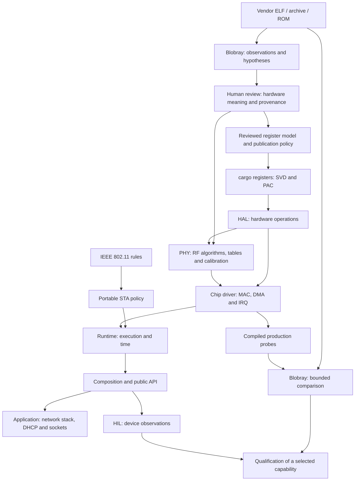
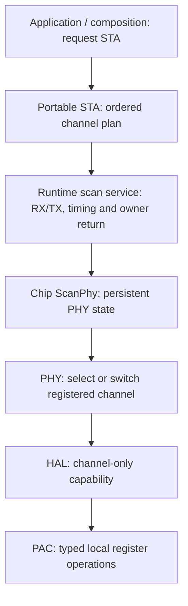
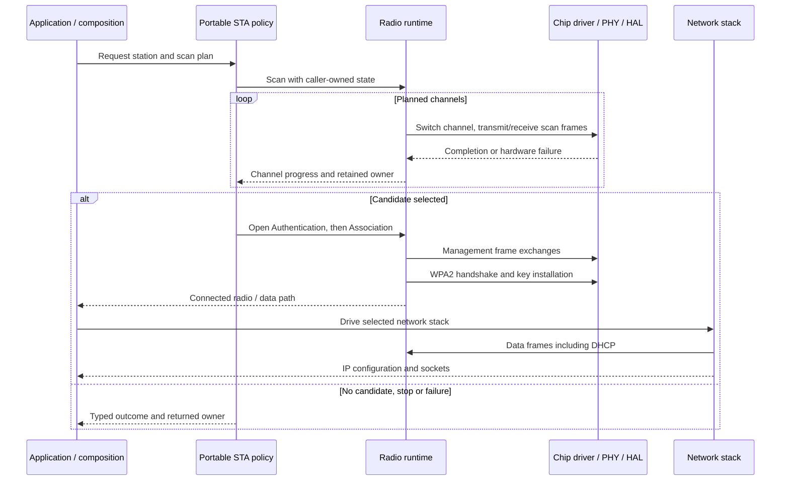
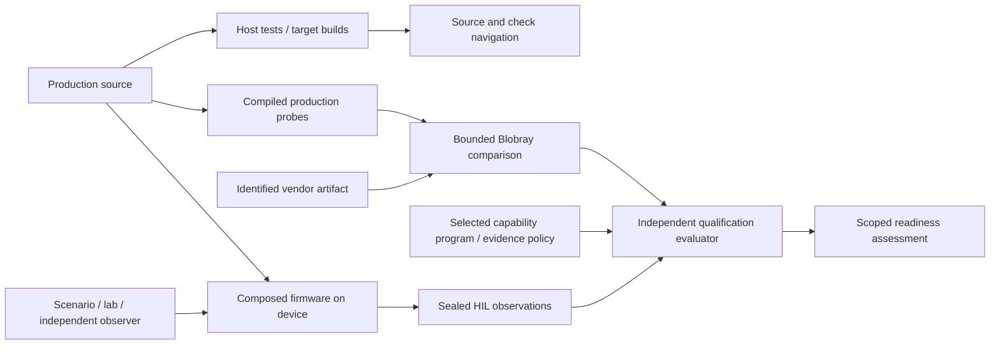

# From binary evidence to a Wi-Fi station

This guide is for contributors who know Rust and basic embedded programming.
It connects hardware research, protocol implementation and independent checks.
Start here before the detailed [repository architecture](architecture.md), then
try the [first host contribution](first-contribution.md).

## Three connected paths

Arrows show how knowledge, execution and evidence move. They are **not Cargo
dependencies**: the allowed dependency graph is defined in
[repository ownership](architecture.md#owners). Production does not depend on
Blobray, vendor artifacts or qualification.

Research establishes inputs to an implementation. Accepting a Blobray assertion
records a review decision at an identified knowledge revision; it does not
publish a PAC. A separate reviewed model and publication policy select that
interface. Comparison can continue after a driver exists, using probes that
compile the production implementation rather than another copy of it.

## Who makes each decision?

| Owner | Determines | Detailed contract |
| --- | --- | --- |
| Blobray | What selected binary code reveals under stated analysis, execution and model limits | [Task map](../tools/blobray/README.md#choose-a-task) |
| Reviewed model | Accepted physical registers, fields, applicability and operating modes | [Hardware descriptions](../registers/esp32s31/README.md) |
| PAC | Typed register authority and permitted register-local operations | [PAC boundary](../crates/hardware/esp32s31/pac/README.md) |
| HAL | Hardware sequencing, waits, delays and recovery | [HAL API source](../crates/hardware/esp32s31/hal/src/lib.rs) |
| PHY | RF algorithms, channel configuration, tables and calibration | [PHY](../crates/hardware/esp32s31/phy/README.md) |
| Chip driver | MAC/DMA/IRQ operations and hardware resource ownership | [Station backend](../crates/hardware/esp32s31/driver/ieee80211/sta/README.md) |
| IEEE 802.11 / STA | Frame rules, protocol transitions and portable policy | [Station policy](../crates/protocols/ieee80211/sta/README.md) |
| Runtime | Execution, timers, wakeups and owners retained across awaits | [Runtime](../crates/runtime/README.md) |
| Composition / application | System assembly, requested role, network stack and user behavior | [Composition](../crates/composition/esp32s31/embassy/ieee80211/README.md), [station example](../examples/esp32s31-station/README.md) |

PAC means *peripheral access crate*. HAL means *hardware abstraction layer*;
here its operations carry restricted authority, not arbitrary register access.
PHY is the physical radio layer; MAC is medium access control. STA is the station
role. DMA moves buffers between memory and hardware; IRQ signals an interrupt.
An **owner** is the value carrying exclusive authority or a resource lifetime.
A **probe** is a compiled entry point into production code. **HIL** means
hardware in the loop. A **capability program** selects requirements whose
readiness the independent qualification evaluator assesses.

## Handoffs, review and checks

| Transition | Input → result | Human decision | Check and owner |
| --- | --- | --- | --- |
| Capture → research | Caller-owned artifact → immutable capture and selected observations | Choose source identity, exact code/data scope and assumptions | [Blobray capture and analysis](../tools/blobray/next/README.md#use); unresolved paths stay visible |
| Research → accepted meaning | Observations and conflicts → reviewed physical declaration or data interpretation | Is the interpretation supported for this chip/profile? An access width is not a register width | [Register research](../tools/blobray/next/README.md#saved-register-research) and [review tool](../tools/registers/review/README.md) |
| Model → PAC | Reviewed model, provenance and API policy → SVD, Rust accessors and bindings | Which fields and ownership capabilities may production expose? | [Publication](../registers/esp32s31/publication/README.md); reproducible `cargo registers generate --check` |
| PAC → HAL | Restricted register authority → ordered hardware operation and terminal outcome | Sequence, wait bounds, delay and recovery requirements | [HAL source](../crates/hardware/esp32s31/hal/src/lib.rs); host behavior checks and applicable hardware evidence |
| Reviewed data + HAL → PHY | Tables, coefficients and hardware operations → channel/calibration algorithms | Source profile, representation, applicability and algorithm boundary | [PHY comparison](phy/README.md) and [source policy](source-policy.md) |
| HAL + PHY → chip driver | Hardware capabilities → MAC/DMA/IRQ transitions with retained owners | Acquisition, publication, completion and failure ownership | [Driver architecture](../crates/README.md); memory/ownership regressions and compiled probes |
| Protocol + driver → runtime | Portable requests and concrete ports → scheduled radio operations | Deadlines, cancellation, wakeups and owner return | [Runtime](../crates/runtime/README.md) and [portable scan tests](../crates/protocols/ieee80211/sta/src/scan/tests.rs) |
| Runtime → application | Composed hardware lifetime → role/control and packet interfaces | Board storage, credentials, stack and socket policy | [Station example](../examples/esp32s31-station/README.md); selected target build and HIL |
| Observations → qualification | Compiled comparisons and sealed device runs → assessment of selected requirements | Scope, freshness and accepted observation methods | [Evidence contract](verification-and-qualification.md) and [qualification](../qualification/README.md) |

Registers are only part of hardware knowledge. RF algorithms may require
recovered integer tables and calibration coefficients. Retain their source
identity, purpose, representation and applicable hardware/profile; verify the
values against the real source artifact. The
[data export contract](../tools/blobray/next/README.md#captured-data-tables-and-coefficients)
retains captured bytes and provenance. Binary origin does not justify omitting
required data or substituting an older profile. A synthetic exercise teaches
review mechanics; it cannot establish these facts about a real chip.

## Production layers during a scan

This is a call/authority view of one operation. The portable
[`scan` policy](../crates/protocols/ieee80211/sta/src/scan.rs) traverses the
caller-selected channel plan through a backend port. It does not tune a radio.
The [runtime binding](../crates/runtime/embassy/esp32s31/ieee80211/src/roles/scan/target.rs)
connects `ScanPhyPort` to the chip's
[`ScanPhy`](../crates/hardware/esp32s31/driver/ieee80211/sta/src/hardware/channel.rs).

`ScanPhy` borrows persistent registered PHY state. Initial `select_channel`
requires a cold, stopped MAC. `switch_channel` handles stop, retune and restore;
the cooperative path obtains serialized channel-only authority through
`RadioAccess`. The [PHY channel implementation](../crates/hardware/esp32s31/phy/src/channel.rs)
uses that limited HAL interface. A generic PAC owner does not escape upward.

## From finding an AP to an IP application

The sequence locates operations; it does not promise that every hardware path
is qualified. IEEE 802.11 Open Authentication precedes Association; WPA2 key
establishment is a later security exchange. DHCP belongs to the application's
network stack and uses the established data path. Reconnection repeats parts
of this lifecycle while preserving the resource-return rules. Follow the
[station example](../examples/esp32s31-station/README.md) for the implemented
network choices and retry behavior.

## What counts as evidence?

A host test proves behavior of its exercised model and implementation. A target
build proves that a selected composition builds. A Blobray `MATCH` is conditional
on selected cases, observations and explicit models; unsupported or unknown
selected behavior remains `INCOMPLETE`. Device observations need applicable
firmware, scenario and observer provenance. Only qualification combines accepted
evidence for the selected requirements; a static capability map has no readiness
verdict.

Next: [run the host tutorial](first-contribution.md), or follow
[the ESP32-S31 hardware route](station-hardware.md).
