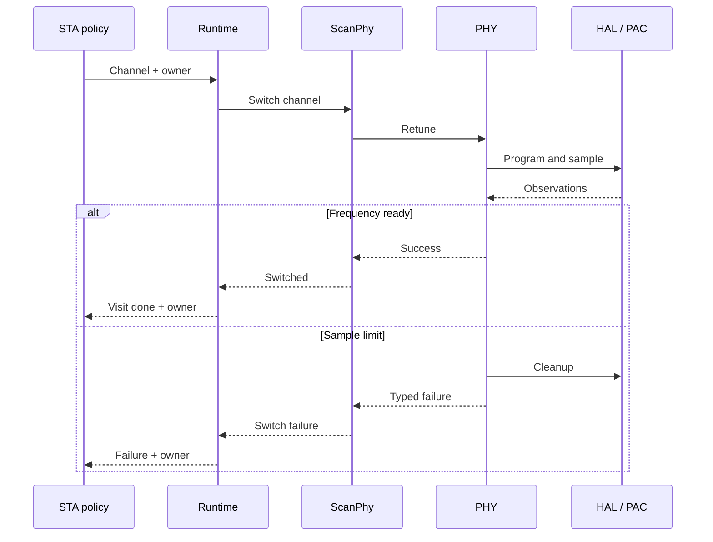

# Follow a channel change from evidence to STA

This worked example is for a Rust/embedded contributor who has read
[the architecture overview](binary-to-station.md). Reading the source and running
host tests needs no board or vendor binary. Repeating binary analysis requires
your own artifacts with the identities selected by the investigation. Running
the radio requires the [station hardware setup](station-hardware.md).

The operation is a channel change during a station scan. We follow one small
part, the frequency-ready observation, through the hardware layers, then locate
it in the larger scan. This is a source walkthrough, not a new hardware result.

## 1. Locate a behavior in the captured code

The [channel transition](../crates/hardware/esp32s31/phy/src/channel.rs) identifies
`libphy.a[phy_rfpll.o]::phy_chip_set_chan` as its recovered root. Its documented
ROM frequency child includes delays and a poll of
`FREQUENCY_PARAMETER_1_STATUS.FREQUENCY_READY`.

In a Blobray investigation, first capture and select the exact artifact and
function. Use [function or linked-image analysis](../tools/blobray/next/reference/analysis/README.md)
to inspect its calls and effects, then
[register research](../tools/blobray/next/reference/registers-data/README.md#saved-register-research)
to inspect candidate accesses. An unresolved call, address or path remains a
limit of that result. A static observation does not establish an interrupt,
a reset value or how long the hardware takes to become ready.

The source identity matters even when two libraries use the same function name.
The model's `BLOB_LIBPHY_PHY_RFPLL_CHANNEL` evidence entry identifies one archive;
the gain-table comment in the current channel implementation identifies another
archive and profile. Follow each claim's own
[evidence catalog](../registers/esp32s31/evidence/vendor-radio-libraries.toml)
and source comment. Do not treat these as one authenticated capture or silently
apply an older review to a new binary. The
[current PHY research instructions](../verification/vendor/projects/esp32s31/README.md#captured-phy-research-with-next)
explain repeatable analysis with caller-supplied inputs.

**Handoff:** observations and identified source context support a review. They
are not yet authority to expose a register to production code.

## 2. Find the accepted hardware meaning

Open the [frequency/channel model](../registers/esp32s31/model/peripherals/phy-frequency-channel-oracle.toml)
and find `FREQUENCY_PARAMETER_1_STATUS`, then its `FREQUENCY_READY` field and
corresponding `[[review]]` entry. The review points to
`BLOB_LIBPHY_PHY_RFPLL_CHANNEL`. Neighboring fields retain their own meanings
and incomplete or unknown status; knowledge of one field does not resolve them.

This is the durable hardware description used by the publisher. Blobray's
accepted knowledge is scoped to a captured source revision. A reviewer must
separately establish the model's geometry, semantics and applicability before
changing publication inputs. The
[synthetic exercise](first-contribution.md#read-the-observations-before-the-declaration)
shows why an observed byte access does not imply a one-byte physical register.

**Handoff:** a reviewed field can be selected by publication policy. Human
interpretation is explicit at this boundary; no command infers the whole PAC.

## 3. Follow publication into a restricted PAC operation

Find `observe_phy_frequency_ready` in the
[PAC API policy](../registers/esp32s31/policy/api.toml). Publication combines this
policy with the reviewed model and emits SVD, raw accessors, the semantic
capability catalog and binding metadata. From the repository root:

```console
cargo registers validate --manifest registers/esp32s31/publication/registers.toml
cargo registers generate --manifest registers/esp32s31/publication/registers.toml --check
```

These commands validate the selected sources and check reproducible outputs.
They do not authenticate the private binary or exercise a radio.

The handwritten [PAC frequency operations](../crates/hardware/esp32s31/pac/src/phy/frequency.rs)
expose `frequency_ready()` through the generated typed field read. The caller
gets a boolean observation through restricted register authority. It does not
get a raw address or permission to access unrelated registers.

**Handoff:** the PAC supplies a local operation with controlled authority.
It does not choose a scan channel or decide how many readiness samples to take.

## 4. Build a hardware operation and a PHY transition

[HAL frequency support](../crates/hardware/esp32s31/hal/src/phy/frequency.rs)
provides `sample_frequency_ready`. The
[channel-only HAL capability](../crates/hardware/esp32s31/hal/src/ieee80211/channel.rs)
exposes the observation alongside the hardware operations needed for retuning.
HAL is where hardware transactions and register authority are coordinated.

The [PHY channel transition](../crates/hardware/esp32s31/phy/src/channel.rs)
adds the RF algorithm: it issues actions and consumes typed completions.
`FrequencyReadyObserved` advances or repeats the readiness step;
`FrequencyReadyTimedOut` selects cleanup and a failure outcome. The transition
itself does not sleep or spin. The
[target port](../crates/hardware/esp32s31/phy/src/target_port.rs) executes the
actions, uses the supplied delay for timer actions, and enforces the current
`CHANNEL_READY_SAMPLE_LIMIT`. This implementation bounds samples; do not
reinterpret the sample limit as a measured elapsed-time guarantee.

Run the existing cleanup regression from the repository root:

```console
cargo test -p oer-esp32s31-phy channel::tests::frequency_timeout_runs_full_radio_cleanup --locked --offline
```

The [test](../crates/hardware/esp32s31/phy/src/channel/tests.rs) supplies two
not-ready observations and then a timeout. It checks that the transition
disables BBPLL calibration, clears DC memory and restores AGC before returning
the typed failure. It tests production transition behavior with supplied
completions; it does not measure RF settling or prove device quiescence.

Channel programming also needs RF tables and calibration state. The gain-table
source comments in this same module identify representation and applicability.
Those data do not come from PAC generation. See
[recovered-data policy](source-policy.md#recovered-tables-and-coefficients).

**Handoff:** PHY plus HAL implement a bounded hardware transition. Portable
STA policy can request a channel visit without knowing the register or RF table.

## 5. Connect the operation to the scan caller

The chip's [ScanPhy](../crates/roles/esp32s31/ieee80211/sta/src/hardware/channel.rs)
borrows persistent `RegisteredWifiPhy` state. Initial selection requires a cold,
stopped MAC. A later switch performs stop, retune and restore. The cooperative
path obtains serialized channel-only authority through `RadioAccess`.

The [runtime target binding](../crates/runtime/esp32s31/ieee80211/src/roles/scan/target.rs)
implements `ScanPhyPort` for this chip owner. Runtime scan services combine
channel switching with RX/TX and dwell timing. Above them, the
[portable scan service](../crates/protocols/ieee80211/sta/src/scan.rs) uses
`StaCandidateScanBackend`: begin once, visit the supplied channel plan, then
select a candidate. Every outcome carries the exact returned backend owner.



Arrows show requests and outcomes at the selected boundaries, not Cargo
dependencies. Cleanup is part of the transition; returning an owner does not
mean every failure leaves hardware reusable. Higher layers retain the error
and the applicable lifecycle state.

The PHY participant includes the transition and target port; HAL/PAC means
the limited channel capability and typed register operations. Runtime completes
the channel visit only after the associated RX/TX and dwell work.

## 6. Continue from a scan to an application

A selected AP is input to the station join lifecycle. Open Authentication and
Association precede WPA2 key establishment. The radio data path then carries
network traffic; the application's selected network stack owns DHCP and sockets.
See the [station lifecycle sequence](binary-to-station.md#from-finding-an-ap-to-an-ip-application)
and [buildable station example](../examples/esp32s31-station/README.md).

When changing this path, choose checks for the claim: a host regression for
transition behavior, register publication checks for model/API changes,
compiled-production comparison for selected vendor observations, and HIL for
device behavior. [Qualification](verification-and-qualification.md) assesses
accepted evidence for the selected capability. No result in this reading
exercise establishes that the whole station is qualified.
