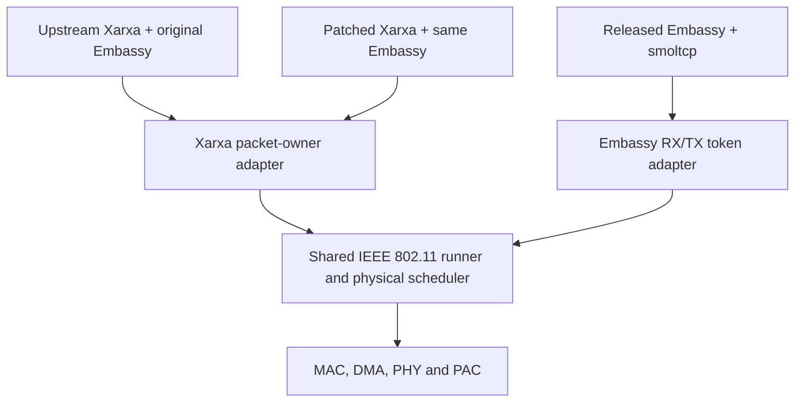

# Network implementations and why they coexist

This document explains which IP-stack implementation an application selects,
why the repository retains each contract, and what that choice changes at the
Wi-Fi boundary. [Wi-Fi network integration](wifi-egress.md) defines packet
ownership and radio execution; component READMEs describe their own APIs.

## Current choices

| Implementation | Purpose | Selection and availability |
| --- | --- | --- |
| **Upstream Xarxa + original Embassy** | An unmodified, reproducible reference for the Xarxa contract; applications can use the original APIs and measurements expose their actual limitations | `--network upstream-xarxa` in HIL and station/AP example builds |
| **Patched Xarxa + original Embassy** | A source-compatible correction to UDP device-capacity wakeups, with the same driver and application contract as the reference | `--network patched-xarxa` in HIL and station/AP example builds |
| **Upstream Embassy + smoltcp** | Compatibility with released network crates and their token-based driver API; an independent stack contract for comparison | `--network upstream-smoltcp` in HIL and station/AP example builds; `compat-network` in the product |
| **Owned Xarxa/Embassy** | Explicit RX/TX packet pools and packet-owner handoff through a maintained, broader patchset | `--network owned-xarxa` in HIL and station/AP example builds; `owned-network` remains the product library default |
| **Research engine** | Bounded synchronous protocol work and deferred packet construction | A library with host tests; no selectable native HIL or example composition |

Names identify both the stack and its source policy. `upstream` alone cannot
distinguish the two original network implementations. The original Git Embassy
revision used with Xarxa and the published `embassy-net` 0.9.1 release use
different network internals and APIs despite sharing a crate name/version.
The [published Embassy reference](https://docs.rs/embassy-net/0.9.1/embassy_net/)
describes its smoltcp integration. Manifests and effective lockfiles identify
the exact sources used by a build.

The source policy here concerns **network dependencies**. The ESP32-S31
`esp-hal` and PAC hardware forks are shared platform dependencies; choosing an
upstream network stack does not remove those hardware dependencies.

## Libraries, crates and source identity

Embassy is a collection of crates. `embassy-executor` runs async tasks;
`embassy-time` supplies async time; `embassy-net` wraps the IP stack. Selecting
network sources does not select a different executor or PHY timer. Xarxa and
smoltcp implement IP/transport protocols, while this repository supplies their
radio-facing adapters and the underlying IEEE 802.11 driver.

| Composition | External network crates and source | Repository adapter |
| --- | --- | --- |
| Upstream Xarxa | `embassy-net` from [original Embassy](https://github.com/embassy-rs/embassy/tree/c0fdd08e94138105fba8be3133c4ced91afc30fc/embassy-net); `xarxa` and `xarxa-driver` from [original Xarxa](https://github.com/embassy-rs/xarxa/tree/14c369bbcbe8ee7167488ac9c9e18be059d83555) | `open-esp-radio-xarxa-upstream` |
| Patched Xarxa | Same Embassy and `xarxa-driver`; only `xarxa` comes from the [UDP wait patch](https://github.com/ermacv/xarxa/tree/d1919959c7821cf2ba17c79da932e1ac6edc2e66) | Same `open-esp-radio-xarxa-upstream` |
| Embassy + smoltcp | Registry `embassy-net` 0.9.1, `embassy-net-driver` 0.2.0 and transitive `smoltcp` | `open-esp-radio-embassy-net-compat` |
| Owned Xarxa/Embassy | `embassy-net` and `embassy-net-driver` from the [owned Embassy fork](https://github.com/ermacv/embassy/tree/1fa0957c07398f83c9795b645a5a6ceda1270f91); `xarxa` from the [owned UDP capacity-wake revision](https://github.com/ermacv/xarxa/tree/0d41d8e80cb617d355cf6981b6ff76635c44cadc), retaining `xarxa-driver` and its pool at [the driver pin](https://github.com/ermacv/xarxa/tree/122e97146fc0a174ef3310f4526defc37663bed4) | `open-esp-radio-embassy-net` |

The original and owned Git revisions are reviewed pins, not tracking branches
or a promise of compatibility with every later upstream revision. Dependency
aliases such as `embassy-net-upstream`, `embassy-net-owned` and
`embassy-net-compat` in application manifests all name the package `embassy-net`;
the alias helps Rust source distinguish contracts and is not a separate
published crate. Optional inactive forks can remain in `Cargo.lock`. The
selected normal/build dependency graph determines what a firmware uses.

The product crate
[`open-esp-radio-esp32s31-embassy-wifi`](../driver/integration/esp32s31/embassy/ieee80211/README.md)
selects adapters and static resources. Its chip-specific bridges are
`open-esp-radio-esp32s31-wifi-xarxa-upstream` and
`open-esp-radio-esp32s31-wifi-embassy-compat`; the shared radio runner is
`open-esp-radio-esp32s31-wifi-embassy`. The [network source map](../driver/network/README.md)
and [driver map](../driver/README.md) locate these packages. Applications own
sockets and IP policy; adapter crates do not acquire independent PHY/DMA owners.

## Why the repository contains patches

Cargo's `[patch]` is a source-selection mechanism; it does not necessarily mean
that library code has been modified. The [Cargo reference](https://doc.rust-lang.org/cargo/reference/overriding-dependencies.html#the-patch-section)
defines workspace-root overrides and their transitive application.

| Source selection | Reason and scope |
| --- | --- |
| Minimal Xarxa fork | Change UDP wakeups when a routed device is full; preserve the original stack/driver API and packet pool |
| Owned Embassy/Xarxa forks | Expose explicit packet pools, credit-return wakes, bounded polling and construction in resource storage; this is a broader contract, not the minimal UDP patch |
| Original Embassy `embassy-time-driver` mapped to registry `=0.2.2` | Share one official timer ABI with the platform; the selected implementation is unmodified |
| Owned Embassy support crates mapped to registry | Reuse released `embassy-futures`, `embassy-sync` and `embassy-time` alongside the maintained network crates |
| `esp-hal` family fork | Supply S31 radio ownership, clock/time, memory startup and interrupt handoff support required by the platform |
| `esp-pacs` fork (`esp32s31` package) | Publish missing Wi-Fi, Bluetooth and IEEE 802.15.4 interrupt sources through the generated platform PAC |

Hardware pins and their exact responsibilities are owned by the
[esp-hal dependency boundary](../driver/adapters/esp-hal/esp32s31/README.md#dependency-boundary)
and [platform manifest](../platform/esp32s31/Cargo.toml). This platform PAC is
separate from this repository's [radio PAC](../driver/chips/esp32s31/pac/README.md).
An upstream network selection therefore means unmodified **network** sources,
not that the complete firmware contains no forks.

## Why keep original and patched Xarxa

The original composition establishes what the public contract can do without
network-source modifications. It is useful both to consumers who want that
contract and as a control for testing whether a patch addresses a specific
limitation. Retaining it avoids treating a measured improvement as an
assumption about every upstream workload.

The patched composition changes one scheduling decision in Xarxa. A UDP send
blocked by a full device records its destination; stack polling resolves the
current route and wakes that sender when the selected interface can transmit,
or when routing fails so the caller can observe the error. This prevents a
full TX queue from sustaining the original sender/runner wakeup loop. An
unrelated ready interface does not release the wait. Binding, closing or
starting another send clears it; the existing driver capacity notification
schedules the stack when TX space returns.

The [patch composition](../driver/network/dependencies/README.md)
retains the exact original `xarxa-driver`, packet pool and Embassy wrapper.
Its published source revision is selected by
[xarxa-patched.toml](../driver/network/dependencies/xarxa-patched.toml).
The builder rejects unexpected changes to the other dependency pins. The
patch is compatible with the original driver/socket APIs; it is not the
broader `owned-network` fork and does not establish that all resource waits
are efficient. Pool exhaustion and raw sockets retain upstream retry behavior.
The original pool has no public release event, including for buffers dropped
by application code outside the driver.

The owned composition also gates device-blocked UDP wakes on the current
route's capacity. Its Embassy pin selects that correction while retaining the
owned packet allocator and driver source identity. This fixes the device wait;
it does not redesign pool retry policy or reserve RX capacity in the original
shared-pool composition.

## What changes in the Wi-Fi driver

For **upstream-xarxa versus patched-xarxa**, the following are shared:

- the `upstream-network` Cargo feature and product composition;
- the Xarxa driver adapter, radio bridge, packet types, pool and queue depths;
- the physical Wi-Fi runner, scheduling rules and SRAM admission;
- IEEE 802.11 state machines, rate/retry policy and Block-Ack handling;
- PHY initialization/calibration, MMIO access, DMA and interrupt handling.

Only Xarxa's UDP wait state and wake policy differ. Different wake and packet
arrival timing can affect observed scheduling and throughput, but the choice
does not enable an alternative Wi-Fi driver implementation. Compiled firmware
is different because the selected stack code is different.

For **Embassy + smoltcp versus Xarxa**, the shared boundary is lower:



The smoltcp composition uses the released Embassy RX/TX token contract,
complete-frame staging and different stack/socket storage. It therefore can
have different copying costs, buffer budgets and backpressure behavior while
using the same physical radio implementation. Shared radio source does not
imply identical adapter costs or identical compiled binaries. The
[compatibility boundary](wifi-egress.md#compatibility-and-rx) describes these
ownership differences.

## Selecting an implemented composition

From the repository root:

```console
cargo hil image build performance --network upstream-xarxa
cargo hil run udp-tx-ht40-task-poll-diagnostic --network patched-xarxa
cargo xtask build firmware station --network upstream-xarxa
cargo xtask build firmware access-point --network patched-xarxa
cargo xtask build firmware station --network upstream-smoltcp
cargo xtask build firmware access-point --network owned-xarxa
```

HIL, the example builder, and direct station/AP Cargo builds default to
`upstream-xarxa`. All four implementations use the same `--network` spelling
in HIL `image build/flash`, `run`, `run-all`, and example builds.

| Build selection | Product Cargo feature | Additional source override |
| --- | --- | --- |
| `upstream-xarxa` | `upstream-network` | None |
| `patched-xarxa` | `upstream-network` | Pinned minimal Xarxa patch |
| `upstream-smoltcp` | `compat-network` | None |
| `owned-xarxa` | `owned-network` | Maintained sources declared in manifests |

The product **library** retains its existing `owned-network` Cargo default;
consumers choosing another contract must use `default-features = false` and
select one feature. CLI selectors describe a complete firmware composition,
whereas library features describe the adapter contract.

Example builds also accept the corresponding `--no-default-features --features`
spelling. The builder resolves that to the same implementation identity and
rejects conflicting network selections. Bundle directories and `network.txt`
record the resolved name, including when no `--network` was supplied. Monitor
and Bluetooth examples have no IP-stack selection.

Aliases `upstream` and `udp-backpressure` remain accepted for `upstream-xarxa`
and `patched-xarxa`. New image reports use canonical names. `cargo hil image
verify-rebuild` currently checks the original Xarxa composition only. Archived
runs retain their recorded command and firmware identity; replay cannot select
another implementation. HIL local dependency overrides are supported only
with `upstream-xarxa`.

## Shared workloads and different admission boundaries

Station composes DHCP and UDP echo on port 4321 for all four implementations.
AP composes the same DHCP server and UDP/TCP echo services on port 7. HIL shares
its UDP/TCP RX, TX and bidirectional workload code, session protocol, pacing,
timeouts, payload validation and result reporting across implementations.
Backend modules only compose stacks, configure IPv4 and adapt socket APIs.
TCP starts accepting before HIL publishes `SessionReady`, including when the
stack enters listen state on the first poll of `accept()`. The same accept
future is retained through readiness publication and connection completion.

The original and patched Xarxa UDP send can complete after handing its packet
to the driver or queueing it inside the stack for neighbor resolution.
Released Embassy/smoltcp send completes when a datagram
enters the socket byte ring. Host delivery and terminal drain therefore matter
when comparing TX results; an API completion alone is not delivery on air.

The ESP32-S31 original and patched Xarxa composition bounds each TX queue to
8 owners while retaining RX depth 16. With the default global pool of 16,
one queued TX direction therefore cannot consume the entire pool needed by
RX publication. Selected TX frames keep their owner until materialization/drop;
sockets and the other logical interface also share the pool. This queue budget
is not an exclusive RX reservation and does not bound unresolved-neighbor
owners held inside Xarxa.

The upstream global pool and unresolved-neighbor queue both default to 16
packet owners. A burst to an unresolved peer can fill that pool before its
ARP reply arrives. This adapter also allocates RX packets from the same pool,
so it can then reject the reply with `PoolExhausted`. The stack cannot resolve
the peer from a reply it never receives. The minimal wakeup patch retains this
resource dependency. Applications must account for neighbor-resolution and RX
headroom together; changing retry wakeups alone does not reserve RX memory.
The adapter's [resource contract](../driver/network/adapters/xarxa/upstream/README.md)
describes allocation failures and ownership.

The Embassy/smoltcp `receive()` contract requires a free TX slot to return
an RX/reply-token pair. With no TX slots, the stack cannot drain RX. The
standalone compatibility radio sink therefore attempts each RX publication
once and drops the new frame if its bounded storage is full. It never awaits
network capacity while holding the radio owner needed to materialize TX and
return software slots. Queued frames retain their owners and order; ordinary
and A-MSDU/reorder publication use the same admission policy. The resource
monitor counts full-storage publication refusals as `rx_queue_full`.

This is an explicit overload loss policy, not a guarantee of lossless RX or
a reserved reply pool. It preserves the unchanged upstream token contract
without additional payload storage. Same-channel role services can instead
retain bounded pending output and return backpressure to outer TX arbitration.
This dependency is distinct from unresolved-neighbor packets blocking a socket
TX queue.

HIL requests 16 queued RX datagrams in each stack. smoltcp retains 16 metadata
entries and 16 × 1472 bytes in each workload's active UDP direction, in PSRAM;
RX-only sockets have no TX byte ring, and TX-only sockets have no RX byte ring.
Xarxa retains packet owners through its pool instead. Both roles use the same
TCP receive/transmit buffer sizes, declared in the HIL traffic resource module.
Equal workload settings do not imply equal total memory use or copy costs.

The task-poll image observes the selected driver contract. For smoltcp, packet
transfers are counted when RX/TX tokens are consumed, not when they are offered;
TX token publication is infallible, so its rejected-publication count is zero.
Xarxa exposes separate readiness and fallible owner-publication operations.
These API differences must be considered when comparing diagnostic counters.
Source support and packaged firmware do not establish that every scenario or
performance gate passes; run bundles and qualification retain that authority.

## What a comparison establishes

Compare identical roles, channel/bandwidth, traffic shape, executor placement
and diagnostic image class. Report actual buffer budgets and copying
boundaries when adapter contracts differ. Throughput, packet loss, pending
polls, task residence, stack headroom and memory use answer different questions;
fewer polls alone are not a measurement of total CPU utilization.

The deterministic backpressure regression checks quiescence and recovery with
the actual production adapter. HIL measures the composed firmware; readiness
remains the [qualification](verification-and-qualification.md) authority.
Results belong in run bundles and commit descriptions, not in this current
architecture reference.
