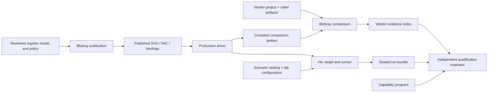

# Исходный аудит недрайверной части репозитория

Дата: 2026-09-05. База: `994aa093`.
Исторический снимок до реализации. Будущее время и старые пути ниже
относятся к исходному плану, а не к текущему backlog. Текущий результат —
[архитектура и выполненная миграция](../REPOSITORY_TOOLING_ARCHITECTURE.md).

## Решение

Иерархию следует строить по владельцу предметной области и результату его
работы. Сейчас смешаны три разных признака: исполняемый инструмент (`tools`),
способ проверки (`hil`) и проект с данными (`verification/vendor/targets`).
При этом часть реальных границ уже корректна. Перемещение всего проверочного
кода в общий `validation/` или всех Cargo packages в `projects/` ухудшит карту.

Рекомендуемая структура сохраняет самостоятельные Blobray и memory-report,
выделяет проверки репозитория в `tools/repo`, помещает evaluator в
`qualification/evaluator`, явно называет vendor investigations проектами и
выделяет register source-of-truth из vendor investigation. HIL остаётся
самостоятельной областью; внутри него имена должны описывать выполнение,
лабораторию, сеанс, доказательства и представление результатов.

Анализ выполнен основным агентом и тремя независимыми агентами: tools/Blobray,
verification/register publication, HIL/qualification/examples. Это аудит
иерархии, интерфейсов, зависимостей и владения данными; не построчная
верификация всех алгоритмов Blobray и не новая hardware qualification.

## Фактический охват

| Область | Tracked файлов | Cargo packages | Строк Rust, включая тесты |
| --- | ---: | ---: | ---: |
| tools | 532 | 12 | 222225 |
| verification | 294 | 13 | 6967 |
| hil | 328 | 6 | 55274 |
| qualification | 47 | 0 | 0 |
| svd | 4 | 0 | 0 |
| examples | 23 | 4 | 950 |
| Всего | 1228 | 35 | 285416 |

Изучены 233 каталога с tracked потомками. Полный список файлов, ближайших
owning packages, workspace roots и 247 dependency declarations сохранён в
[инвентаризации](README.md). Исходный код драйвера рассматривается
только как внешний потребитель/предмет проверки. `_oracles`, private lab/run
configs, build outputs и содержимое локальных vendor binaries не исследовались.

Root Cargo workspace имеет 64 участника, отдельный embedded HIL workspace —
4, probes workspace — 6. Эти три root подтверждены `cargo metadata --no-deps
--locked --offline`. Число 35 выше — все packages выбранных областей, включая
четыре independent examples; это не число участников одного workspace.

## Термины и полномочия

Verification проверяет соответствие заданным требованиям; product validation
проверяет пригодность для предполагаемого использования в рабочем окружении.
Оба процесса могут использовать тесты и анализ; деление «verification = host,
validation = hardware» некорректно. Это различие соответствует
[NASA Product Verification](https://www.nasa.gov/reference/5-3-product-verification/)
и [Product Validation](https://www.nasa.gov/reference/5-4-product-validation/).

В этом репозитории `validate` также означает узкую операцию проверки входного
документа или инварианта. Это не самостоятельный архитектурный владелец.
Верхнеуровневого `validation/` нет; существующие `validation.rs` и features
`validation-probes` имеют локальный контракт и не требуют общей папки.

| Владелец | Что получает | За какой результат отвечает |
| --- | --- | --- |
| Blobray engine | ELF/archive, typed models и caller-selected project | Анализ и vendor comparison: MATCH/DIFF/INCOMPLETE в пределах доказательств |
| Vendor project | Reusable chip facts, project overlay, probes, private run bindings | Композиция конкретного исследования и policy сравнения |
| Register publication | Reviewed model, provenance, API policy и ownership ranges | Воспроизводимые SVD/PAC/bindings, без присвоения hardware readiness |
| HIL runner | Scenario, target image recipe, private lab configuration | Исполнение на DUT и неизменяемый bundle с наблюдениями и исходом сценария |
| Qualification evaluator | Capability program, vendor index, sealed HIL bundles | Независимое вычисление vendor/HIL axes и итоговой готовности |
| Repository checks | Cargo graphs, compiler results, generated sources, linked images | Соблюдение source/dependency/unsafe/build policies |
| Memory-report | ELF и внешняя placement/stack policy | Фактическая карта памяти и проверка ограничений потребителя |



Эта схема задаёт полномочия, а не только Cargo edges. Проверяющий evidence
потребитель должен сохранять независимость от producer даже при соседних
папках. Package и filesystem project — разные границы: Cargo workspace
задаёт общие lock/output и root profiles/patches, а не предметного владельца.
Поэтому перенос пути не требует нового crate или workspace.
См. [Cargo Workspaces](https://doc.rust-lang.org/cargo/reference/workspaces.html).

## Подтверждённые проблемы

### 1. Qualification README описывает прежнюю модель доверия

[qualification/README.md](../../qualification/README.md) и
[verification/qualification contract](../VERIFICATION_AND_QUALIFICATION.md)
описывают v3: поиск production owners/test functions и отсутствие явно
заданных implementation/host/async outcomes. Но
[model.rs](../../qualification/evaluator/src/model.rs) задаёт schema 4 и берёт
`implementation`, `host`, `async` из деклараций программы, проверяя их
согласованность с gaps. Vendor и HIL axes вычисляются по evidence. Все три
действующих capability manifests используют schema 4.

Это существенная неточность документации: разработчик может принять
декларацию за машинное доказательство. Первый этап — описать реальное
поведение v4. Возвращать source regex или менять release policy под видом
переименования папок нельзя. `validate`, `evaluate`, `gate` остаются разными
операциями; валидная неполная программа не означает готовый продукт.

### 2. Verification содержит полноценные проекты, а README показывает пакеты данных

[verification/README.md](../../verification/README.md) не показывает reusable chip
providers и конкретный host executable. Фактически здесь 13 packages:
7 root-workspace packages для chip/project providers и host, 6 isolated probes.
`vendor/chips/esp32s31` — reusable chip identity/knowledge;
`vendor/targets/esp32s31` — проект исследования с policy, revisions, probes и
compiled overlay. Его `target.toml` описывает ISA/ABI; это не HIL board target.

Рекомендация: `vendor/targets` → `vendor/projects`, включая ESP32-C5 portability
fixture. Сохранять project IDs, provider IDs и package names. Конкретный
`blobray-host` остаётся в проекте: generic Blobray принимает registry и не
должен приобретать зависимость на ESP32-S31 composition. Шесть probes —
обёртки над compiled production code; перенос в HIL или driver неверен.

### 3. Production register publication вложена в vendor investigation

Источники одного контракта разбросаны:

- `verification/vendor/chips/esp32s31/registers`: device + 108 peripheral fragments;
- `verification/vendor/targets/esp32s31/registers`: API/lints и 9 provenance catalogs;
- `.../publication/vendor-project.toml`: отдельная source-only composition;
- `.../reviewed/project-facts.toml`: три reviewed IEEE 802.15.4 hardware assertions;
- `svd`: generated radio SVD/bindings и отдельный reviewed platform catalog;
- `driver/chips/esp32s31/pac`: оба generated Rust outputs и handwritten owners.

[svd/README.md](../../registers/esp32s31/README.md) ошибочно указывает project registers как
editable peripheral model; фактический model находится в chip subtree.
[Source-only manifest](../../registers/esp32s31/publication/vendor-project.toml)
уже отделён от artifact-specific comparison и должен сохранить этот контракт.
Full и source-only manifests дублируют один список из 26 ownership ranges.
При этом они выбирают разные inputs: source-only использует API/reviewed
assertions, не весь набор investigation evidence catalogs/lints. Общая policy
не должна автоматически импортировать полный investigation context.

Рекомендация: domain `registers/esp32s31` с model/policy/evidence/published и
отдельной publication composition. Полный vendor project ссылается на этот
контракт. Generator остаётся в Blobray, generated Rust остаётся в driver.
Так для изменения production register API не требуется владение vendor
investigation. `esp32s31-platform-radio-deps.svd` — reviewed upstream input,
его нельзя помечать generated output или кормить им radio PAC generator.

### 4. Tools смешивает проекты и repository checks

Первая фраза [tools/README.md](../../tools/README.md) ограничивает дерево генераторами
и policy checks, но Blobray — самостоятельный analysis product, а memory-report —
универсальная library + CLI. Все шесть корневых shell gates и Python Cargo graph
checker имеют одного repo owner; их стоит сгруппировать в `tools/repo`.

`tools/tests/test_run_limited.py` проверяет lifecycle launcher Blobray и
должен находиться у его scripts. Два остальных Python suites принадлежат repo
checks. [Предыдущий shell audit](../SHELL_SCRIPT_AUDIT.md) остаётся действительным:
все 11 shell entrypoints имеют назначение; доказанно ненужных новых скриптов
не найдено. `build-analysis-inputs` остаётся у vendor project, privileged
`linux-net` — у HIL. Разные языки реализации не требуют отдельных проектов.

Evaluator предлагается перенести из `tools/qualification-check` в
`qualification/evaluator`: владелец readiness находится рядом с программами,
сохраняя независимую проверку входов. `cargo qualification` и package identity
остаются прежними. `qualification/targets/<chip>` уже читается однозначно
внутри своей области и обязательного переименования не требует.

### 5. Названия HIL modules скрывают владельцев

[HIL runner](../../hil/host/runner/src/main.rs) правильно отдельный от driver, но:

| Сейчас внутри runner/src | Содержимое | Рекомендуемый владелец |
| --- | --- | --- |
| `qualification` | Workloads, scenario catalog, ImageClass | `scenario`, `workload`, `image/class` |
| `transport` | Lab config/provenance/lock, fixture controls, sockets, эксперименты | `lab`, `fixture`, `transport`, `workload` соответственно |
| `evidence/traffic_capture` | UART process/thread/session lifetime | `session` вместе с дочерними protocol/readiness/validation |
| `reporting/run/{archive,integrity,model}` | Авторитетный bundle, seal и provenance | `evidence/run` |
| `reporting` render/history | Производные HTML/JUnit/history views | `reporting` |

Разделять целых владельцев: fixture lock с lab lifecycle, serial capture с
сеансом, archive с integrity. Не заменять обзор владения массовым `pub(crate)`.
Embedded `runtime` технически корректно обозначает stage two boot; package и
binary identity сохраняются. Его `product_hil.rs`/`console.rs` следует разделять
на application/workload/session/logging обязанности после обзора состояния.
Board policy и HIL telemetry остаются в HIL, не становятся chip HAL.

### 6. Два потребителя HIL catalog сейчас расходятся

В `hil/scenarios` 189 плоских TOML schema 4. По текущим tags: 111 diagnostic,
44 qualification, 20 characterization; это пересекающиеся признаки, не
разделы владения. Группировка должна идти по protocol/workload domain.

[Runner catalog](../../hil/host/runner/src/scenario/catalog.rs)
читает один уровень и отбрасывает non-TOML entries. Filename не обязан совпадать
с scenario ID. [Evaluator](../../qualification/evaluator/src/hil.rs) отвергает
любой non-TOML entry, включая README/подкаталог, и требует filename stem = ID.
Простой `mv` в подпапки изменит discovery или сломает qualification.

Сначала установить единый filesystem contract: рекурсивные обычные TOML,
явная политика docs/symlinks/containment, уникальные IDs, filename = ID,
детерминированный порядок. Затем независимо реализовать и проверить оба reader.
ID, repetitions, tags и recipes сохраняются. Для run-all сохраняются порядок
`ImageClass::ALL` и прежний catalog order внутри каждого класса;
если новый обход меняет порядок, это отдельное осознанное изменение поведения.
Только после этого группировать каталог.

Общая Rust schema crate сейчас не нужна. Evaluator читает минимальные private
проекции bundle/catalog и независимо проверяет digests/provenance. Общими
должны быть документированные serialized contracts и небольшой synthetic
interoperability corpus, а не validator functions или runner internals.
`hil/protocol` остаётся bounded no_std wire protocol, не host bundle schema.

### 7. Declarative Blobray knowledge зависит от полного backend

Обе knowledge crates используют backend-riscv ради reviewed memory/pointer
описателей; backend тянет execution-model. Это не автоматическое выполнение
hooks, но declarative compile boundary слабее, чем можно ожидать из названия.

Отдельное ограниченное изменение: ISA-neutral reviewed descriptors перенести
в существующий `analysis-model`, оставив decoding/recognizer в backend.
Для pointer encoding сначала отделить immutable declaration от recognizer;
не переносить ISA algorithm вместе с данными. Новая crate не требуется.
Внутренний `tools/blobray/src/harnesses` содержит provider registry/composition;
каноническое `providers` точнее отражает его роль. Публичный API требует
явной compatibility политики, это не повод удалять root exports.

### 8. Reference firmware support частично скрыта внутри HIL

[Station example README](../../examples/esp32s31-station/README.md) прямо говорит,
что reference linker/bootstrap для полного production memory graph сейчас
находится в HIL. Поэтому source-check обычного примера не доказывает такой
же flashable image contract.

Это кандидат на отдельного reusable firmware/board owner с двумя реальными
потребителями — HIL и examples. Сначала нужна карта sections, relocation,
PSRAM/stack ownership и HIL-only instrumentation. Весь bootstrap/board/runtime
переносить в driver нельзя. Новый общий `platform`/`support` каталог заранее
не вводится; выделение оправдано только конкретной общей композицией.

## Предлагаемое дерево

Ниже будущие пути; это не описание уже выполненной миграции.

```text
tools/
  repo/                         repository gates + их Python tests
  blobray/                      generic product, crates/addons/catalogs
    scripts/tests/              launcher tests у владельца
  memory-report/                generic ELF library + CLI
verification/vendor/
  knowledge/                    data-only ecosystem vocabulary
  chips/esp32s31/                reusable chip identity + compiled provider
  projects/
    esp32s31/                   investigation manifest, overlays, probes, host
    esp32c5/                    portability fixture, без выдуманного chip model
registers/esp32s31/
  model/                        device/peripherals, MMIO map, reviewed facts
  policy/                       PAC API/lints/ownership ranges
  evidence/                     reviewed provenance catalogs
  upstream/                     reviewed platform-PAC register catalog
  published/                    generated radio SVD + bindings
  publication/                  source-only manifest, ссылки на общие inputs
qualification/
  evaluator/                    существующий независимый package
  targets/esp32s31/              три capability programs и исторические records
hil/
  protocol/                     bounded wire protocol
  scenarios/                    domain subfolders после исправления readers
  host/
    runner/src/
      scenario/ image/ lab/ fixture/ session/ workload/ evidence/ reporting/
    linux-net/                  privileged fixture
  targets/esp32s31/
    board/ bootstrap/ runtime/ telemetry/ linker/ memory/
examples/                       обычные application compositions
```

`registers` заменяет узкий format-root `svd` и принимает его соответствующие
файлы; это не второй параллельный источник register truth. Reusable chip
provider и artifact-specific provider остаются разными. Data-only ecosystem
knowledge не сливается с executable addons. Каталог не обязан быть crate.

## Данные, generated результаты и история

| Класс | Владелец / место | Политика |
| --- | --- | --- |
| Reviewed models/policies | registers, vendor project, qualification program | Версионировать как исходные inputs; provenance/IDs/applicability сохранять |
| Generated production outputs | published register files и driver PAC | Версионировать там, где их потребляют; publisher reproducibility |
| Private artifact/run bindings | ignored caller-selected locations | Не переносить содержимое в source tree; только public templates |
| Mutable analysis/cache/image builds | project generated/cache и `target/hil/...` | Не считать доказательством завершённой проверки |
| Vendor evidence index | project output, выбранный manifest | Freshness/source hashes проверяет evaluator |
| Sealed HIL bundles / firmware objects | `target/hil/<chip>/{runs,objects}` | Не переписывать старые manifests/hashes ради новых source paths |
| HTML/JSON history | `target/hil/<chip>/history.*` | Восстанавливаемое представление sealed bundles |
| Dated records/revision snapshots | существующие records/revisions | История, не текущий verdict; исходные identity/schema сохранять |

На первом этапе не унифицировать все output dirs в новый `artifacts/`:
Blobray workspace cache и HIL sealed runs имеют разные lifecycle/trust contracts.
В частности, старый `revisions/state.blobray` уже имеет историческую schema 4
при текущей 5; path cleanup не должен выдавать его за свежий валидный run.

## План реализации и условия завершения

| Этап | Работа | Условие приёмки |
| --- | --- | --- |
| 1. Контракты и навигация | Исправить qualification v4 docs, source-of-truth SVD docs, README карт tools/verification; перечислить реальные entrypoints | Документация соответствует текущему коду; текущий и будущий paths не смешаны |
| 2. Перемещения с сохранением поведения | tools/repo + tests, qualification/evaluator, vendor/projects; workspace/script/test/doc references | Package/API identities, тела исходного кода, CLI, provider/project IDs и schemas сохранены; metadata всех workspace islands, scripts/tests/standalone checks PASS |
| 3. HIL module ownership | Разделить scenario/image/workload/lab/session/evidence/reporting и embedded application responsibilities | Поля/Drop/async boundaries/effective visibility/cfg прежние; host tests и все затронутые target image profiles PASS |
| 4. Catalog contract | Независимые readers и positive/negative interoperability fixtures; затем domain folders | Те же 189 IDs и значения TOML, repetitions/tags/image selection; прежний execution order либо отдельно согласованная смена; silent loss/duplicates/path escapes отвергаются |
| 5. Register owner | Перенести model/policy/review inputs/publication/published; устранить дублирование ranges через explicit shared policy | Baseline SHA/содержимое обоих Rust outputs, radio SVD и bindings совпадают либо каждое отклонение явно рассмотрено; source-only publication без private artifacts; отдельные input selection sets и provider/applicability contracts сохранены |
| 6. Blobray typed boundary | providers namespace; выделить neutral reviewed descriptors из backend | Existing semantic tests и standalone build, reviewed declarations сохраняют смысл; no chip dependency в generic engine |
| 7. Общий firmware support | Инвентаризировать boot/linker contract; выделить только доказанно общее с конкретным example consumer | Реальные linked images, placement/stack/relocation проверки; HIL instrumentation не попадает в product support |

Этапы 4, 5 (shared policy schema) и 6 содержат изменения контрактов и требуют
отдельных focused regressions. Их нельзя выдавать за mechanical path rename.
Если этап 7 не выявит безопасного общего owner, результатом будет явное
обоснование сохранённой композиции и документированный предел examples.

Итоговые проверки: обычные параллельные workspace tests, fmt/Clippy,
metadata всех islands, обе Python группы, shell syntax/ShellCheck,
source-only, standalone Blobray, affected PAC publication и actual target
image builds. Не добавлять regex assertions по Rust именам как замену
компилятору и ownership review. Не менять pins и не создавать новые crates
для симметрии каталогов. Независимые workspace patches нельзя потерять при
переносе: Cargo не наследует их между root manifests.

Изменённый source path может законно сделать прежнее evidence устаревшим.
Пересчёт hashes в старом bundle ради зелёного verdict недопустим. Исторические
HIL/vendor результаты сохраняются как история; новые qualifying результаты
должны быть произведены соответствующим workflow после миграции.

## Проверка самого аудита

Инвентаризация сверена с tracked tree базы; каждый local dependency path
разрешается в существующий manifest. Locked/offline metadata трёх основных
workspaces прочитаны без сборки. Runtime, scripts, Cargo manifests/locks,
qualification claims и аппаратное состояние этим аудитом не менялись.
Полные тесты и on-air прогоны не запускались: текущий результат — документы
и review artifacts, а не реализация предложенной структуры.
