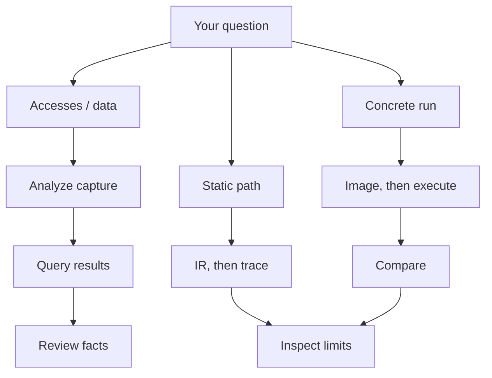

# Blobray

Blobray investigates captured RV32 ELF/archive inputs and retains analysis,
reviewed knowledge and concrete comparison evidence. `cargo blobray` runs the
new application directly; its Linux supervisor owns memory/time limits and child
process cleanup. No external limiter is required.

Use Blobray when the missing information is in a captured binary: where a
register is accessed, which calls reach it, what data a function consumes, or
how selected observations compare with compiled Rust. It produces retained
research and conditional comparison results. Implementing the hardware
operation belongs to PAC/HAL/PHY and the driver; choosing protocol behavior
belongs to the portable protocol layer. The
[architecture route](../../docs/binary-to-station.md) explains those handoffs.

## Choose a task

Start with [the host tutorial](../../docs/first-contribution.md) for a synthetic
exercise, or [the hardware route](../../docs/station-hardware.md) for real input
and board prerequisites. Commands below name current families; follow each
reference for required selectors, request files and supported subcommands.

| Task | Current command families | Reference |
| --- | --- | --- |
| Capture and inspect inputs | `init`, `import`, `inventory`, `select`, `doctor` | [Capture](next/reference/capture-images/README.md#use), [selection](next/reference/capture-images/README.md#selection-and-inspection-plans), [diagnosis](next/reference/resources-storage/README.md#diagnosis-and-recovery) |
| Investigate code | `analyze-function`, `analyze-project`, `research` | [Function analysis](next/reference/analysis/README.md#function-analysis-contract), [library research](next/reference/analysis/README.md#library-investigations) |
| Find accesses and relationships | `find-accesses`, `find-references`, `navigate`, `flow`, `memory-slice` | [Navigation](next/reference/navigation/README.md#navigation-over-saved-research), [flow](next/reference/navigation/README.md#structural-flow-and-effect-inventory), [memory](next/reference/navigation/README.md#memory-definitions-at-a-publication-point) |
| Investigate registers and data | `registers`, `data`, `export-data`, `knowledge` | [Register research](next/reference/registers-data/README.md#saved-register-research), [tables and coefficients](next/reference/registers-data/README.md#captured-data-tables-and-coefficients) |
| Prepare a linked image | `link-plan`, `prepare-image`, `images` | [Prepared images](next/reference/capture-images/README.md#synthetic-prepared-images) |
| Inspect static representations | `ir`, `trace` | [Semantic IR](next/reference/ir-traces/README.md#saved-semantic-ir-profiles), [static traces](next/reference/ir-traces/README.md#static-observable-traces) |
| Execute and compare | `execute`, `compare`, `replay`, `code-coverage` | [Execution and comparison](next/reference/execution/README.md#concrete-execution-and-comparison), [effect contracts](next/reference/comparison/README.md#reviewed-effect-comparison) |
| Preserve research | `backup`, `restore`, explicit export commands | [Knowledge and preservation](next/reference/knowledge-review/README.md#knowledge-and-preservation) |

### Choose a research method



Arrows show an operator's choice of method and next step. Querying saved facts
does not execute a device. A static trace follows decidable saved paths;
concrete execution supplies machine state and explicit device/call models.
Both can leave selected behavior unresolved.

| Question | Required input | Inspect in the result | Next action |
| --- | --- | --- | --- |
| What is in this archive or ELF? | Caller-owned input and source identity | Captured revision, inventory and diagnostics | Select exact symbols or ranges |
| Which code accesses this MMIO range? | Analyzed scope and explicit address range | Observations, masks, provenance and unresolved addresses | Review physical meaning; do not infer register width from access width |
| What values or coefficients does this code use? | Captured data range or retained instruction evidence | Exact bytes, representation and applicability | Review and export required data with provenance |
| Which paths and memory definitions reach an operation? | Saved analyses and explicit query scope | Structural relationships, ambiguity and blockers | Refine the scope or investigate a missing dependency |
| Do two selected static paths have the same observations? | Saved IR, roots, entry inputs and observation ranges | Ordered effects, exactness and `MATCH`/`DIFF`/`INCOMPLETE` | Resolve blockers or choose concrete execution |
| Does this compiled Rust operation agree with the vendor case? | Both captured implementations, concrete scenarios, models and a relation | Execution completeness, selected differences and model assumptions | Fix the implementation or review the intended relation |
| Can another investigation reopen these results? | Retained project | Backup/restore integrity and source-free reads | Preserve the whole project; an individual export is not a complete backup |

## Three different choices

- **Research method:** static analysis, concrete scenario execution or comparison.
  A static trace is not an executed trace or an equivalence proof.
- **Output format:** `--format human` or `--format json`; this changes presentation,
  not the research method or verdict.
- **Resource enforcement:** `--limit-mode kernel` requires delegated cgroups;
  `--limit-mode watchdog` explicitly chooses sampled process-tree enforcement.
  There is no automatic fallback.

Related tools have different owners: `cargo registers` publishes reviewed
hardware interfaces; `cargo xtask` checks and builds repository compositions;
`cargo hil` obtains device observations; `cargo qualification` evaluates a
selected set of requirements. Blobray does not decide product readiness.

### Know which interface you are reading

`cargo blobray` invokes `blobray-next`; the
[operator index](next/README.md#reference-navigation) describes that interface.
CLI and JSON use the same application operations. `--help` is available on the
top-level command and subcommands. JSON format is useful for automation; it is
not a separate analysis engine. `Completed` describes run termination and may
coexist with partial coverage or an `INCOMPLETE` comparison.

TUI, reference-code generation, retention GC and cross-revision rebase are not
implemented. Design obligations do not make those features callable. Use the
current references to select commands and their supported scope.

## Start an investigation

Blobray and the typed vendor scenarios form the separate `tools/blobray` Cargo
workspace, with its own `Cargo.lock` and `tools/blobray/target` directory, so
Blobray dependencies never change the radio workspace. From the repository
root, `cargo blobray` and `--manifest-path tools/blobray/Cargo.toml` select it.

```console
cargo build --manifest-path tools/blobray/Cargo.toml --profile blobray -p blobray-next --bin blobray
cargo blobray init --project /path/to/research
cargo blobray import --project /path/to/research --input vendor=/path/to/lib.a --limit-mode watchdog
cargo blobray analyze-project --project /path/to/research --limit-mode watchdog
cargo blobray status --project /path/to/research --limit-mode watchdog
```

Kernel enforcement requires a delegated cgroup. `--limit-mode watchdog` explicitly
selects sampled process-tree RSS enforcement when that is the desired policy;
there is no automatic fallback. See the [operator reference](next/README.md) for
linking, research, knowledge review, execution/comparison, replay and preservation.
Explicit executable ranges and physical static/dynamic symbols support retained
code research without inferred boundaries. Exact data ranges, integer-table review and instruction-derived constants can be
exported with captured bytes and provenance; see the operator reference.
CLI/JSON share the [application](crates/application/README.md) operations.
Saved interface discovery, function/context review, structural paths, memory slices
and conditional event routes retain their evidence. The register catalogue reports
MMIO candidates and masks separately from reviewed physical declarations.
Configured semantic IR profiles retain original facts and provenance. Static trace
queries compare explicitly selected physical MMIO/fence observations with visible
path blockers and assumptions; they are distinct from concrete execution.

Register source publication belongs to the independent
[register tool](../registers/README.md). It consumes reviewed hardware models and
policies, without loading an investigation or executing vendor code.

```console
cargo registers generate --manifest registers/esp32s31/publication/registers.toml --check
cargo xtask check blobray-standalone
```

Concrete execution supports phased RV32 integer/stack arguments, atomics, explicit
goals, device/call models and reviewed runtime interfaces/FIFO services. Comparison
selects MMIO/fence/delay, low/high return words, final normal-memory ranges,
physical or reviewed call pairs, and the internal memory/branch timeline. Explicit
accepted projections map byte fields/arrays, branch coordinates and ABI word
positions while preserving unknowns and raw physical evidence.
Unknown selected values and unmet goals/model obligations cannot MATCH. Results
remain conditional on the selected cases and explicit modeling assumptions.

[Reviewed effect contracts](next/reference/comparison/README.md#reviewed-effect-comparison) are
implemented and retain their conditional claim ceiling. Cross-revision
correspondence/rebase, retention GC, reference-code generation and TUI remain
pending. Unsupported execution remains `INCOMPLETE`.

The [architecture](docs/design/architecture.md), [contracts](docs/design/contracts.md)
and [workflows](docs/design/workflows.md) distinguish implemented scope from target
obligations. Qualifying production behavior remains an external responsibility.
