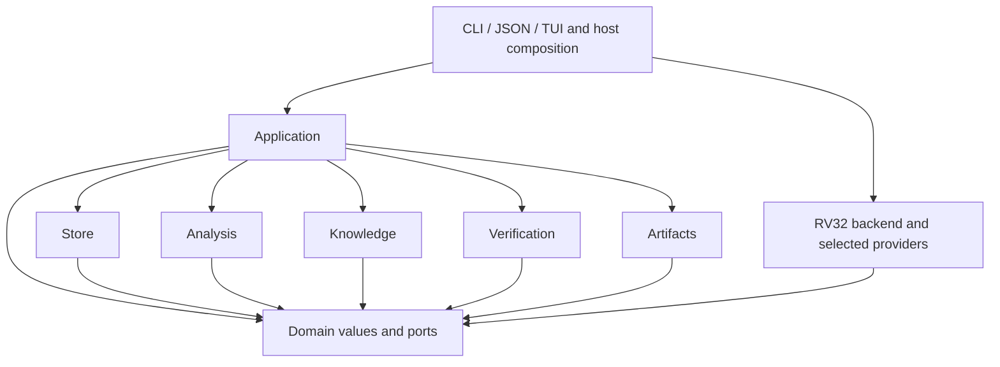

# Blobray architecture

This directory is the architecture authority for Blobray Next. Implemented
profiles and remaining target interfaces are distinguished in
[workflows](workflows.md); the [operator reference](../../next/README.md)
owns CLI syntax and current format versions. Legacy architecture documents govern
only the retained legacy engine and do not define Next behavior.

This document owns purpose, component boundaries and dependency direction.
[Contracts](contracts.md) owns identities, interfaces, persistence and resource
lifetimes. [Workflows](workflows.md) owns user scenarios and acceptance conditions.

## Purpose and success conditions

Blobray supports reproducible investigation of compiled vendor software,
preservation of reviewed knowledge, and evidence-based comparison with compiled
Rust replacements. A researcher and an automated client operate on the same
project state through the same application operations.

The unit of work is an investigation with identified inputs and explicit
questions. A successful investigation preserves what was observed, how it was
derived, what was assumed, what was accepted by review, and what remains unknown.
An analysis result is useful without being a proof of equivalence.

The architecture satisfies these conditions:

- Import preserves private binary inputs independently of their original paths.
- Every run binds a fixed investigation revision and its execution recipe.
- Clearing computational caches preserves accepted knowledge and its evidence.
- Changing a library produces a new revision and explicit correspondence;
  existing evidence remains interpretable in its original context.
- Readers observe coherent publications. Failure and cancellation cannot expose
  an unfinished run as the current completed result.
- CLI, JSON and TUI share selection, analysis, review and verification semantics.
- Each resource has a named owner for acquisition, completion and release.
- An uncertainty or unsupported operation remains visible at every projection.

The first implementation covers RV32 and the ESP32-S31 investigation. Container
formats, ISA semantics, ABI, ecosystem models and chip facts have separate
interfaces. Additional ISA implementations are outside this design's initial
acceptance scope. The initial deployment is a local repository with one writer
and concurrent readers. Distributed execution, a network service and concurrent
collaborative editing are outside that scope.

SVD/PAC and reference-code generators are separate consumers of versioned
research contracts. Blobray supplies knowledge and evidence to them; their
publication policies do not shape the analysis engine. Production readiness
belongs to the independent qualification evaluator, as defined by the
[repository qualification contract](../../../../docs/verification-and-qualification.md).

## Information boundaries

| Kind | Authority and owner | Relationship to other information |
| --- | --- | --- |
| Imported source | Exact captured bytes and import provenance; store | Root input, privately retained outside Git |
| Structural observation | Artifact parser or ISA backend, identified by producer | Refers to exact source occurrences; retains unsupported regions |
| Derived analysis | Analysis operation and its complete recipe | Depends on observations and selected interpretation inputs |
| Hypothesis | Analysis or researcher proposal | Has supporting evidence and unresolved obligations; cannot satisfy a reviewed assertion by itself |
| Reviewed assertion | Knowledge transaction and recorded review decision | Has subject, applicability and retained evidence; cannot rewrite an observation |
| Executable model | Explicit provider implementation and applicability | Supplies bounded environmental behavior; records its participation |
| Comparison evidence | Verification operation | Records compiled inputs, scenarios, observation relation and verdict |
| Qualification result | External evaluator | Consumes eligible evidence under independent readiness policy |

Physical occurrence identity, semantic subject identity, and correspondence are
distinct. A semantic name can outlive a binary revision, but applying it to a new
occurrence requires a recorded association. Correspondence is evidence for that
association, not an automatic transfer of all previous assertions.

## Crates and modules

Crate boundaries enforce independent dependency and authority rules. Modules
inside each crate divide implementation without acquiring extra capabilities.
The shipping host package is `blobray-next` and its executable is `blobray`. Modules within existing crates own prepared objects, borrowed data views, reference indexes and concrete scenarios; these responsibilities do not require another runtime crate.

| Crate | Principal modules | Owns | Allowed local dependencies |
| --- | --- | --- | --- |
| `blobray-domain` | identity, provenance, applicability, observations, effects, ports | Shared values and narrow extension interfaces | None |
| `blobray-artifacts` | containers, objects, symbols, relocations, mappings | Structural inspection of supplied immutable bytes | domain |
| `blobray-analysis` | passes, IR, relationships, correspondence, lineage | Derived analysis and computation dependency declarations | domain |
| `blobray-backend-riscv` | decode, lift, ABI, execution | RV32 semantics and concrete machine state | domain |
| `blobray-knowledge` | code, functions, interfaces, registers, review | Assertion validation and explicit acceptance/rebase decisions | domain |
| `blobray-verification` | scenarios, comparison, evidence | Comparison relations and verdict construction | domain |
| `blobray-store` | imports, objects, revisions, transactions, cache, retention | Durable storage and separately authorized cache operations | domain |
| `blobray-application` | workspace, operations, planning, jobs, image preparation, queries | User operations, orchestration and resource ownership | domain, artifacts, analysis, knowledge, verification, store |
| `blobray` | CLI, JSON, TUI, host composition, platform adapters | Process entry points, rendering and concrete dependency selection | application, domain, backend-riscv, selected add-ons |

The common `blobray-` prefix is omitted in the dependency column. Application
receives backend, model and external-tool capabilities through domain ports; it
has no dependency on the RISC-V implementation. Analysis obtains lifting through
the same ports. Verification can request execution through an injected executor
and compares typed observations; it cannot access the repository or select a
different input behind the caller's back.

Domain modules contain shared values and the contracts needed for dependency
inversion. They do not accumulate workspace orchestration, parsers, registries,
database connections or concrete model implementations. A private result type
stays with its subsystem until another boundary actually consumes it.

### Module authority

A crate dependency permits calling an interface; it does not grant every module
in the caller the callee's full authority. The following module boundaries apply
even when their implementation shares a crate or process.

| Module boundary | Receives | Owns | Cannot acquire implicitly |
| --- | --- | --- | --- |
| application / workspace | Explicit project selection and store factory | Opening sessions and selecting revisions | Analysis or repair while opening a read session |
| application / planning | Retained snapshot, request, pass and provider descriptors | Immutable recipe and prerequisite explanation | Live input capture, pass execution or publication |
| application / jobs | Admitted operation, host capabilities and resource policy | Scheduling, cancellation, accounting and terminal cleanup | Frontend-specific execution semantics |
| application / image preparation | Link plan and captured input leases | Materialization recipe, tool invocation request and validated image receipt | A different tool, input order or companion chosen by the backend |
| store / transactions | Explicit writer capability and expected base | Durable payload retention and atomic reference changes | Claim acceptance or comparison verdicts |
| store / readers | Selected revision/publication and read lease | Validation and bounded delivery of retained records | Writer creation, origin reload, repair or migration |
| store / retention | Explicit maintenance request and reachability roots | Preview, root revalidation and reclamation | Expiration of reviewed knowledge to meet a quota |
| analysis / passes | Declared dependencies, byte/image views, ISA ports and run control | Observations, hypotheses and disposable memo | Tool discovery, accepted knowledge changes or current selection |
| knowledge / review | Candidate assertions, applicability and retained evidence | Semantic validation of an acceptance candidate | Fetching source paths or committing the candidate |
| verification / comparison | Execution observations, coverage and declared relation | Verdict, counterexample and unsatisfied obligations | Substituting an implementation or upgrading a claim ceiling |
| host / adapters | Explicit launch/render request and owned resources | OS containment, tool identification and presentation | Research selection, review or verdict policy |

Application may use concrete store transactions internally. Computation modules
receive only byte sources, selected records and output sinks; passing a store
`Project` or an application reference would also expose unrelated authority.
An artifact parser validates binary structure; store validates serialized record
structure and reference ownership; application validates operation outputs. These
are complementary checks, not interchangeable parsers.

Domain owns cross-subsystem identities, observations and narrow resource/control
ports. Policy-free capacity bookkeeping may live with those ports. Application
owns budget defaults/admission and the supervisor's launch/recovery protocol;
host owns Linux process identity, containment configuration and output format.
Private worker messages are not public research schemas. A shared import-job
module is not a reason to expose staging paths or human/JSON selection to parsers.

No additional runtime or allocator crate is required by this design. Extracting
a crate requires a distinct authority or independently usable contract; file
size, common prefixes and similar container names are insufficient reasons.

Arrows represent compile-time dependencies. Runtime calls through injected ports
do not add a reverse crate dependency.

## Authority and extension boundaries

**Target extension contract:** a general `ProviderSet` is not a callable Next
registry. The current host injects the decoder/executor and operation host.
The broader provider contract below does not require a new runtime crate.

In that target contract, the application owns a `ProviderSet` for its lifetime. Creating another
application with different providers is supported in the same process. Library
code does not install a process-global registry, inspect CLI flags, or read
environment variables to select a provider.

Providers declare identity, implementation identity, contract versions,
applicability, supported operations and interpretation inputs. A compiled model
is an implementation dependency even when its configuration is unchanged.
Facts-only packs and executable models remain separate selections. Chip facts
do not acquire investigation-specific applicability merely through composition.

The image-preparation operation owns link planning. Its host adapter owns each
external linker process, CLI/script dialect and raw evidence parsers under the
application job supervisor. `LinkerHost` accepts an ElfAnalysisLinkV1 semantic
request and returns typed occurrence-qualified placement/extraction/exit records.
LLD and GNU ld retain distinct identities and archive-selection semantics.
GNU seekable output uses an application-admitted extent enforced by Linux
RLIMIT_FSIZE; application independently validates roots and ELF before publication. The ISA backend
consumes a prepared image; it does not discover tools through `PATH` or invoke
`rustc` to choose a linker. All execute, replay and comparison operations use
the same image-preparation contract.

The job supervisor owns cancellation, resource budgets, temporary directories
and descendant processes. CLI and TUI are clients of this owner. The resource
limiter is a platform adapter of the same job contract. Existing repository
process helpers may inform that adapter, but importing a repository-only helper
must not break standalone Blobray composition.

The application also owns the cooperative execution context: an operation-wide
work counter, deadline and bounded progress. Parsers and storage receive a narrow
control port from domain; they cannot choose their own budgets or restart clocks.
The host owns emergency containment and platform observations. No second runtime
or global allocator becomes an implicit resource owner. The mandatory
[resource contracts](contracts.md#resource-ownership-and-bounded-computation)
apply to computation, retained-data queries and diagnostics. Implemented coverage
is reported by Next, separately from these target obligations.

In Next, application creates the working-capacity authority. Domain defines
positional byte and borrowed-record ports; artifacts enumerates members and emits
ELF records; store owns verified file leases, disk streams and read-only manifest
validation. Application owns temporary disk policy, full operation admission and
aggregate reservations; store admits each data-file extension through bounded
files. Domain defines the capacity/error/observation ports. Host owns private
runtime-root validation, process identity and containment. Read-query output is temporary caller
state outside the project, with no durable journal or writer authority. One host
worker contract and application job set serve import, queries, inspection planning
and planned inspection. Runtime owner records and leases span query delivery and
Plan lifetime; only proven orphans are automatically reclaimed. Project import
recovery remains explicit. The implemented limits and exclusions belong to the
[temporary storage contract](../../next/README.md#temporary-storage-and-crash-cleanup).
Plans retain a captured manifest and fixed recipe;
reopening verifies the selected project without substituting current. Restricted
application read views hide writer/recovery access and pin the selected manifest;
query admission resolves current before launching work. CLI import and inventory consume
streaming paths; the materializing convenience APIs and their narrower guarantees
are described in Next's [memory boundary](../../next/README.md#current-memory-boundary).

The target supervisor serves durable operations and ephemeral read operations.
They share admission, cancellation, deadlines, worker ownership and cleanup.
Only durable operations receive a project journal and publication capability.
Read operations return their diagnostics to the caller. Sharing the supervisor
does not authorize a query to create a project write lock or recovery record.
Embedded synchronous adapters use the same operation lifecycle; lower-level
streaming ports explicitly leave supervision and consumer capacity to the caller.

Knowledge validators borrow observations and assertion candidates. Storage and
application own reading, committing and exporting them. External generators
receive a validated snapshot and produce an export bundle with provenance; they
cannot modify research observations or comparison verdicts. HAL, driver and
qualification behavior remains with those external owners.

## Disposition of existing responsibilities

This mapping defines destination responsibilities, not a code-movement recipe.
Existing algorithms require validation against the target contracts before reuse.

| Existing responsibility | Target disposition |
| --- | --- |
| Contracts, analysis-model, semantics and execution-model shared values | Consolidate shared identity/effect vocabulary in domain; keep comparison algorithms in verification and executable behavior in selected backends/models |
| Container parsing embedded in backend-riscv | Separate format inspection into artifacts; retain ISA-specific decode, relocation semantics and execution in the backend |
| CapturedSourceSet, CapturedArtifact and verification ExecutionInputs | One imported-source ownership contract; provide borrowed views and job-owned file materialization as adapters |
| Linkage inventory and archive execution linking | Preserve inventory, candidate association and selected image as distinct results; unify image-preparation ownership |
| Direct analysis, project passes and low-level commands | One application operation path and one pass declaration used by planning and execution |
| Query store, stage cache and function memoization | Store owns durability and retention; computational memoization remains disposable and dependency-qualified |
| Published outputs, revision snapshots and verification evidence history | One durable publication/reference mechanism; retain their different semantic records |
| Code, function, interface and register workspaces | Distinct knowledge modules sharing review transactions, applicability and evidence references |
| Symbol correspondence and lineage | Distinct analysis modules; knowledge owns acceptance of their suggested transfers |
| Navigation, research prioritization and status | Query projections over a selected snapshot; no independent publication authority |
| Flow/function investigation and semantic IR exports | Analysis/query operations; rendering and file export consume their results |
| CLI-owned verification and policy orchestration | Move use-case ownership into application; verifier remains the verdict authority |
| TUI worker, linker children and limiter | One application job lifecycle with platform-specific process supervision |
| Register publication and reference generation | Separate downstream consumers; retain required tables, coefficients and provenance |
| Chip/project hosts and providers | Explicit composition outside generic code; preserve facts/model applicability boundaries |

After consumers use the target owner, redundant coordinators, live-path reload
paths, global provider installation and cache-as-durable-state interfaces have no
place in the new architecture. Removing them requires preservation of their
necessary behavior, inputs and evidence. Similar names alone do not establish
duplication.

The disposition applies to Next as well as legacy. Materializing helpers are
adapters over the same validated stream and require explicit caller limits and
supervision obligations; they cannot become an alternative operation engine.
The target application API exposes retained read capabilities, not concrete store
handles or filesystem staging protocols. Host wire/render types stay outside
the shared research vocabulary. The currently callable, narrower interfaces and
their limitations remain documented in [Next](../../next/README.md).

Retirement requires every consumer to use the target owner, required records to
have preservation outcomes, and the corresponding workflow contracts to be
exercised. A cache name does not establish disposability. Existing occurrence,
pass-dependency and publication checks are useful behavioral evidence; copying
their coordinators or private formats is not an architectural requirement.

## Basis for the decisions

The following projects supply architectural comparisons, not chosen runtime
dependencies or claims that their behavior meets Blobray's proof requirements.

| Source | Relevant mechanism | Decision and limit |
| --- | --- | --- |
| [angr/CLE loading](https://docs.angr.io/en/latest/core-concepts/loading.html) | Objects, symbols, relocations and mapped address spaces have loader ownership | Separate artifact inventory and prepared image. CLE's extern-object representation of unresolved symbols does not establish resolved behavior for Blobray. |
| [Ghidra DomainObject](https://ghidra.re/ghidra_docs/api/ghidra/framework/model/DomainObject.html) | Explicit consumers, release and modification transactions | Give snapshots and knowledge edits explicit ownership. Borrow the contract idea, not its Java object model. |
| [rev.ng model](https://docs.rev.ng/user-manual/key-concepts/model/) and [artifacts and analyses](https://docs.rev.ng/user-manual/key-concepts/artifacts-and-analyses/) | Editable model is separate from derived artifacts; model changes invalidate affected cached artifacts | Separate accepted interpretation from computed results. rev.ng analyses can update its model; Blobray analysis instead proposes changes requiring a separate review decision. |
| [LLD archive semantics](https://lld.llvm.org/ELF/warn_backrefs.html) | GNU ld and LLD can select different archive members | Identify the actual linker and recipe. A synthetic analysis link cannot prove original firmware selection. |
| [Bazel remote caching](https://bazel.build/remote/caching) | Action-result metadata is separate from content-addressed output bytes | Separate computation identity from content identity; Blobray adds durable evidence ownership beyond cache reuse. |
| [restic read/write ordering](https://restic.readthedocs.io/en/stable/100_references.html#read-and-write-ordering) | Write data before indexes and snapshots; read from the snapshot first | Publish a root only after its dependency closure exists. Blobray additionally retains evidence dependencies and active readers; restic's lock-file expiry is not its recovery protocol. |
| [Salsa database/runtime](https://salsa-rs.github.io/salsa/plumbing/database_and_runtime.html) | Revision changes coordinate with running computations and cancellation | Define revisions and job ownership explicitly. This does not select Salsa or its cancellation mechanism for implementation. |
| [bumpalo allocation limits](https://docs.rs/bumpalo/latest/bumpalo/struct.Bump.html#bump-allocation-limits) | Limits apply when obtaining backing chunks, not to each allocation in an existing chunk | Phase allocation is useful; a generic bump allocator does not establish Blobray's accounting or cleanup contract. |
| [Rust GlobalAlloc](https://doc.rust-lang.org/std/alloc/trait.GlobalAlloc.html) and [Linux mmap](https://man7.org/linux/man-pages/man2/mmap.2.html) | Global allocation has reentrancy/unwind constraints; mappings and prefaulting do not guarantee physical memory availability | Keep capacity authority explicit and process containment separate. A global allocator or a successful mapping is insufficient evidence of a bounded operation. |

These comparisons support the separation of loading, interpretation, execution
and durable knowledge. Blobray deliberately does not adopt automatic unresolved
symbol stand-ins, automatic acceptance of analysis edits, or cache retention as
evidence retention. The comparison unit is a concrete contract and its failure
behavior, not a project's feature count. No runtime dependency on these engines
is selected here.

Reuse decisions for external engines require a separate fit evaluation against
the [acceptance scenarios](workflows.md#acceptance-scenarios). No engine is adopted
solely because it already parses archives or stores an analysis database.

Register source publication is owned by [the register tool](../../../registers/README.md),
with separate reviewed contracts/model/review modules and no legacy execution dependency.
That owner also initializes native source geometry and captures SVD imports without
accepting hardware claims. Next's saved register catalogue uses the application
navigation owner, pure expression observations and indexed knowledge applicability;
it has no generator or production dependencies.
The primary `cargo blobray` command selects Next. Final-image target auditing uses
the ordinary ephemeral supervisor and injected ISA port; it has no project writer.

Saved semantic IR packaging stays within these boundaries: domain defines profile
requests and result records, analysis propagates finite labels over supplied arcs,
application selects the saved scope and owns call/provenance traversal, and store
validates and atomically publishes immutable references. CLI is a client of the
same build/query operations. Original function streams remain the semantic source;
this adds neither an analysis engine nor another runtime owner.
