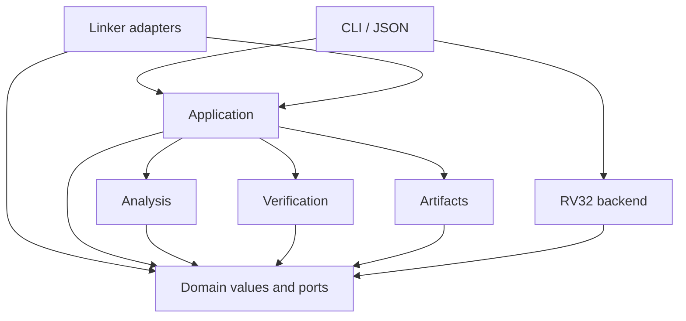

# Blobray architecture

This directory is the architecture authority for Blobray. Supported
profiles are listed in [workflows](workflows.md); the [operator reference](../../cli/README.md)
owns CLI syntax and current format versions.

This document owns purpose, component boundaries and dependency direction.
[Contracts](contracts.md) owns identities, interfaces and resource lifetimes.
[Workflows](workflows.md) owns user scenarios and acceptance conditions.

## Purpose and success conditions

Blobray supports reproducible investigation of compiled vendor software and
evidence-based comparison with compiled Rust replacements. Every operation
runs inside its caller's process over executables the caller supplies as
bytes, identified by their SHA-256 content. A result is useful without being a
proof of equivalence.

The architecture satisfies these conditions:

- An input is identified by its content, never by its path; a request that
  names content the caller did not give fails.
- An operation keeps no state after it returns. The caller owns its inputs,
  its limits and whatever it keeps of the result.
- CLI and JSON share selection, analysis and verification semantics.
- Each resource has a named owner for acquisition, completion and release.
- An uncertainty or unsupported operation remains visible at every projection.

Blobray covers RV32 and the ESP32-S31 investigation; no other ISA is
implemented. Container formats, ISA semantics, ABI, ecosystem models and chip
facts have separate interfaces. There is no project repository, distributed
execution, network service or concurrent collaborative editing.

SVD/PAC publication belongs to the register tool, which consumes reviewed
hardware models rather than investigations; its publication policies do not
shape the analysis engine. Production readiness
belongs to the independent qualification evaluator, as defined by the
[repository qualification contract](../../../../docs/verification-and-qualification.md).
Retained evidence belongs to its consumer: the vendor verification scenarios
record their shards in Git, and reviewed contracts reach a comparison by
content.

## Information boundaries

| Kind | Authority and owner | Relationship to other information |
| --- | --- | --- |
| Captured input | Exact caller bytes, identified by content | Root input, privately held outside Git |
| Structural observation | Artifact parser or ISA backend, identified by producer | Refers to exact occurrences; retains unsupported regions |
| Derived analysis | Analysis operation over its declared inputs | Depends on observations and selected interpretation inputs |
| Hypothesis | Analysis or researcher proposal | Has supporting evidence and unresolved obligations; cannot become a reviewed contract by itself |
| Reviewed contract | Git review outside Blobray, supplied by content to a comparison | Selected by the digest of its canonical encoding; cannot rewrite an observation |
| Executable model | Explicit provider implementation and applicability | Supplies bounded environmental behavior; records its participation |
| Comparison evidence | Verification operation | Records compiled inputs, scenarios, observation relation and verdict |
| Qualification result | External evaluator | Consumes eligible evidence under independent readiness policy |

Physical occurrence identity and semantic meaning are distinct. A reviewed
contract names exact physical endpoints; applying it to another binary
requires a reviewed change to the contract, not an automatic transfer.

## Crates and modules

Crate boundaries enforce independent dependency and authority rules. Modules
inside each crate divide implementation without acquiring extra capabilities.
The command line package is `blobray-cli` and its executable is `blobray`; the
Linux linker adapters are the separate `blobray-linker`, so a consumer that
links, such as the vendor scenarios, does not depend on the command line.

| Crate | Principal modules | Owns | Allowed local dependencies |
| --- | --- | --- | --- |
| `blobray-domain` | identity, observations, effects, resources, ports | Shared values and narrow extension interfaces | None |
| `blobray-artifacts` | containers, objects, symbols, relocations, mappings | Structural inspection of supplied immutable bytes | domain |
| `blobray-analysis` | references, values, navigation facts | Derived function analysis | domain |
| `blobray-backend-riscv` | decode, lift, ABI, execution | RV32 semantics and concrete machine state | domain |
| `blobray-verification` | scenarios, comparison, record validation | Comparison relations and verdict construction | domain |
| `blobray-application` | captured, library, linking, data, audit, in_process | Operations over given executables and their resource ownership | domain, artifacts, analysis, verification |
| `blobray-linker` | GNU ld and LLD adapters, bounded subprocess transport | External linker processes behind `LinkerHost` | domain, application |
| `blobray-cli` | CLI, JSON wire documents | Process entry point, rendering and concrete dependency selection | application, domain, backend-riscv |

The common `blobray-` prefix is omitted in the dependency column. Application
receives backend, model and external-tool capabilities through domain ports; it
has no dependency on the RISC-V implementation. Analysis obtains lifting through
the same ports. Verification can request execution through an injected executor
and compares typed observations; it cannot select a different input behind the
caller's back.

Domain modules contain shared values and the contracts needed for dependency
inversion. They do not accumulate orchestration, parsers, registries or
concrete model implementations. A private result type stays with its
subsystem until another boundary actually consumes it.

### Module authority

A crate dependency permits calling an interface; it does not grant every module
in the caller the callee's full authority.

| Module boundary | Receives | Owns | Cannot acquire implicitly |
| --- | --- | --- | --- |
| application / captured | One executable, memory and control | Member enumeration and object inventory | Paths, thin-member files or another executable |
| application / linking | Link request, named executables, linker path and host | Materialization, invocation and validation of every linker claim | A different tool, input order or companion chosen by the adapter |
| application / in_process | Request, executables, contracts and projections | Sessions, devices, call models and records of one comparison | Executables the caller did not give |
| analysis | Byte/image views, ISA ports and run control | Observations, hypotheses and disposable operation-local indexes | Tool discovery or input selection |
| verification / comparison | Execution observations, coverage and declared relation | Verdict, counterexample and unsatisfied obligations | Substituting an implementation or upgrading a claim ceiling |
| linker adapters | A fixed semantic link invocation and workspace | Linker process, dialect flags and raw evidence parsing | Research selection or verdict policy |

Computation modules receive only byte sources, selected records and output
sinks. An artifact parser validates binary structure; application validates
operation outputs. These are complementary checks, not interchangeable
parsers.

Domain owns cross-subsystem identities, observations and narrow resource/control
ports. The caller owns every limit: it creates the working memory and the run
control an operation charges. No additional runtime or allocator crate is
required. Extracting a crate requires a distinct authority or independently
usable contract; file size, common prefixes and similar container names are
insufficient reasons.

```mermaid
flowchart TD
    Host[CLI / JSON] --> App[Application]
    Linker[Linker adapters] --> App
    Linker --> Domain
    Host --> RV[RV32 backend]
    App --> Analysis[Analysis]
    App --> Verify[Verification]
    App --> Artifacts[Artifacts]
    App --> Domain[Domain values and ports]
    Analysis --> Domain
    Verify --> Domain
    Artifacts --> Domain
    RV --> Domain
```

Arrows represent compile-time dependencies. Runtime calls through injected ports
do not add a reverse crate dependency.

## Authority and extension boundaries

The host injects the decoder/executor and the linker adapter into each
operation. Library code does not install a process-global registry, inspect
CLI flags or read environment variables to select an implementation; several
callers with different injections can coexist in one process.

Linking owns link planning. Its host adapter owns each external linker
process, CLI/script dialect and raw evidence parsers. `LinkerHost` accepts a
fixed semantic invocation and returns typed placement, extraction and exit
records. LLD and GNU ld retain distinct identities and archive-selection
semantics. GNU seekable output uses an extent the application admits, enforced
by Linux `RLIMIT_FSIZE`; application independently validates roots and the ELF
before returning an image. The ISA backend consumes a linked image; it does not
discover tools through `PATH` or invoke `rustc` to choose a linker.

Operations charge one caller-supplied control for work and deadline and one
working-memory authority for capacity. Parsers receive the narrow control port
from domain; they cannot choose their own budgets or restart clocks. No second
runtime or global allocator becomes an implicit resource owner. The mandatory
[resource contracts](contracts.md#resources-and-bounded-computation)
apply to every operation.

## Basis for the decisions

The following projects supply architectural comparisons, not chosen runtime
dependencies or claims that their behavior meets Blobray's proof requirements.

| Source | Relevant mechanism | Decision and limit |
| --- | --- | --- |
| [angr/CLE loading](https://docs.angr.io/en/latest/core-concepts/loading.html) | Objects, symbols, relocations and mapped address spaces have loader ownership | Separate artifact inventory and linked image. CLE's extern-object representation of unresolved symbols does not establish resolved behavior for Blobray. |
| [rev.ng model](https://docs.rev.ng/user-manual/key-concepts/model/) and [artifacts and analyses](https://docs.rev.ng/user-manual/key-concepts/artifacts-and-analyses/) | Editable model is separate from derived artifacts | Separate reviewed interpretation from computed results. rev.ng analyses can update its model; Blobray analysis never changes a reviewed contract or register model. |
| [LLD archive semantics](https://lld.llvm.org/ELF/warn_backrefs.html) | GNU ld and LLD can select different archive members | Identify the actual linker and recipe. A synthetic analysis link cannot prove original firmware selection. |
| [Bazel remote caching](https://bazel.build/remote/caching) | Action-result metadata is separate from content-addressed output bytes | Identify inputs and outputs by content; the vendor scenarios key reused results by their request and producer identities. |
| [bumpalo allocation limits](https://docs.rs/bumpalo/latest/bumpalo/struct.Bump.html#bump-allocation-limits) | Limits apply when obtaining backing chunks, not to each allocation in an existing chunk | Phase allocation is useful; a generic bump allocator does not establish Blobray's accounting or cleanup contract. |
| [Rust GlobalAlloc](https://doc.rust-lang.org/std/alloc/trait.GlobalAlloc.html) and [Linux mmap](https://man7.org/linux/man-pages/man2/mmap.2.html) | Global allocation has reentrancy/unwind constraints; mappings and prefaulting do not guarantee physical memory availability | Keep capacity authority explicit. A global allocator or a successful mapping is insufficient evidence of a bounded operation. |

These comparisons support the separation of loading, interpretation and
execution. Blobray deliberately does not adopt automatic unresolved symbol
stand-ins or automatic acceptance of analysis results. No runtime dependency on
these engines is selected here.

Register source publication is owned by [the register tool](../../../registers/README.md),
with separate reviewed contracts/model/review modules and no execution
dependency. Blobray's register accesses are observations of the given
libraries; they have no generator or production dependencies.
